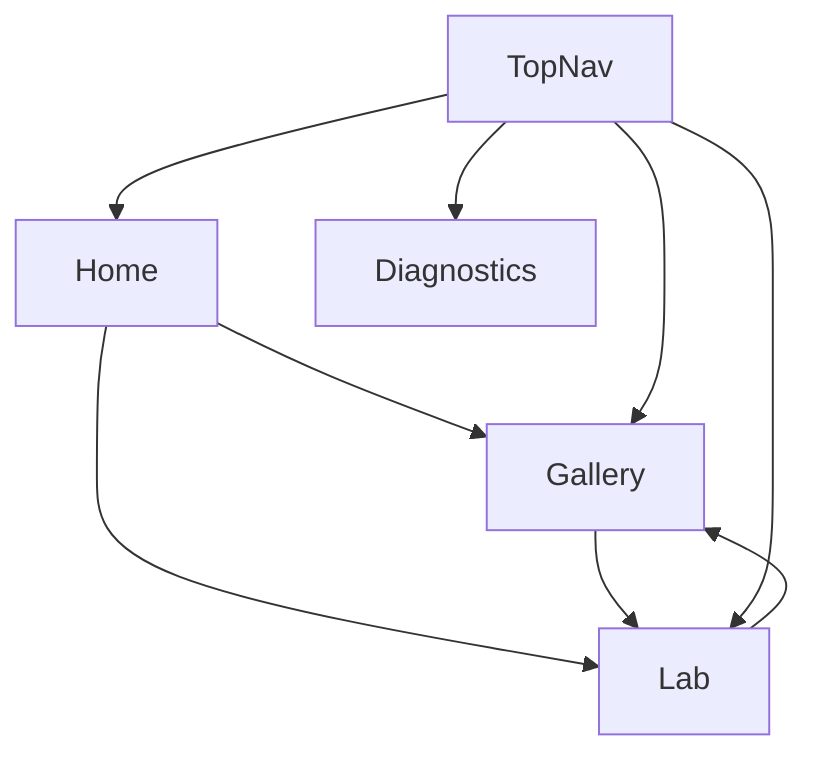

# Page Map
## Layer A — All Pages Overview

---

## 🗺️ Site Map

```
/                           # Home - Portal to platform
├── /gallery               # Gallery - Project browser
├── /lab                   # Lab - Main workspace
│   └── /lab?id=xxx       # Lab with specific project
└── /diagnostics          # Diagnostics - Debug view
```

---

## 📄 Page Details

### Home (/)

| Attribute | Value |
|-----------|-------|
| **Pattern** | Portal |
| **Shell** | None (standalone) |
| **TopNav** | Yes (branding only) |
| **Main Content** | Quick start cards, Hero |
| **Auth Required** | No |

---

### Gallery (/gallery)

| Attribute | Value |
|-----------|-------|
| **Pattern** | Browser |
| **Shell** | None (standalone) |
| **TopNav** | Yes (full nav) |
| **Main Content** | Project cards grid |
| **Auth Required** | No |

---

### Lab (/lab)

| Attribute | Value |
|-----------|-------|
| **Pattern** | Workspace |
| **Shell** | LabShell |
| **TopNav** | Yes (Lab mode) |
| **Main Content** | Simulation canvas |
| **Panels** | Left (Output), Right (Studio), Bottom (Dock) |
| **Auth Required** | No |

---

### Diagnostics (/diagnostics)

| Attribute | Value |
|-----------|-------|
| **Pattern** | Utility |
| **Shell** | None |
| **TopNav** | Yes (minimal) |
| **Main Content** | System info, debug data |
| **Auth Required** | No |

---

## 🔗 Navigation Flow



---

**Source:** [PAGE_WIRING_DIAGRAMS.md](../../platform/design_system/PAGE_WIRING_DIAGRAMS.md)  
**Layer:** A — UX/UI Intent
