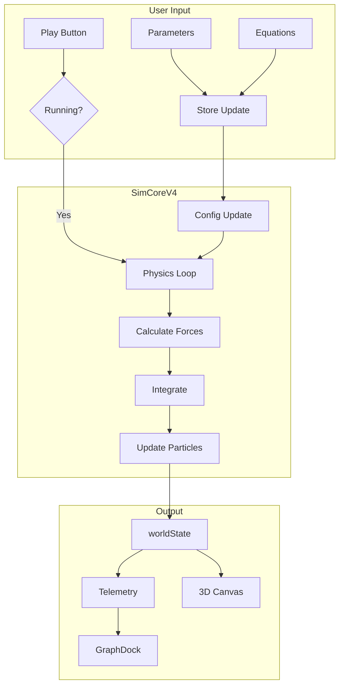

# Flow Diagram
## Layer D — Data Flow Paths

---

## 🔄 Main Simulation Flow



---

## 📊 Data Flow: Input → Engine

```
User Input (Studio Panel)
    │
    ├─ dt slider ────────────────────┐
    ├─ softening slider ─────────────┤
    ├─ equation toggle ──────────────┼──▶ simStoreV4 ──▶ SimCoreV4
    ├─ equation params ──────────────┤
    └─ speed control ────────────────┘
```

---

## 📊 Data Flow: Engine → Output

```
SimCoreV4
    │
    ├─ worldState.particles ─────────▶ 3D Canvas
    ├─ worldState.time ──────────────▶ HUD Counter
    ├─ worldState.step ──────────────▶ HUD Counter
    │
    └─ telemetry
         ├─ energy ──────────────────▶ GraphDock
         ├─ momentum ────────────────▶ GraphDock
         ├─ stability ───────────────▶ HUD Status
         └─ metrics ─────────────────▶ MetricCards
```

---

## 📊 Data Flow: Save/Load

```
Save:
    SimCoreV4.worldState ──▶ API /runs ──▶ Database

Load:
    Database ──▶ API /runs/[id] ──▶ SimCoreV4.init()
```

---

**Layer:** D — Flow/Engine Logic
