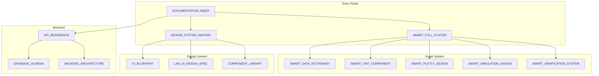

# UET Platform - Complete Documentation Index

> **Master Navigation for ALL Platform Documentation**  
> **Total Documents:** 30 files across 2 directories  
> **Last Updated:** 2024-12-24

---

## 📁 Quick Navigation

| Category | Start Here |
|----------|------------|
| **🧠 Smart System** | [SMART_FULL_SYSTEM.md](SMART_FULL_SYSTEM.md) |
| **🎨 UI Design** | [DESIGN_SYSTEM_MASTER](design_system/DESIGN_SYSTEM_MASTER.md) |
| **🔌 Backend/API** | [API_REFERENCE.md](API_REFERENCE.md) |
| **🗄️ Database** | [DATABASE_SCHEMA.md](DATABASE_SCHEMA.md) |
| **✅ Testing** | [SMART_VERIFICATION_SYSTEM.md](SMART_VERIFICATION_SYSTEM.md) |

---

## 📊 SMART SYSTEM (8 Files)

| # | File | Purpose | Location |
|---|------|---------|----------|
| 1 | [SMART_FULL_SYSTEM.md](SMART_FULL_SYSTEM.md) | **Master Overview** - Start here | /platform/ |
| 2 | [SMART_DATA_DICTIONARY.md](SMART_DATA_DICTIONARY.md) | All Metrics + Units | /platform/ |
| 3 | [SMART_VERIFICATION_SYSTEM.md](SMART_VERIFICATION_SYSTEM.md) | L0-L5 Test Checklists | /platform/ |
| 4 | [SMART_SYSTEM_DESIGN.md](design_system/SMART_SYSTEM_DESIGN.md) | Parameters + DB | /design_system/ |
| 5 | [SMART_UNIT_COMPONENT.md](design_system/SMART_UNIT_COMPONENT.md) | Unit Converter | /design_system/ |
| 6 | [SMART_PLOTLY_DESIGN.md](design_system/SMART_PLOTLY_DESIGN.md) | Charts | /design_system/ |
| 7 | [SMART_SIMULATION_DESIGN.md](design_system/SMART_SIMULATION_DESIGN.md) | Engine + Control | /design_system/ |
| 8 | [SMART_INDEX.md](design_system/SMART_INDEX.md) | File Structure | /design_system/ |

---

## 🎨 DESIGN SYSTEM (13 Files)

| # | File | Purpose |
|---|------|---------|
| 1 | [DESIGN_SYSTEM_MASTER.md](design_system/DESIGN_SYSTEM_MASTER.md) | **Master** - Theme, Colors, Typography |
| 2 | [UI_BLUEPRINT.md](design_system/UI_BLUEPRINT.md) | Full UI Specification |
| 3 | [LAB_UI_DESIGN_SPEC.md](design_system/LAB_UI_DESIGN_SPEC.md) | Lab Page Layout |
| 4 | [BUTTON_SPECIFICATION.md](design_system/BUTTON_SPECIFICATION.md) | Button Styles |
| 5 | [COMPONENT_LIBRARY.md](design_system/COMPONENT_LIBRARY.md) | Component Inventory |
| 6 | [ANIMATION_AND_COMPONENTS.md](design_system/ANIMATION_AND_COMPONENTS.md) | Animations |
| 7 | [UX_FLOWS_AND_INTERACTIONS.md](design_system/UX_FLOWS_AND_INTERACTIONS.md) | User Flows |
| 8 | [VISUALIZATION_CAPABILITIES.md](design_system/VISUALIZATION_CAPABILITIES.md) | 3D/Charts |
| 9 | [PAGE_WIRING_DIAGRAMS.md](design_system/PAGE_WIRING_DIAGRAMS.md) | Page Connections |
| 10 | [GALLERY_CONTENT_MAP.md](design_system/GALLERY_CONTENT_MAP.md) | Gallery Structure |
| 11 | [EQUATION_SYSTEM_DESIGN.md](design_system/EQUATION_SYSTEM_DESIGN.md) | Equation UI |
| 12 | [SMART_SETTINGS_DESIGN.md](design_system/SMART_SETTINGS_DESIGN.md) | **Settings = Verification View** |
| 13 | [GRID_LAYOUT_DESIGN_SYSTEM.md](design_system/GRID_LAYOUT_DESIGN_SYSTEM.md) | Layout Constants |

---

## 🔌 BACKEND & API (6 Files)

| # | File | Purpose |
|---|------|---------|
| 1 | [API_REFERENCE.md](API_REFERENCE.md) | REST API Documentation |
| 2 | [BACKEND_ARCHITECTURE.md](BACKEND_ARCHITECTURE.md) | Server Design |
| 3 | [DATABASE_SCHEMA.md](DATABASE_SCHEMA.md) | PostgreSQL Tables |
| 4 | [LOCALHOST_SERVICES.md](LOCALHOST_SERVICES.md) | Local Dev Setup |
| 5 | [DATA_DICTIONARY.md](DATA_DICTIONARY.md) | (Old) → See SMART_DATA_DICTIONARY |
| 6 | [VERIFICATION_SYSTEM.md](VERIFICATION_SYSTEM.md) | Physics Verification |

---

## 🗺️ ROADMAPS & PLANNING (4 Files)

| # | File | Purpose |
|---|------|---------|
| 1 | [FRONTEND_IMPLEMENTATION_ROADMAP.md](FRONTEND_IMPLEMENTATION_ROADMAP.md) | Frontend Phases |
| 2 | [PRODUCTION_ROADMAP.md](PRODUCTION_ROADMAP.md) | Production Checklist |
| 3 | [GAP_ANALYSIS_VS_BLUEPRINT.md](GAP_ANALYSIS_VS_BLUEPRINT.md) | Current vs Target |
| 4 | [UNIT_SYSTEM_ARCHITECTURE.md](UNIT_SYSTEM_ARCHITECTURE.md) | Unit Pipeline |

---

## 📋 DOC-FIRST WORKFLOW (4 Files) - NEW

> **กติกาเหล็ก:** ทุก change ต้องผ่าน Doc ก่อน

| # | File | Purpose |
|---|------|---------|
| 1 | [CHANGE_MANAGEMENT.md](CHANGE_MANAGEMENT.md) | **Workflow Master** - Change Card templates, Process |
| 2 | [COMPONENT_REGISTRY.md](COMPONENT_REGISTRY.md) | All components with doc refs |
| 3 | [BUTTON_ACTION_IDS.md](BUTTON_ACTION_IDS.md) | All button action_ids |
| 4 | [SETTINGS_CONTRACT.md](SETTINGS_CONTRACT.md) | All settings with contracts |

---

## 🔗 Cross-Reference Map

---

## ✅ Document Status

### ✅ Updated (24 Dec 2024)
- SMART_FULL_SYSTEM.md ✅
- SMART_VERIFICATION_SYSTEM.md ✅
- SMART_SIMULATION_DESIGN.md ✅
- SMART_PLOTLY_DESIGN.md ✅
- SMART_SYSTEM_DESIGN.md ✅
- SMART_UNIT_COMPONENT.md ✅
- SMART_DATA_DICTIONARY.md ✅
- SMART_INDEX.md ✅
- API_REFERENCE.md ✅
- DATABASE_SCHEMA.md ✅
- BACKEND_ARCHITECTURE.md ✅
- FRONTEND_IMPLEMENTATION_ROADMAP.md ✅
- DOCUMENTATION_INDEX.md ✅

### 📝 Original (No changes needed)
- DESIGN_SYSTEM_MASTER.md
- UI_BLUEPRINT.md
- LAB_UI_DESIGN_SPEC.md
- BUTTON_SPECIFICATION.md
- And others...

---

## 🎯 Quick Lookup

| I need to... | Go to... |
|--------------|----------|
| Add a metric | [SMART_DATA_DICTIONARY](SMART_DATA_DICTIONARY.md) |
| Add unit conversion | [SMART_UNIT_COMPONENT](design_system/SMART_UNIT_COMPONENT.md) |
| Fix chart issue | [SMART_PLOTLY_DESIGN](design_system/SMART_PLOTLY_DESIGN.md) |
| Add API endpoint | [API_REFERENCE](API_REFERENCE.md) |
| Add database table | [DATABASE_SCHEMA](DATABASE_SCHEMA.md) |
| Check UI design | [DESIGN_SYSTEM_MASTER](design_system/DESIGN_SYSTEM_MASTER.md) |
| Run tests | [SMART_VERIFICATION_SYSTEM](SMART_VERIFICATION_SYSTEM.md) |
| Check file structure | [SMART_INDEX](design_system/SMART_INDEX.md) |

---

> **Note:** All documents have cross-references at the top.
> If a document is missing links, please update it.
