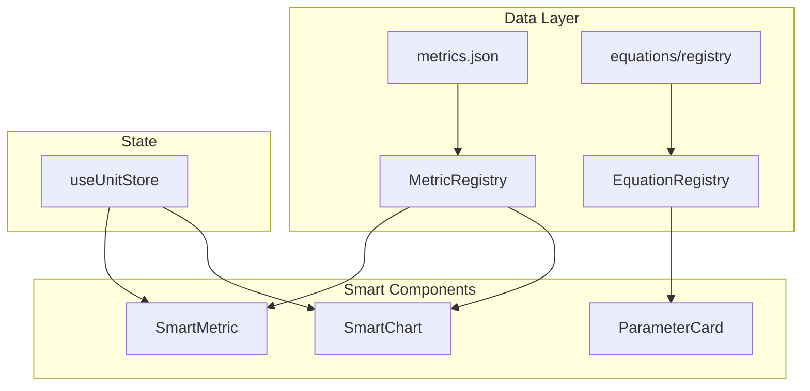

# UET Lab - Frontend Implementation Roadmap

> **Related Documents:**
> - [SMART_INDEX](design_system/SMART_INDEX.md) ← Smart System Master
> - [SMART_DATA_DICTIONARY](SMART_DATA_DICTIONARY.md) ← Metric Definitions
> - [LAB_UI_DESIGN_SPEC](design_system/LAB_UI_DESIGN_SPEC.md) ← UI Layout
> - [SMART_PLOTLY_DESIGN](design_system/SMART_PLOTLY_DESIGN.md) ← Charts

> **MASTER PLAN & BACKEND MAPPING**  
> แผนการพัฒนาระยะยาวสำหรับการสร้าง Frontend ใหม่ให้สมบูรณ์ตาม Design System  
> **Last Updated: 2024-12-24** (Smart System Integration)

---

## 📅 IMPLEMENTATION PHASES

### Phase 1: Shell & Structure (Foundation) ✅ DONE
- [x] Implement `LabShell` (TopNav, Panels, Dock layouts)
- [x] Implement `RoomRouter` & URL Params (`/lab?room=xxx`)
- [x] Build **Atomic Components** (Buttons, Cards, Inputs)
- [x] Create Static `Home` & `Gallery` layouts
- [x] Integrate `LayoutContext` for panel state

### Phase 2: Live Simulation & Wiring (The Heart) ✅ DONE
- [x] Wire `SimCoreV4` เข้ากับ `Sim3DRoom`
- [x] Implement `MetricCards` (1-1-1 Pattern)
- [x] Implement `GraphDock` รับข้อมูลจาก Sim buffer
- [x] Wire `RightPanel` inputs เข้ากับ Engine

### Phase 3: Smart System (The Brain) 🔄 IN PROGRESS
- [ ] **Smart Unit Converter** - Unit dropdown with conversion
- [x] **Smart Parameter Cards** - Auto-generate from equation ✅
- [ ] **Smart Charts** - Unit-aware axes, real-time throttling
- [x] **Smart Metric Registry** - Central data definitions ✅

### Phase 4: Backend Integration (The Cloud) ✅ MOSTLY DONE
- [x] Connect **Save/Export** Actions -> API ✅ (via SyncManager)
- [x] Connect **Gallery** Load -> API ✅ (Dynamic projects loaded)
- [ ] Connect **Notes** Tab -> API
- [ ] Implement Authentication UI

### Phase 5: Polish & Advanced (The Soul)
- [ ] Implement **Diagnostics Room**
- [ ] Add UX/Micro-interactions
- [ ] Mobile/Tablet Responsiveness
- [ ] Performance Tuning

---

## 🧠 SMART SYSTEM IMPLEMENTATION (Phase 3 Detail)

### 3.1 Files to Create

```
frontend/src/
├── lib/smart/
│   ├── UnitConverter.ts          # Conversion logic
│   └── TelemetryBuffer.ts        # Realtime data buffer
│
├── stores/
│   └── useUnitStore.ts           # Unit preferences
│
├── components/smart/
│   ├── SmartMetric.tsx           # Unit button row
│   ├── ParameterCard.tsx         # Parameter input
│   └── SmartChart.tsx            # Plotly wrapper
│
└── features/metrics/
    └── GraphDock.tsx             # Bottom chart dock
```

### 3.2 Smart Component Dependencies



### 3.3 Implementation Order

| Step | Component | Dependencies | Effort |
|------|-----------|--------------|--------|
| 1 | `UnitConverter.ts` | metrics.json | 2h |
| 2 | `useUnitStore.ts` | - | 1h |
| 3 | `SmartMetric.tsx` | 1, 2 | 3h |
| 4 | `ParameterCard.tsx` | MetricRegistry | 3h |
| 5 | `TelemetryBuffer.ts` | - | 2h |
| 6 | `SmartChart.tsx` | 1, 2, 5 | 4h |
| 7 | `GraphDock.tsx` | 6 | 2h |

**Total Estimated: ~17 hours**

---

## 🗺️ FRONTEND-TO-BACKEND MAPPING

### 1. Lab / Simulation Data
| Component | Backend Service | API Endpoint | Data Object |
|-----------|-----------------|--------------|-------------|
| **Metric Card** | TelemetryService | (Local Stream) | `TelemetrySample` |
| **Graph Dock** | TelemetryService | `GET /api/telemetry` | `TelemetrySample[]` |
| **Save Button** | PersistenceService | `POST /api/runs` | `RunRecord` |
| **Export Button** | ExportService | (Client-side) | `Blob` |
| **Equation Toggle** | SimCore | (Internal) | `EquationModule` |
| **Param Slider** | SimCore | (Internal) | `SimulationParams` |

### 2. Smart System APIs 🆕
| Component | Backend Service | API Endpoint | Data Object |
|-----------|-----------------|--------------|-------------|
| **SmartMetric** | MetricRegistry | `GET /api/registry` | `MetricDefinition[]` |
| **ParameterCard** | EquationRegistry | `GET /api/equations` | `EquationModule[]` |
| **SmartChart** | TelemetryService | `GET /api/telemetry` | `TelemetrySample[]` |
| **Unit Preferences** | UserService | `GET/PUT /api/preferences` | `UnitPreferences` |

### 3. Gallery & Project Data
| Component | Backend Service | API Endpoint | Data Object |
|-----------|-----------------|--------------|-------------|
| **Gallery Grid** | GalleryService | `GET /api/projects` | `Project[]` |
| **Load Preset** | SimService | `GET /api/runs/:id` | `RunRecord + State` |
| **Delete Run** | PersistenceService | `DELETE /api/runs/:id` | `SuccessResponse` |

### 4. Diagnostics & System
| Component | Backend Service | API Endpoint | Data Object |
|-----------|-----------------|--------------|-------------|
| **Diagnostics Room** | TestRegistry | (Local Runner) | `TestResult` |
| **Health Indicator** | HealthService | `GET /api/health` | `HealthStatus` |
| **User Profile** | AuthService | `GET /api/auth/me` | `UserProfile` |

---

## 🏗️ DIRECTORY STRUCTURE

```
frontend/src/
├── features/               <- LOGIC & UI (Smart Components)
│   ├── simulation/         -> SimCore / TelemetryService
│   ├── gallery/            -> GalleryService / API
│   ├── auth/               -> AuthService
│   ├── metrics/            -> GraphDock / MetricCards (Smart)
│   └── diagnostics/        -> TestRegistry
│
├── shell/                  <- LAYOUT (Dumb Components)
│   ├── LabShell.tsx
│   ├── TopNav.tsx
│   └── panels/
│
├── components/smart/       <- SMART COMPONENTS 🆕
│   ├── SmartMetric.tsx
│   ├── ParameterCard.tsx
│   └── SmartChart.tsx
│
├── lib/
│   ├── registry/           <- Central Data Registry
│   ├── smart/              <- Smart System Logic 🆕
│   └── services/           <- API Connectors
│
└── stores/                 <- Zustand Stores
    ├── useUnitStore.ts     <- Unit Preferences 🆕
    └── useTelemetryStore.ts
```

---

## ✅ PHASE CHECKLIST

### Phase 3: Smart System
- [ ] Create `lib/smart/UnitConverter.ts`
- [ ] Create `stores/useUnitStore.ts`
- [ ] Create `components/smart/SmartMetric.tsx`
- [ ] Create `components/smart/ParameterCard.tsx`
- [ ] Create `lib/smart/TelemetryBuffer.ts`
- [ ] Create `components/smart/SmartChart.tsx`
- [ ] Update `features/metrics/GraphDock.tsx`
- [ ] Add `compatible_units` to `metrics.json`
- [ ] Test unit conversion accuracy
- [ ] Test chart performance (5fps throttle)

---

**สรุป:** แผนนี้จะทำให้ Frontend เป็น Smart System ครบวงจร:
1. **Smart Units** - เปลี่ยน unit ได้ทุก metric
2. **Smart Params** - Auto-generate จาก equation
3. **Smart Charts** - Real-time + unit-aware
4. **Smart Registry** - Central data definitions

เริ่ม Phase 3 ได้เลยครับ! 🚀
