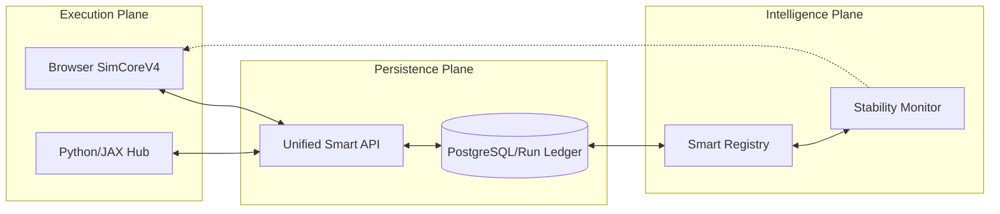

# Strategic Master Plan: The Unified Smart Simulation Platform (n-Project)

## 1. Vision & Objective
To transform the current UET Harness into a **Universal Smart Simulation Ecosystem**. 
The goal is to provide a unified environment where **Interactive Visualization (Frontend)**, **Persistent Research Records (Database)**, and **High-Performance Computation (Scripts/JAX)** work as a single, cohesive unit capable of supporting any number of physics projects (**n-Project Scale**).

## 2. Executive Analysis: The "Triple Disconnect"
Our audit revealed that the system is currently "three separate brains":
1.  **Interactive Brain (Frontend):** Fast, beautiful, but loses data on refresh (Ephemeral).
2.  **Storage Brain (SQL):** Structured, persistent, but currently "inert" (Disconnected).
3.  **Research Brain (Python):** Robust, high-precision, but "offline" (Filesystem-only).

**The Strategic Goal:** Dissolve these boundaries to create a **Real-Time Persistent Research Cycle**.

---

## 3. Long-Term Phase Roadmap (Phases 1-6)

### Phase 1: Foundation & Shell ✅ (COMPLETE)
*   **Status:** Stable environment with SimCoreV4 and modern UI.
*   **Result:** Beautiful, reactive interface ready for data.

### Phase 2: The Data Pipeline (Persistence Bridge) 🔄 (NEXT)
*   **Objective:** Eliminate data loss.
*   **Key Actions:**
    *   Implement **Auto-Sync**: Every "Play" creates a `Run` record in PostgreSQL.
    *   Implement **Telemetry Flush**: Periodically save in-memory history to `TelemetrySamples`.
    *   Implement **Project Persistence:** Gallery cards load/save configuration to the database.

### Phase 3: The Smart Registry (Metadata Autonomy)
*   **Objective:** Remove hardcoded constants.
*   **Key Actions:**
    *   **Registry-as-a-Service:** UI fetches `Metrics` and `Equations` from the database.
    *   **Dynamic Presets:** Presets are managed via a web interface, not code updates.
    *   **Unit-Aware Engine:** Backend calculates and converts units before sending to UI.

### Phase 4: Expansion & "n-Project" Support
*   **Objective:** Deploy new physics labs in minutes.
*   **Key Actions:**
    *   **Project Templating:** Create a standard structure for adding new equation types (e.g., Navier-Stokes, Quantum Dynamics).
    *   **Plugin Architecture:** Load simulation kernels dynamically from a module registry.
    *   **Universal Diagnostics:** Standardized G0-G5 validation suite for all new projects.

### Phase 5: Intelligent Research (The "Smart" Brain)
*   **Objective:** AI-guided simulation optimization.
*   **Key Actions:**
    *   **Automated Sweeps:** UI-driven batch simulation scheduling (Trigger Python scripts from web).
    *   **Stability Prediction:** Predictive alerts when simulation parameters are likely to diverge.
    *   **Unified Grading:** The web HUD uses the same production-grade grading logic as the Python backend.

### Phase 6: Production Scale & Collaboration
*   **Objective:** Cloud-native multi-user environment.
*   **Key Actions:**
    *   **WebSockets:** Move from polling to real-time streaming for multi-user HUDs.
    *   **Research Collaboration:** Shared projects, shared notes, and peer-to-peer simulation review.
    *   **Cloud Orchestration:** Scale high-performance runs to GPU clusters directly from the web UI.

---

## 4. Target System Architecture

## 5. Feasibility Assessment
**Can we achieve this?**  
**YES.** All critical "hard" parts are already implemented:
- The **Physics Engine (V4)** is already equation-agnostic.
- The **Prisma Schema** already contains the necessary tables for Runs, Metrics, and Equations.
- The **UI Shell** is already resizable and dynamic.

Following this roadmap will turn the platform from a "Visualization Tool" into a **"Production-Grade Science Lab."**
