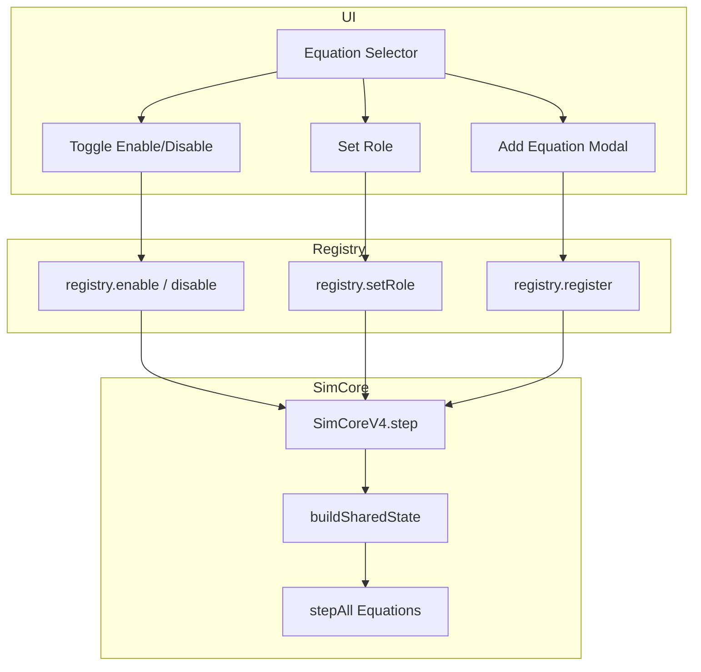

# Equation System Design Specification

## ⚠️ CRITICAL RULE: Registry-First

> **ALL UI components that display equations MUST read from EquationRegistry.**
> 
> ❌ NEVER hardcode equation templates in UI components.
> ✅ ALWAYS use `registry.getAll()` or `availableEquations` from store.
>
> **Violation of this rule breaks the Smart System architecture.**

---

## Current Architecture Summary

### Core Components

| File | Purpose |
|------|---------|
| `types.ts` | Type definitions: `EquationModule`, `EquationParameter`, `CouplingInfo` |
| `registry.ts` | `EquationRegistry` singleton - manages all equations |
| `BaseEquation.ts` | Abstract base class for all equations |
| `modules/newton.ts` | Newton (Classical Mechanics) |
| `modules/einstein.ts` | Einstein (General Relativity) |
| `modules/uet.ts` | UET (Unified Equilibrium Theory) |

### Equation Roles

| Role | Description |
|------|-------------|
| `driver` | Primary equation, drives simulation forward (usually Newton) |
| `observer` | Reads values only, doesn't modify state |
| `coupled` | Participates in coupled calculation with others |

---

## UI Design: Equation Manager Panel

### 1. Equation Selector

```
┌─────────────────────────────────────────────┐
│  ⚡ ACTIVE EQUATIONS                        │
├─────────────────────────────────────────────┤
│  ┌─ DRIVER ───────────────────────────────┐ │
│  │ ⚙️ Newton                    [●]       │ │
│  │    Classical Mechanics                 │ │
│  └────────────────────────────────────────┘ │
│                                             │
│  ┌─ COUPLED ──────────────────────────────┐ │
│  │ 🌌 Einstein                  [●]       │ │
│  │    General Relativity                  │ │
│  │ ⚡ UET                       [●]       │ │
│  │    Unified Equilibrium Theory          │ │
│  └────────────────────────────────────────┘ │
│                                             │
│  [+ Add Equation]                           │
└─────────────────────────────────────────────┘
```

### 2. Add Equation Modal

```
┌──────────────────────────────────────────────┐
│              ADD EQUATION                  ✕ │
├──────────────────────────────────────────────┤
│  ┌─ CLASSICAL ─────────────────────────────┐ │
│  │ ⚙️ Newton         ✓ Added              │ │
│  └─────────────────────────────────────────┘ │
│                                              │
│  ┌─ RELATIVISTIC ──────────────────────────┐ │
│  │ 🌌 Einstein       ✓ Added              │ │
│  └─────────────────────────────────────────┘ │
│                                              │
│  ┌─ UNIFIED ───────────────────────────────┐ │
│  │ ⚡ UET            ✓ Added              │ │
│  └─────────────────────────────────────────┘ │
│                                              │
│  ┌─ QUANTUM ───────────────────────────────┐ │
│  │ 🔮 Schrödinger    [Add]                │ │
│  │ ⚛️ Dirac          [Add]                │ │
│  └─────────────────────────────────────────┘ │
│                                              │
│  ┌─ CUSTOM ────────────────────────────────┐ │
│  │ [📁 Import from File...]               │ │
│  │ [🔗 Load from URL...]                  │ │
│  └─────────────────────────────────────────┘ │
└──────────────────────────────────────────────┘
```

### 3. Equation Detail Panel

```
┌──────────────────────────────────────────────┐
│  ⚡ UET - Unified Equilibrium Theory       ✕ │
│  v1.0.0 • unified                           │
├──────────────────────────────────────────────┤
│  ROLE: [Driver ▾] [Coupled ●] [Observer]    │
├──────────────────────────────────────────────┤
│  PARAMETERS                                  │
│  ──────────────────────────────────────────  │
│  κ (Kappa)           [====●====] 0.30       │
│  Coupling strength to equilibrium            │
│                                              │
│  β (Beta)            [====●====] 0.50       │
│  Damping coefficient                         │
│                                              │
│  s (Bias)            [====●====] 0.00       │
│  Symmetry breaking bias                      │
├──────────────────────────────────────────────┤
│  OUTPUTS (Live)                              │
│  ──────────────────────────────────────────  │
│  C_mean: 0.523 (internal)                   │
│  I_mean: 0.477 (internal)                   │
│  Ω: 1.234e+5 (indicator) ⚠️ NOT ENERGY     │
│  force_modifier: 0.98                       │
│  stability_score: 0.95                      │
├──────────────────────────────────────────────┤
│  COUPLING                                    │
│  ──────────────────────────────────────────  │
│  ✓ Compatible with: newton, einstein        │
│  Shared: C_mean, I_mean, omega              │
└──────────────────────────────────────────────┘
```

---

## Data Flow



---

## Implementation Tasks

- [ ] Create `EquationSelectorPanel.tsx`
- [ ] Create `AddEquationModal.tsx`
- [ ] Create `EquationDetailPanel.tsx`
- [ ] Add role toggle buttons
- [ ] Add parameter sliders with live preview
- [ ] Show coupling compatibility matrix
- [ ] Support custom equation import
