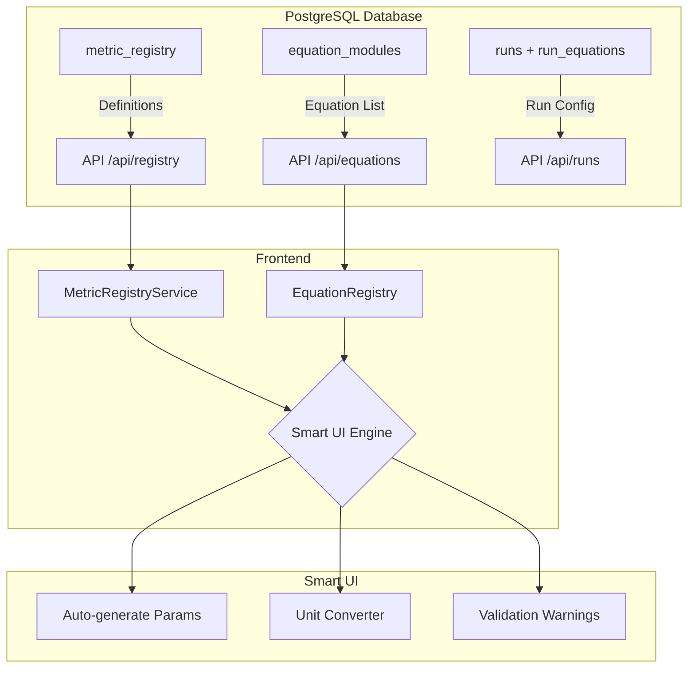
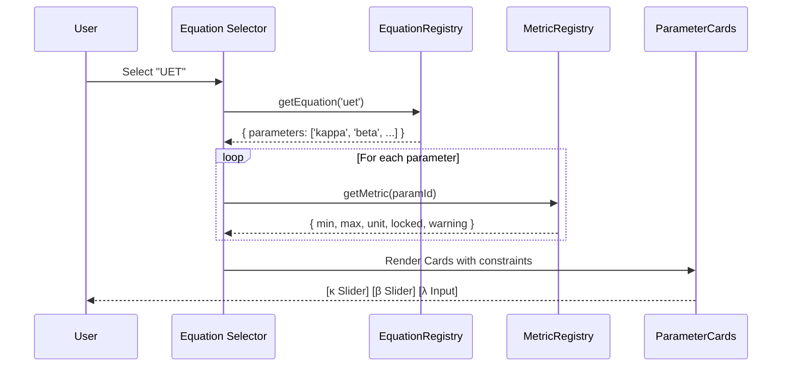

# Smart Unified System Design

> **Related Documents:**
> - [DOCUMENTATION_INDEX](../DOCUMENTATION_INDEX.md) ← Master Index
> - [UNIT_SYSTEM_ARCHITECTURE](../UNIT_SYSTEM_ARCHITECTURE.md) ← Unit Pipeline
> - [EQUATION_SYSTEM_DESIGN](EQUATION_SYSTEM_DESIGN.md) ← Equation UI
> - [SMART_UNIT_COMPONENT](SMART_UNIT_COMPONENT.md) ← Unit Converter
> - [DATA_DICTIONARY](../standards/DATA_DICTIONARY.md) ← Central Schema
> - [DATABASE_SCHEMA](../DATABASE_SCHEMA.md) ← Table Definitions

---

## 1. ภาพรวม: Smart System คืออะไร?

**Smart System** คือระบบที่ทำให้ UI ฉลาดขึ้นโดยอัตโนมัติ:
- เลือกสมการ → Parameters auto-generate
- เปลี่ยน Unit → ค่าแปลงอัตโนมัติ
- บาง Parameter fixed/warning → ระบบรู้จาก Database

---

## 2. Database ช่วย Smart System อย่างไร?

### 2.1 Data Flow Architecture



### 2.2 ตาราง Database ที่เกี่ยวข้อง

| Table | ช่วย Smart System ยังไง |
|-------|------------------------|
| `metric_registry` | เก็บ unit, range, format ของทุก metric |
| `equation_modules` | เก็บ metadata สมการ + parameter list |
| `run_equations` | Link runs ↔ equations, เก็บ param values |
| `unit_modes` | เก็บ mode การแสดงผล (physical/uet_internal) |
| `telemetry_samples` | เก็บ computed outputs (ใน SI เสมอ) |

### 2.3 ทำไมต้อง Store SI?

> **กฎเหล็ก:** Database เก็บ **Raw SI** เท่านั้น (kg, m, s, J)
> - ไม่เก็บค่าที่แปลงแล้ว (เช่น "Earths")
> - แปลงที่ Frontend เท่านั้น
> - เหตุผล: เปลี่ยนสูตรแปลงภายหลังได้โดยไม่กระทบข้อมูลเก่า

---

## 3. Metric Registry (Central Database)

### 3.1 ไฟล์ Source
**Frontend:** `lib/registry/metrics.json` (295 lines)
**Backend:** `metric_registry` table

### 3.2 Metric Definition Structure

```json
{
  "metric_id": "kappa",
  "label": "Kappa",
  "symbol": "κ",
  "unit": "dim",
  "unit_category": "QNT",
  "mode_default": "UET",
  "plot_group": "uet_group",
  "format": "decimal",
  "default_visible": false,
  "constraints": {
    "min": 0,
    "max": 2,
    "step": 0.01,
    "locked": false,
    "warning_if": "value > 1.5",
    "warning_message": "High κ may cause instability"
  }
}
```

### 3.3 API Usage

```typescript
// Frontend Service
import { metricRegistry } from '@/lib/registry';

// Get all metrics
const metrics = metricRegistry.getMetrics();

// Get single metric with constraints
const kappa = metricRegistry.getMetric('kappa');
// → { min: 0, max: 2, unit: 'dim', locked: false }

// Get metrics by equation
const uetParams = metricRegistry.getMetricsForEquation('uet');
// → [kappa, beta, lambda, alpha, s]
```

---

## 4. Equation Registry Integration

### 4.1 เมื่อเลือกสมการ จะเกิดอะไร?



### 4.2 Equation → Parameter Mapping

| สมการ | Parameters (จาก DB) | Fixed Params | Warnings |
|-------|---------------------|--------------|----------|
| Newton | G, dt, softening | - | - |
| Einstein | G, c, dt | c 🔒 | "c is constant" |
| UET | κ, β, s, λ, α | - | "λ=0 unstable" |
| Schrödinger | ℏ, dt, grid_size | ℏ 🔒 | "small dt needed" |

---

## 5. Parameter Card Types (Smart UI)

### 5.1 Slider Mode (Adjustable)
```
┌─────────────────────────────────────────────┐
│  κ (Kappa) - Coupling Strength              │
│  ╔═══════════════════════════════════════╗  │
│  ║ [====●==========] 0.30                ║  │
│  ╚═══════════════════════════════════════╝  │
│  Range: 0.01 - 2.0 | Unit: dimensionless    │
└─────────────────────────────────────────────┘
```

### 5.2 Fixed Mode (Read-only) 🔒
```
┌─────────────────────────────────────────────┐
│  c (Speed of Light)                    🔒   │
│  ╔═══════════════════════════════════════╗  │
│  ║ 299,792,458 m/s                       ║  │
│  ╚═══════════════════════════════════════╝  │
│  ⚠️ Physical constant - cannot modify       │
└─────────────────────────────────────────────┘
```

### 5.3 Input Mode (Free text)
```
┌─────────────────────────────────────────────┐
│  T (Simulation Time)                        │
│  ╔═══════════════════════════════════════╗  │
│  ║ [____________] 10.0 s                 ║  │
│  ╚═══════════════════════════════════════╝  │
│  [x] Run until equilibrium                  │
└─────────────────────────────────────────────┘
```

### 5.4 Computed Mode (Auto-calculated)
```
┌─────────────────────────────────────────────┐
│  N (Steps)                          🔄      │
│  ╔═══════════════════════════════════════╗  │
│  ║ Auto-calculated from T and dt         ║  │
│  ║ N = T / dt = 1000                     ║  │
│  ╚═══════════════════════════════════════╝  │
└─────────────────────────────────────────────┘
```

---

## 6. Warning System

### 6.1 Warning Rules (from Database)

```json
{
  "metric_id": "lambda",
  "constraints": {
    "warning_if": "value === 0",
    "warning_message": "λ=0 disables field interaction, may cause instability",
    "warning_level": "warn"  // 'info' | 'warn' | 'error'
  }
}
```

### 6.2 UI Display

```
┌─────────────────────────────────────────────┐
│  λ (Lambda) - Decay Length       ⚠️ WARNING │
│  ╔═══════════════════════════════════════╗  │
│  ║ [●===================] 0.00           ║  │
│  ╚═══════════════════════════════════════╝  │
│  ⚠️ λ=0 disables field interaction          │
└─────────────────────────────────────────────┘
```

---

## 7. Implementation Checklist

### Database
- [ ] Extend `metric_registry` with `constraints` JSONB column
- [ ] Add `equation_modules.parameters` array column
- [ ] Add `equation_modules.compatibility` JSONB column

### Frontend
- [ ] Create `ParameterCard.tsx` with 4 modes
- [ ] Add `metricRegistry.getMetricsForEquation(eqId)`
- [ ] Implement warning display logic
- [ ] Auto-compute N from T and dt

### Integration
- [ ] Connect EquationRegistry → MetricRegistry
- [ ] Persist user's parameter values to `run_equations`
- [ ] Load previous run config as preset

---

## 8. Code Implementation

### 8.1 ParameterCard Component

```typescript
interface ParameterCardProps {
  metricId: string;
  value: number;
  onChange: (value: number) => void;
}

function ParameterCard({ metricId, value, onChange }: ParameterCardProps) {
  const metric = metricRegistry.getMetric(metricId);
  const { min, max, locked, warning_if, warning_message } = metric.constraints;
  
  const hasWarning = warning_if && eval(warning_if.replace('value', String(value)));
  
  if (locked) {
    return <FixedCard metric={metric} value={value} />;
  }
  
  return (
    <div className="parameter-card">
      <label>{metric.label} ({metric.symbol})</label>
      <Slider 
        min={min} 
        max={max} 
        value={value} 
        onChange={onChange}
      />
      {hasWarning && <Warning message={warning_message} />}
    </div>
  );
}
```

### 8.2 Auto-generate from Equation

```typescript
function EquationParameterPanel({ equationId }: { equationId: string }) {
  const equation = equationRegistry.get(equationId);
  const [params, setParams] = useState(() => 
    equation.parameters.reduce((acc, p) => {
      const metric = metricRegistry.getMetric(p);
      acc[p] = metric.defaultValue;
      return acc;
    }, {})
  );
  
  return (
    <div>
      <h3>{equation.name} Parameters</h3>
      {equation.parameters.map(paramId => (
        <ParameterCard
          key={paramId}
          metricId={paramId}
          value={params[paramId]}
          onChange={(v) => setParams(prev => ({ ...prev, [paramId]: v }))}
        />
      ))}
    </div>
  );
}
```
