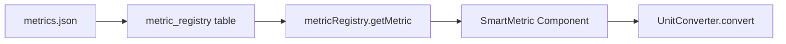

# Smart Unit Button Specification

> **Related Documents:**
> - [SMART_SYSTEM_DESIGN](SMART_SYSTEM_DESIGN.md) ← Main Smart System
> - [UNIT_SYSTEM_ARCHITECTURE](../UNIT_SYSTEM_ARCHITECTURE.md) ← Full Pipeline
> - [DATA_DICTIONARY](../standards/DATA_DICTIONARY.md) ← All Units

> **Component Goal**: Turn static unit labels into interactive conversion tools without cluttering the UI.

---

## 1. Visual Anatomy

The metric display row consists of three distinct interaction zones:

```text
[ ☑️ Graph Toggle ]  [  123.45  ]  [  kg ▾  ]
       (A)              (B)          (C)
```

- **(A) Graph Toggle**:
  - **Type**: Checkbox
  - **Action**: Adds/Removes this metric from the Timeline Chart below.
  - **State**: Checked/Unchecked.

- **(B) Numeric Value**:
  - **Type**: Text Display
  - **Content**: The scalar value *calculated* based on the current Unit Selection (C).
  - **Update**: Updates real-time (60fps) from Simulation Engine.

- **(C) Smart Unit Label (The "Converter")**:
  - **Type**: Dropdown Button (Ghost/Subtle Style).
  - **Appearance**: Looks like text (e.g., "kg") but has a hover state and caret.
  - **Action**: Opens a specific list of **Compatible Units** for that dimension.
  - **Result**: Instantly recalculates (B) without affecting the underlying physics.

---

## 2. Database Integration

### 2.1 Where does unit data come from?



### 2.2 Metric Definition with Units

```json
{
  "metric_id": "mass",
  "label": "Mass",
  "symbol": "m",
  "unit": "kg",
  "unit_category": "QNT",
  "dimension_group": "mass",
  "compatible_units": [
    { "id": "kg", "label": "kg", "factor": 1 },
    { "id": "earths", "label": "Earths (M⊕)", "factor": 1.674e-25 },
    { "id": "suns", "label": "Suns (M☉)", "factor": 5.03e-31 },
    { "id": "saturns", "label": "Saturns", "factor": 1.76e-27 }
  ]
}
```

### 2.3 Why Store Base SI Only?

| ❌ Bad: Store Converted | ✅ Good: Store SI |
|------------------------|-------------------|
| `mass: 1.0 Earths` | `mass: 5.97e24 kg` |
| Can't change formula later | Formula changeable anytime |
| Different users see different | Everyone sees same base |

---

## 3. Interaction Flow

### Phase 1: Default State (Engine Output)
The simulation sends raw SI units (Standard).
- **Engine**: Sends `mass = 5.97e24` (Implicitly kg).
- **UI Display**: `5.97e24` `kg`.

### Phase 2: User Interaction
The user wants to make sense of this huge number.
1.  User clicks **`kg ▾`**.
2.  Dropdown appears with **Relatable Anchors**:
    - `kg` (SI Standard)
    - `Earths (M⊕)` (1.0 = 5.97e24 kg)
    - `Suns (M☉)` (1.0 = 1.99e30 kg)
3.  User selects **`Earths`**.

### Phase 3: Immediate Feedback
The frontend immediately applies the conversion factor.
- **Display Update**: `1.00` `Earths`.
- **Graph Axis**: Updates Y-Axis Label to `Mass (Earths)`.
- **Persistence**: User preference saved to `useUnitStore`.

---

## 4. Conversion Map (from Database)

| Dimension | Default (SI) | Option A | Option B | Option C |
|:---|:---|:---|:---|:---|
| **Mass** | `kg` | `Earths` ($M_{\oplus}$) | `Suns` ($M_{\odot}$) | `Saturns` |
| **Distance** | `m` | `km` | `AU` (Astro Unit) | `ly` (Light Year) |
| **Speed** | `m/s` | `km/h` | `Mach` (Speed of Sound) | `c` (% Light Speed) |
| **Energy** | `J` | `kWh` | `TNT` (Tons) | `eV` (Electron Volts) |
| **Temp** | `K` | `C` (Celsius) | `F` (Fahrenheit) | `eV` (Plasma Temp) |
| **Time** | `s` | `min` | `h` | `days` |
| **Angular Momentum** | `kg·m²/s` | `Earth-orbit` | `Solar-system` | - |

---

## 5. Technical Implementation

### 5.1 Component Structure

```typescript
interface SmartMetricProps {
  metricId: string;         // e.g., 'mass', 'total_energy'
  rawValue: number;         // Raw SI value from simulation
  onGraphToggle?: (checked: boolean) => void;
}

function SmartMetric({ metricId, rawValue, onGraphToggle }: SmartMetricProps) {
  // 1. Get metric definition from registry
  const metric = metricRegistry.getMetric(metricId);
  
  // 2. Get user's unit preference from store
  const { getPreference, setPreference } = useUnitStore();
  const currentUnit = getPreference(metricId) || metric.unit;
  
  // 3. Convert on the fly for display
  const displayValue = unitConverter.convert(
    rawValue, 
    metric.unit, 
    currentUnit
  );
  
  // 4. Get compatible units for dropdown
  const unitOptions = metric.compatible_units || getUnitsForDimension(metric.dimension_group);

  return (
    <div className="smart-metric-row">
      {/* (A) Graph Toggle */}
      <Checkbox 
        onToggle={onGraphToggle}
        defaultChecked={metric.default_visible}
      />

      {/* (B) Converted Value */}
      <ValueDisplay 
        value={displayValue} 
        format={metric.format}
      />

      {/* (C) Unit Converter Dropdown */}
      <UnitDropdown
        currentUnit={currentUnit}
        options={unitOptions}
        onSelect={(newUnit) => setPreference(metricId, newUnit)}
      />
    </div>
  );
}
```

### 5.2 Unit Converter Service

```typescript
// lib/UnitConverter.ts
class UnitConverterService {
  private conversions: Map<string, Map<string, number>> = new Map();
  
  constructor() {
    // Load from metrics.json
    const metrics = metricRegistry.getMetrics();
    metrics.forEach(m => {
      if (m.compatible_units) {
        const unitMap = new Map<string, number>();
        m.compatible_units.forEach(u => unitMap.set(u.id, u.factor));
        this.conversions.set(m.dimension_group, unitMap);
      }
    });
  }
  
  convert(value: number, fromUnit: string, toUnit: string): number {
    if (fromUnit === toUnit) return value;
    
    // Get conversion factors
    const fromFactor = this.getFactor(fromUnit);
    const toFactor = this.getFactor(toUnit);
    
    // Convert: value_SI * toFactor
    return value * toFactor / fromFactor;
  }
  
  private getFactor(unit: string): number {
    for (const [dim, units] of this.conversions) {
      if (units.has(unit)) return units.get(unit)!;
    }
    return 1; // Base SI
  }
}

export const unitConverter = new UnitConverterService();
```

### 5.3 Zustand Store for Preferences

```typescript
// stores/useUnitStore.ts
interface UnitStoreState {
  preferences: Record<string, string>;
  getPreference: (metricId: string) => string | undefined;
  setPreference: (metricId: string, unit: string) => void;
  resetToDefaults: () => void;
}

export const useUnitStore = create<UnitStoreState>((set, get) => ({
  preferences: {},
  
  getPreference: (metricId) => get().preferences[metricId],
  
  setPreference: (metricId, unit) => set(state => ({
    preferences: { ...state.preferences, [metricId]: unit }
  })),
  
  resetToDefaults: () => set({ preferences: {} })
}));
```

---

## 6. Graph Integration

When unit changes, the graph must also update:

```typescript
// In TelemetryGraph.tsx
function TelemetryGraph({ metricIds }: { metricIds: string[] }) {
  const { getPreference } = useUnitStore();
  
  return (
    <ResponsiveContainer>
      <LineChart>
        {metricIds.map(id => {
          const metric = metricRegistry.getMetric(id);
          const unit = getPreference(id) || metric.unit;
          const unitLabel = getUnitLabel(unit);
          
          return (
            <Line 
              key={id}
              dataKey={(d) => unitConverter.convert(d[id], metric.unit, unit)}
              name={`${metric.label} (${unitLabel})`}
            />
          );
        })}
        <YAxis label={{ value: getAxisLabel(metricIds, getPreference) }} />
      </LineChart>
    </ResponsiveContainer>
  );
}
```

---

## 7. Implementation Checklist

- [ ] Add `compatible_units` to `metrics.json`
- [ ] Create `UnitConverter` service
- [ ] Create `useUnitStore` Zustand store
- [ ] Create `SmartMetric` component
- [ ] Create `UnitDropdown` subcomponent
- [ ] Integrate with `TelemetryGraph`
- [ ] Add keyboard shortcuts (↑↓ to cycle units)
- [ ] Persist preferences to localStorage
