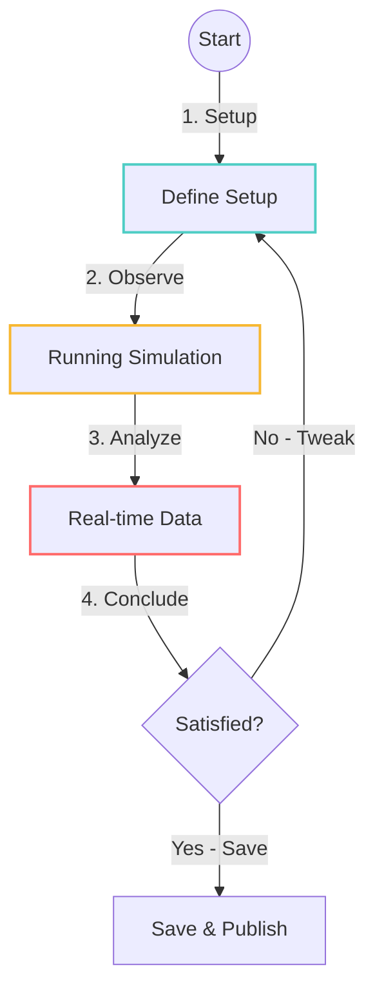

# UET Lab - UX Flows & Interaction Design

> **USER EXPERIENCE SPECIFICATION**  
> เอกสารกำหนด "ความรู้สึก" และ "การไหล" ของการใช้งาน (Interactions & Journeys)  
> ต่อเนื่องจาก UI Layouts เพื่อให้ระบบมีชีวิต

**Related Docs:**
- [Animation & Components Spec](./ANIMATION_AND_COMPONENTS.md) - รายละเอียด Animation และ Button-Function Connections

---

## 1. THE SCIENTIST'S JOURNEY (Core Loop)

เราออกแบบ UX โดยยึด "วงจรการทดลองวิทยาศาสตร์" (The Scientist's Loop)

### UX Goals per Stage:
1.  **Setup (Right Panel):** ต้องรู้สึก "แม่นยำ" (Precision). Input ต้องไม่มี lag. Slider ต้องลื่น.
2.  **Running (Center/Canvas):** ต้องรู้สึก "น่าทึ่ง" (Awe). 3D ลื่นไหล ไม่มี UI บังสายตา.
3.  **Analysis (Left/Bottom):** ต้องรู้สึก "ชัดเจน" (Clarity). กราฟอ่านง่าย ตัวเลขไม่อัดแน่นเกินไป.
4.  **Save/Export:** ต้องรู้สึก "มั่นใจ" (Confidence). มี Feedback ว่าเซฟสำเร็จเก็บไว้ที่ไหน.

---

## 2. INTERACTION STATES (Micro-interactions)

การตอบสนองเล็กๆ น้อยๆ ที่ทำให้แอพดู "Premium"

### 2.1 Buttons & Actions
- **Default:** Glass surface, soft border.
- **Hover:** Glow effect (Inner shadow + Border brightens). `transition: all 0.2s ease`.
- **Active (Click):** Scale down 98% (Tactile feel).
- **Disabled:** Opacity 0.5, Grayscale, Cursor not-allowed.

### 2.2 Metric Cards (The 1-1-1 Interaction)
- **Hover Card:** Background สว่างขึ้นเล็กน้อย + แสดงปุ่ม `[Graph ▾]` ชัดขึ้น.
- **Toggle Checkbox:**
  - *Immediate response:* Checkbox tick ทันที.
  - *Delayed response (100ms):* Chip ลอยลงไปที่ Graph Dock ด้านล่าง (Animation: Fly-to-cart style).
- **Expand Graph:** Slide down animation (Height transition). ห้ามกระตุก.

### 2.3 Loading States (Skeleton Screens)
ห้ามใช้ Spinner หมุนติ้วๆ ตรงกลางหน้าจอ ให้ใช้ **Skeleton** แทน:

- **Loading Gallery:** แสดง Grid เปล่าๆ สีเทาจางๆ วูบวาบ (Pulse).
- **Loading Simulation:** แสดง Progress Bar เส้นบางๆ ด้านบน TopNav.
- **Processing Data:** ปุ่ม Save ขึ้นสถานะ "Saving..." และจางลง ห้าม Block หน้าจอ.

---

## 3. FEEDBACK SYSTEMS (System Communication)

วิธีที่ระบบคุยกับผู้ใช้

### 3.1 Toast Notifications (ล่างซ้าย)
ใช้แจ้งเตือนเหตุการณ์ที่ไม่ขัดจังหวะการทำงาน
- **Success (Green):** "Saved run #1233 successfully." (หายเองใน 3วิ)
- **Info (Blue):** "Auto-grouped 3 metrics into 'Energy' plot." (หายเองใน 5วิ)
- **Warning (Yellow):** "Frame rate drop detected (<30 FPS)." (ค้างไว้จนกว่าจะดีขึ้น)

### 3.2 Validation Strip (Left Panel)
ใช้แจ้ง "คุณภาพ" ของการทดลองปัจจุบัน
- **Pass (Green Pulse):** เมื่อเงื่อนไขถูกต้องทั้งหมด.
- **Fail (Red Flash):** เมื่อค่าหลุดเกณฑ์ (เช่น Energy Drift > 1%).
- *Clicking the strip* -> เปิด Modal อธิบายสาเหตุละเอียด.

### 3.3 Error Boundaries (ถ้าพังจริง)
- ถ้ากราฟพัง -> แสดง "Graph Error / Reset View" ในกรอบกราฟ (ไม่พังทั้ง Dock).
- ถ้า WebGL พัง -> แสดง "Rendering Context Lost / Reload Canvas" (ไม่พังทั้ง UI).

---

## 4. KEY FLOWS STEP-BY-STEP

### Flow A: "The Quick Probe" (ลองเปลี่ยนค่าเล่นๆ)
1. User หมุนมุมกล้องใน 3D (Mouse Drag).
2. User ปรับค่า `dt` ใน Right Panel (Slider).
3. **UX Moment:** Sim ไม่ต้อง Restart! แต่แสดงผล Realtime feedback ทันที (ถ้าทำได้) หรือมีปุ่ม "Apply" ที่กระพริบเตือนให้กด.
4. User กด Pause -> Step -> Step เพื่อดูช็อตละเอียด.

### Flow B: "The Deep Dive" (จับผิดผลการทดลอง)
1. User เห็นค่า Energy แปลกๆ บน Metric Card.
2. User กด Checkbox `Total Energy` -> กราฟโผล่ที่ Dock.
3. User กด Checkbox `Kinetic`, `Potential` ตามมา.
4. **UX Moment:** Dock รวมกราฟ 3 เส้นให้อัตโนมัติ (Overlay) เพราะ Unit Group เดียวกัน (Joule).
5. User ลากเมาส์บนกราฟเพื่อ Zoom ช่วงเวลาที่ Energy แกว่ง.
6. 3D Canvas ย้อนเวลา (Time-travel) ไปจุดนั้นให้เห็นภาพ. (Supreme Feature!)

---

**สรุป UX Core Value:**
"User ต้องรู้สึกว่าเป็น God of this Universe 🌌 ควบคุมได้ทุกอย่าง เห็นทุกอย่าง และระบบคอยปกป้องความผิดพลาดให้"
