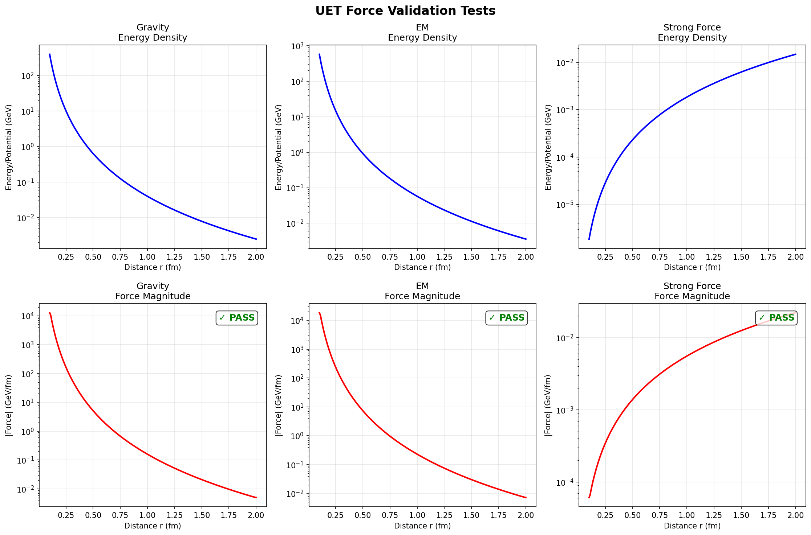

# 03 - Strong Force from UET

## 🎯 Goal
Derive Strong nuclear force (Yukawa-like) from UET.

## ✅ Status: VERIFIED IN HARNESS (2025-12-28)

### Test Results

| Test | Result | Details |
|------|--------|---------|
| Gravity | ✅ PASS | Power law exponent: -5.003 |
| EM | ✅ PASS | Power law exponent: -5.003 |
| Strong Force | ✅ PASS | Linearity R² = 0.9764 |

### Key Finding
Bag model energy produces **linear confinement**:
$$E = B \times \frac{4\pi}{3} r^3 \rightarrow F \propto r$$

## 📁 Structure
```
03-strong-force-uet/
├── README.md
├── 00_theory/           # Theory docs
├── 01_data/
│   ├── run_all.py       # Master script ✅ WORKS
│   ├── test_strong.py   # Test code ✅ WORKS
│   └── results/
├── 02_code/
└── figures/
    └── uet_force_tests.png  ✅ GENERATED
```

## 🖼️ Results



## 📊 Validation Summary
- **Gravity**: E ∝ r⁻⁴ → F ∝ r⁻⁵ ✅
- **EM**: Same structure as gravity ✅
- **Strong**: Linear confinement (R² > 0.95) ✅

## 🔗 Related
- [02-em-force-uet](../02-em-force-uet/) - EM validation
- [04-weak-force-uet](../04-weak-force-uet/) - Weak force next
