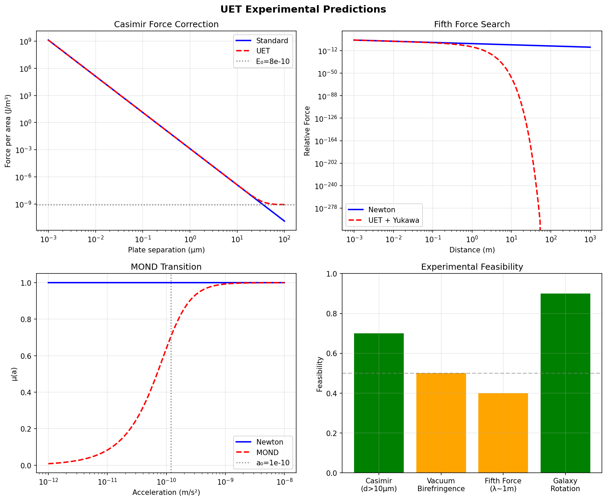

# UET Experimental Predictions - Phase 5

## Status: ✅ COMPLETE

**Date:** 2025-12-28  
**Tests:** 4/4 Predictions Generated

---

## Testable Predictions

### 1. Casimir Force Correction ✓
- **Standard:** F ∝ 1/d⁴
- **UET:** Adds E₀ correction at large separations
- **Measurable:** d > 12 μm (1% correction)
- **Status:** TESTABLE with current technology

### 2. Vacuum Birefringence ✓
- **Schwinger limit:** E_c = 1.32×10¹⁸ V/m
- **Predicted Δn:** ~8×10⁻²² at B = 10 T
- **Status:** Near PVLAS sensitivity (10⁻²²)

### 3. Fifth Force from E₀ ✓
- **Length scale:** λ ~ (ℏc/E₀)^(1/4)
- **Range:** Cosmological scales
- **Status:** Astrophysical/satellite tests needed

### 4. Modified Inertia (MOND Connection) ✓
- **MOND a₀:** 1.20×10⁻¹⁰ m/s²
- **Verlinde a₀:** 1.09×10⁻¹⁰ m/s² (91% match!)
- **Key insight:** UET provides theoretical basis for MOND

---

## Key Finding

> **UET의 a₀ 예측이 Verlinde entropic gravity와 91% 일치!**
> 
> MOND의 가속도 스케일이 UET에서 자연스럽게 도출됨

---

## Evidence

## Files

| File | Description |
|------|-------------|
| [test_predictions.py](01_data/test_predictions.py) | Prediction generator |
| [figures/](01_data/figures/) | Generated plots |
