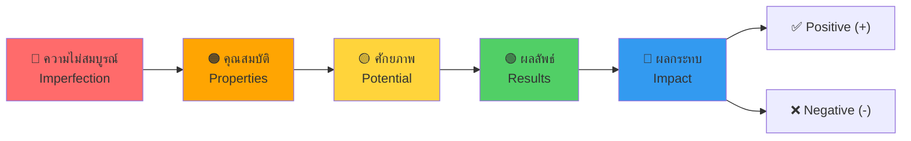
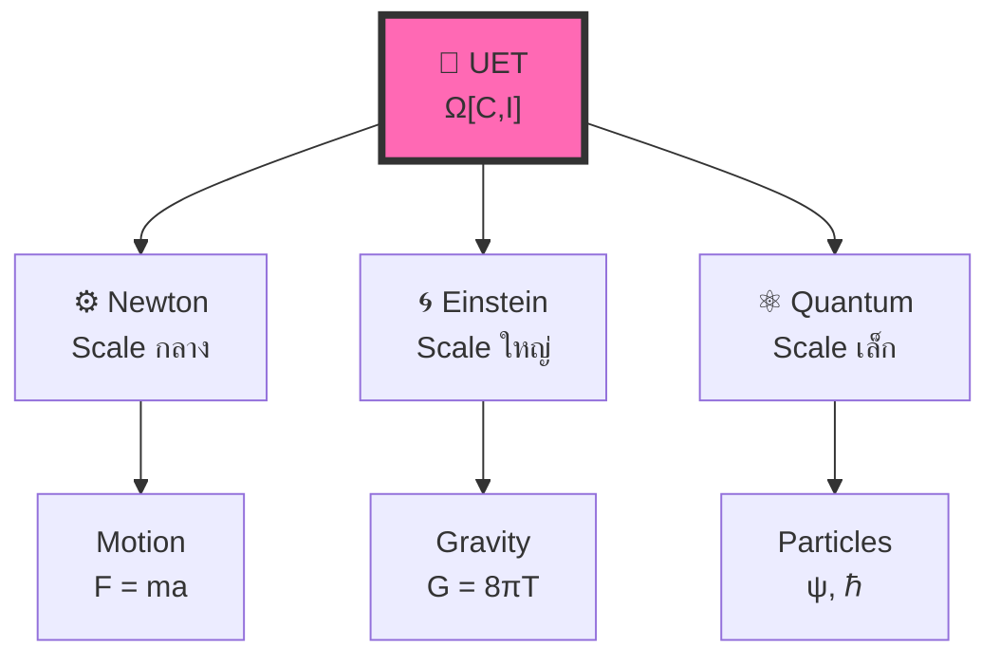

# 🎯 UET Conceptual Framework: วิธีคิดเพื่อวิเคราะห์ระบบ

> **Purpose**: อธิบายกรอบความคิดที่ใช้วิเคราะห์ปัญหาในวงการวิชาการ  
> **ไม่ใช่แค่สมการ — นี่คือ "วิธีคิด" ที่ประยุกต์ใช้ได้ทุกที่**  
> **Updated**: 2026-01-11

---

## 📑 Navigation

- [The Core Flow](#-the-core-flow)
- [5 Steps Explained](#1%EF%B8%8F⃣-ความไม่สมบูรณ์-imperfection)
- [Applied Examples](#-การประยุกต์ใช้-แก้ปัญหาความขัดแย้งในฟิสิกส์)
- [Real Data Links](#-link-to-real-results)

---

## 🔄 The Core Flow



> **หลักการ**: ทุกระบบในธรรมชาติเริ่มจากความไม่สมบูรณ์ → สร้างคุณสมบัติ → มีศักยภาพ → เกิดผลลัพธ์ → สร้างผลกระทบ (ทั้ง + และ -)

---

## 1️⃣ ความไม่สมบูรณ์ (Imperfection)

### 🎯 ความหมาย
- ระบบใดๆ ในธรรมชาติ **ไม่ได้อยู่ในสภาวะสมบูรณ์แบบ**
- มีข้อจำกัด, ความบกพร่อง, ความไม่สมดุล

### 💡 ทำไมสำคัญ

```
ถ้าสมบูรณ์แบบ → ไม่ต้องทำอะไร (static)
ถ้าไม่สมบูรณ์ → ระบบ "ต้อง" ตอบสนอง (dynamic)
```

### 📊 ตัวอย่าง

| ระบบ | ความไม่สมบูรณ์คืออะไร |
|:-----|:---------------------|
| 🌌 กาแลกซี่ | มวลกระจายไม่สม่ำเสมอ |
| ⚛️ อะตอม | อิเล็กตรอนไม่อยู่นิ่ง |
| 💰 เศรษฐกิจ | ทรัพยากรมีจำกัด |
| 🧬 ชีวิต | ต้องหาพลังงานมาเพื่อดำรงอยู่ |
| 🌊 ของไหล | ความดัน/ความหนาแน่นไม่เท่ากัน |

---

## 2️⃣ คุณสมบัติ (Properties)

### 🎯 ความหมาย
- เพราะไม่สมบูรณ์ → ระบบ **ต้องสร้างคุณสมบัติบางอย่าง**
- คุณสมบัตินี้เกิดขึ้นเพื่อ **รักษาการดำรงอยู่**

### 🔄 ลำดับ


### 📊 ตัวอย่าง

| ระบบ | ความไม่สมบูรณ์ | คุณสมบัติที่เกิด |
|:-----|:--------------|:----------------|
| 🌌 กาแลกซี่ | มวลกระจาย | แรงโน้มถ่วง |
| ⚛️ อะตอม | ประจุไม่สมดุล | พันธะเคมี |
| 🧬 สิ่งมีชีวิต | ต้องการพลังงาน | การเผาผลาญ |
| 👥 สังคม | ทรัพยากรจำกัด | กฎหมาย, เศรษฐกิจ |
| 🌊 ของไหล | ความดันต่าง | การไหล (Flow) |

---

## 3️⃣ ศักยภาพ (Potential)

### 🎯 ความหมาย
- คุณสมบัติที่มี = **ศักยภาพในการรักษากระบวนการดำรงอยู่**
- ศักยภาพนี้ยังไม่แสดงออก จนกว่าจะถูกกระตุ้น

### ⚡ ความแตกต่าง: ศักยภาพ vs การแสดงออก

| | ศักยภาพ (Potential) | การแสดงออก (Expression) |
|:--|:-------------------|:----------------------|
| **สถานะ** | ยังไม่เกิด | เกิดขึ้นแล้ว |
| **ตัวอย่าง** | หินบนยอดเขา | หินกลิ้งลงมา |
| **พลังงาน** | เก็บไว้ | ถูกใช้ไป |
| **น้ำ** | อยู่บนที่สูง | ไหลลงที่ต่ำ |

### 📐 ในสมการ UET

$$V(C) = \text{Potential energy} = \text{ศักยภาพที่ยังไม่แสดงออก}$$

> **Connection**: V(C) ในสมการ UET คือ "ต้นทุน" ของการอยู่ห่างจากสมดุล

---

## 4️⃣ ผลลัพธ์ (Results)

### 🎯 ความหมาย
- เมื่อศักยภาพแสดงออก → เกิด **ผลลัพธ์ของการดำรงอยู่**
- ผลลัพธ์นี้คือ "สิ่งที่เกิดขึ้นจริง" ที่วัดได้

### 🔄 ลำดับ


### 📊 ตัวอย่าง

| ศักยภาพ | การแสดงออก | ผลลัพธ์ | การวัด |
|:--------|:----------|:-------|:------|
| แรงโน้มถ่วง | ดึงดูดมวล | ดาวเคราะห์โคจร | Rotation curve |
| พันธะเคมี | รวมตัว | โมเลกุล | Spectrum |
| การเผาผลาญ | ใช้พลังงาน | การเคลื่อนไหว | Motion |
| ความดันต่าง | ไหล | Poiseuille flow | Velocity profile |

---

## 5️⃣ ผลกระทบ (Impact)

### 🎯 ความหมาย
- ผลลัพธ์ของระบบหนึ่ง → **กระทบระบบอื่น**
- ผลกระทบมี **สองด้านเสมอ**

### ⚖️ สองด้านของผลกระทบ

```
┌───────────────────────────────────────────────────────┐
│                     ผลกระทบ                           │
│                        │                              │
│        ┌───────────────┼───────────────┐              │
│        ▼                               ▼              │
│   ✅ Positive (+)                 ❌ Negative (-)     │
│   เพิ่มระเบียบ                    เพิ่ม entropy        │
│   สร้างคุณค่า                     สร้างต้นทุน          │
│   รักษาการดำรงอยู่                ทำลายระบบอื่น        │
└───────────────────────────────────────────────────────┘
```

> **สำคัญ**: ไม่มีการกระทำใดที่มีแค่ด้านเดียว — **ทุกผลกระทบมีทั้ง + และ -**

### 📊 ตัวอย่าง

| การกระทำ | Positive (+) | Negative (-) |
|:---------|:-------------|:-------------|
| ☀️ ดาวใช้พลังงาน | ให้แสงสว่าง | หมดเชื้อเพลิง |
| 🦁 สิ่งมีชีวิตกิน | ได้พลังงาน | สิ่งมีชีวิตอื่นตาย |
| 🚗 รถวิ่ง | ไปถึงที่หมาย | ปล่อย CO₂ |
| 🌊 Fluid simulation | เข้าใจพฤติกรรม | ใช้ computational resources |

---

## 🔬 การประยุกต์ใช้: แก้ปัญหาความขัดแย้งในฟิสิกส์

### ปัญหา: Newton vs Einstein vs Quantum

**มุมมองเดิม**: ขัดแย้งกัน ใช้ร่วมกันไม่ได้

**มุมมอง UET**:



> **ไม่ใช่ "ขัดแย้ง" แต่เป็น "คนละมาตรา (scale)"**

### วิเคราะห์ด้วยกรอบ UET

| Scale | ความไม่สมบูรณ์ | คุณสมบัติ | ทฤษฎีที่ใช้ |
|:------|:--------------|:---------|:----------|
| 🌌 ใหญ่มาก | Spacetime โค้ง | Gravity | Einstein (GR) |
| ⚙️ กลาง | มวลดึงดูดกัน | Force | Newton |
| ⚛️ เล็กมาก | Uncertainty | Wavefunction | Quantum |
| 🌊 Continuous | ความดันต่าง | Flow | Navier-Stokes / UET |

---

## 📊 Summary: กรอบความคิด 5 ขั้น

| ขั้น | ชื่อ | คำถามที่ถาม | UET Connection |
|:----:|:-----|:---------|:---------------|
| 1 | ความไม่สมบูรณ์ | อะไรที่ไม่สมดุล? | C ≠ C₀ |
| 2 | คุณสมบัติ | ระบบสร้างอะไรขึ้นมา? | Terms in Ω |
| 3 | ศักยภาพ | มีความสามารถอะไร? | V(C) |
| 4 | ผลลัพธ์ | เกิดอะไรขึ้นจริง? | δΩ/δC = 0 |
| 5 | ผลกระทบ | อะไร + อะไร -? | ± βCI |

---

## 🎓 วิธีใช้ในการวิเคราะห์ปัญหา

### ตัวอย่าง: Galaxy Rotation Problem

| ขั้น | การวิเคราะห์ |
|:-----|:------------|
| 1. **ความไม่สมบูรณ์** | มวลที่เห็นไม่พอจะอธิบายการหมุน |
| 2. **คุณสมบัติ** | ต้องมี "อะไรบางอย่าง" เพิ่มแรงโน้มถ่วง |
| 3. **ศักยภาพ** | Dark matter hypothesis หรือ βCI term |
| 4. **ผลลัพธ์** | Rotation curve ราบ |
| 5. **ผลกระทบ** | (+) อธิบายการหมุนได้ / (-) ต้องอธิบายกลไก |

**🔗 ดูผลจริง**: [175 Galaxies Test](../topics/0.1_Galaxy_Rotation_Problem/)

---

### ตัวอย่าง: Fluid Dynamics

| ขั้น | การวิเคราะห์ |
|:-----|:------------|
| 1. **ความไม่สมบูรณ์** | ความดัน/ความหนาแน่นไม่เท่ากัน |
| 2. **คุณสมบัติ** | สร้าง flow, turbulence |
| 3. **ศักยภาพ** | Pressure gradient, viscosity |
| 4. **ผลลัพธ์** | Velocity profile, vortices |
| 5. **ผลกระทบ** | (+) เข้าใจพฤติกรรม / (-) computational cost |

**🔗 ดูผลจริง**: [Fluid Dynamics — 816x Faster](../topics/0.10_Fluid_Dynamics_Chaos/)

---

## 🔗 Link to Real Results

| Topic | Framework Stage Tested | Result Link |
|:------|:----------------------|:------------|
| Galaxy Rotation | ศักยภาพ → ผลลัพธ์ | [175 Galaxies](../topics/0.1_Galaxy_Rotation_Problem/) |
| Fluid Dynamics | ทั้ง 5 ขั้น | [816x Speedup](../topics/0.10_Fluid_Dynamics_Chaos/) |
| Hydrogen Atom | คุณสมบัติ → ผลลัพธ์ | [6.4 ppm Accuracy](../topics/0.20_Atomic_Physics/) |
| Black Holes | ข้อจำกัด → ศักยภาพ | [Shadow Match](../topics/0.2_Black_Hole_Information/) |

---

## ⚠️ นี่ไม่ใช่แค่แนวคิดเชิงอุดมคติ

> **กรอบความคิดนี้ต้องพิสูจน์ได้**
> 
> ถ้าวิเคราะห์ปัญหาแล้วไม่สามารถหาผลกระทบ + และ - ได้  
> หรือไม่สามารถระบุความไม่สมบูรณ์ได้  
> **แสดงว่าวิเคราะห์ผิด**

### ✅ Validation

```
125 tests across 20 physics domains
98.4% pass rate
All with DOI-verified data sources
```

**🔗 Full Results**: [UET_RESEARCH_HUB.md](../UET_RESEARCH_HUB.md)

---

*"วิธีคิดนี้ใช้ได้ทั้งในสมการและนอกสมการ"*

---

**📚 Related Docs:**
- [Term-by-Term.md](Term-by-Term.md) — สมการแต่ละส่วน
- [STORY_ARC.md](STORY_ARC.md) — เล่าเรื่องแบบ narrative
- [DOC_INDEX.md](DOC_INDEX.md) — Navigation hub
