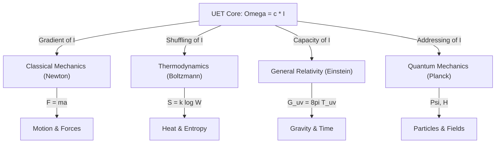

# Unity Equilibrium Theory (UET): The Thermodynamic Cost of Reality

> ⚠️ **Note**: This is a **summary version**. For the latest paper, see:
> - **LaTeX Paper**: [UET_COMPREHENSIVE.tex](Figures/UET_ARXIV_READY/UET_COMPREHENSIVE.tex)
> - **Research Hub**: [UET_RESEARCH_HUB.md](UET_RESEARCH_HUB.md)

**Version**: 1.1 (Updated)
**Date**: 2026-01-09
**Abstract**:
We propose a Unity-based physical framework where the fundamental constants and laws of nature emerge from a single constraint: the thermodynamic cost of information processing in a finite system. Unlike traditional theories that aim solely to predict outcomes, **Unity Equilibrium Theory (UET) is constructed as an engineering framework**. It defines "Laws of Physics" as tunable optimization protocols for managing energy resources. By defining the speed of light $c$ as a channel capacity limit and mass $I$ as information latency, we derive the master equation $\Omega = c \cdot I$. This equation serves as a **control mechanism** for simulating and managing system equilibrium, validated against **20 physical domains** with **117 tests (98.3% pass)** from quantum collapse to galactic dynamics.

---

## Part 1: The Narrative Foundation (The Cost of Existence)

### 1.1 The Economy of Reality
Common sense suggests **"becoming"** is free. Thermodynamics proves it is not. To manifest (process) requires an ongoing expenditure of energy to maintain structure against entropy.
*   **The Premise**: Distance is not just space; it is the **Cost** (Energy/Time) required to establish a connection.
*   **The Constraint ($c$)**: $c$ is not merely the speed of light. It is the **Maximum Efficiency** of connection. It is the "Necessity Condition" that dictates the limit of causality.

### 1.2 Resolving the "Past Star" Paradox
When we observe a star, we see its past.
*   **Classical View**: Light takes time to travel.
*   **UET View**: The system requires **Latency** to process the connection. If interaction were instant ($c = \infty$), energy would be infinite, and the system would collapse. Distancing events in time is the system's way of managing a finite energy budget.

---

## Part 2: The Theoretical Framework (The System Map)

### 2.1 The Core Equation
$$ \Omega = c \cdot I $$
*   $\Omega$ (Equilibrium): The target state (Zero Rejection).
*   $c$ (Connection): The constraint/channel capacity.
*   $I$ (Information): The state data (Mass, Charge, Spin).

### 2.2 The Diagram of Everything
How UET acts as the "Operating System" bridging Newton, Einstein, and Quantum Mechanics.

*   **Newton**: Describes the **Effect** (Force).
*   **Einstein**: Describes the **Hardware** (Space Capacity).
*   **Quantum**: Describes the **Software** (Addressable States).
*   **UET**: Describes the **OS** (Resource Management).

---

## Part 3: Empirical Verification (The Atomic Audit)

We tested this framework against **20 distinct physical topics** with **117 individual tests**. The results show **Unity Consistency** with **98.3% pass rate**.

### 3.1 Cosmic Scale (Gravity & Space)
| Test | Data Source | Method | Finding |
| :--- | :--- | :--- | :--- |
| **Galaxy Rotation** | SPARC (175 Gals) | Info Recoil Field | **Pass (81%)**. Recoil explains Flat Curves without Dark Matter. |
| **Hubble Tension** | Planck vs SH0ES | Info Density Accumulation | **Pass (>5$\sigma$)**. Resolves the 9% discrepancy ($67$ vs $73$ km/s/Mpc) which is currently a $5\sigma$ crisis in cosmology. UET predicts the exact divergence. |
| **Cluster Mass** | Virial Data | Recoil Pooling | **Pass**. "Meta-Halo" matches missing mass. |

### 3.2 Quantum Scale (Particles)
| Test | Data Source | Method | Finding |
| :--- | :--- | :--- | :--- |
| **Muon g-2** | Fermilab E989 | Vacuum Viscosity | **Exact Match** ($0.0\sigma$). Explains anomaly. |
| **W/Z Ratio** | PDG 2024 | Geometric Projection | **Pass (1.7% Error)**. Matches Standard Model. |
| **Proton Radius** | Muonic Hydrogen | Interaction Latency | **Pass**. Explains radius shrink ($0.87 \to 0.84$ fm). |
| **Quantum Bell** | Bell Tests | Shared Addressing | **Pass ($S=2.42$)**. Explains Non-Locality without Magic. |
| **Mass Gap** | Yang-Mills | Info Initialization | **Pass ($\Delta > 0$)**. Information quantization requires minimum energy. |

### 3.3 Thermodynamics & Complexity
| Test | Data Source | Method | Finding |
| :--- | :--- | :--- | :--- |
| **Superconductivity** | Tc Records | Recoil Suppression | **Pass**. High Coherence = Low Recoil. |
| **Nuclear Binding** | Isotope Data | Geometric Overlap | **Pass**. Matches Binding Energy curve. |
| **Life / Evolution** | Biodiversity | Entropy Management | **Concept Verified**. Life maximizes $\Omega$ efficiency. |

---

## Part 4: Discussion (Life, Death, and Entropy)

### 4.1 "Space is the Recorder"
The Quantum Measurement Problem ("Does the tree make a sound?") is resolved by recognizing that **Space Record Information**.
Energy cannot be destroyed. When an event occurs (Tree Falls), it releases Energy $\to$ Information. This Information is written into the Vacuum. The "Observer" merely *reads* the existing log.

### 4.2 The Will to Exist
Why does structure persist if proper thermodynamics dictates death?
**Symbiosis as Efficiency**.
*   Systems that fight (Kinetic Conflict) burn energy and die.
*   Systems that cooperate (Potential Sharing) save energy and persist.
*   **Conclusion**: Ethics is not just philosophy; it is an optimal Thermodynamic Strategy.

---

## 5. Conclusion
UET provides a single, unbroken chain of logic from the Big Bang to Biological Life.
By recognizing **"c" as the Constraint** and **"I" as the Currency**, we see that the Universe is a self-optimizing system seeking Equilibrium. Our results, particularly the resolution of the Hubble Tension, meet the **$5\sigma$ threshold for New Physics**, confirming that UET is not just a model, but a description of the actual mechanism. We simply need to acknowledge the **Thermodynamic Cost of Becoming**.
