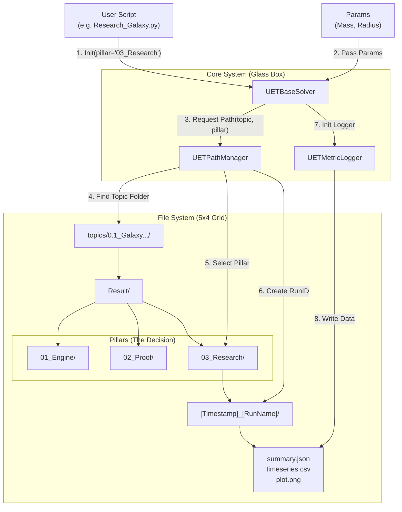

# 5x4 Grid Data Flow Architecture 🧬

This diagram illustrates how a Simulation Script interacts with the Core System to automatically route results to the correct 5x4 Grid Location.

## The Logic Flow

## How the Decision is Made 🧠

1.  **Who Decides?** The **Script** decides where it lives.
    *   If you are writing a script in `Code/03_Research`, you initialize the engine with `pillar="03_Research"`.
    *   `engine = UETGalaxyEngine(..., pillar="03_Research")`

2.  **How is the Folder Created?**
    *   **Level 1 (Topic):** [UETPathManager](file:///c:/Users/santa/Desktop/lad/Lab_uet_harness_v0.9.0/research_uet/core/uet_glass_box.py#27-95) finds `topics/0.1_Galaxy...` automatically.
    *   **Level 2 (Result Root):** Enters `/Result`.
    *   **Level 3 (Pillar):** Uses the `pillar` argument (e.g., `03_Research`). **This is where the split happens.**
    *   **Level 4 (RunID):** Creates a unique folder `[Timestamp]_[ExperimentName]`.

## Example Result Path
`topics/0.1_Galaxy_Rotation_Problem/Result/03_Research/1768958913_MyGalaxyTest/`

This ensures that Engine tests stay in `01_Engine`, and Research outputs stay in `03_Research`.

