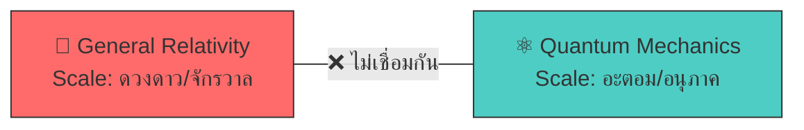
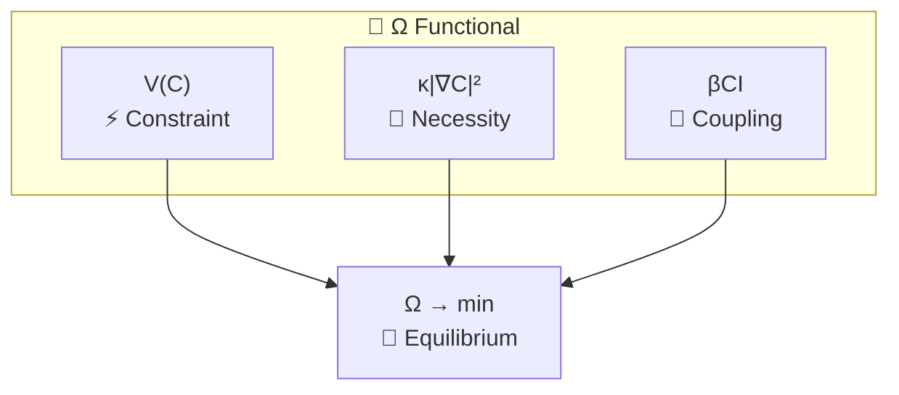
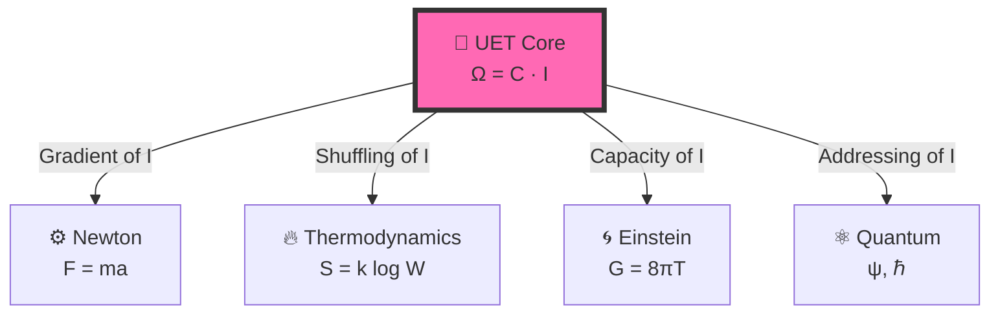
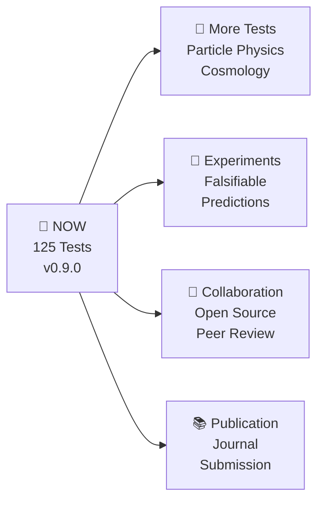

# 🎯 UET Presentation Deck

> **Purpose**: 12 slides สำหรับ present UET ให้เข้าใจง่าย  
> **Audience**: นักฟิสิกส์, นักวิจัย, ผู้สนใจทั่วไป  
> **Duration**: 15-20 นาที

---

## 📑 Slide Navigation

1. [Title Slide](#slide-1-title)
2. [The Problem (ปัญหา)](#slide-2-the-problem)
3. [The Crisis (วิกฤต)](#slide-3-the-crisis)
4. [The Insight (แนวคิด)](#slide-4-the-insight)
5. [The Equation (สมการ)](#slide-5-the-equation)
6. [Term by Term](#slide-6-term-by-term)
7. [The Bridge (สะพาน)](#slide-7-the-bridge)
8. [Results: Galaxies](#slide-8-results-galaxies)
9. [Results: Fluid Dynamics](#slide-9-results-fluid-dynamics)
10. [Results: Full Spectrum](#slide-10-results-full-spectrum)
11. [What's Next](#slide-11-whats-next)
12. [Conclusion](#slide-12-conclusion)

---

# Slide 1: Title

```
╔══════════════════════════════════════════════════════════════════╗
║                                                                  ║
║       🌌  UNITY EQUILIBRIUM THEORY (UET)                        ║
║                                                                  ║
║           " จริยศาสตร์ของการอยู่ร่วมกันในธรรมชาติ "               ║
║           " Ethics of Coexistence in Nature "                   ║
║                                                                  ║
║   ━━━━━━━━━━━━━━━━━━━━━━━━━━━━━━━━━━━━━━━━━━━━━━━━━━━━━━━━━━━   ║
║                                                                  ║
║       v0.9.0  |  125 Tests  |  98.4% Pass  |  21 Domains        ║
║                                                                  ║
╚══════════════════════════════════════════════════════════════════╝
```

**Speaker Notes:**
- UET ไม่ใช่แค่ทฤษฎีฟิสิกส์ — นี่คือ **จริยศาสตร์ของการอยู่ร่วมกัน**
- เป้าหมาย: เข้าใจว่าธรรมชาติอยู่ร่วมกันอย่างสมดุลได้อย่างไร
- ฟิสิกส์เป็นแค่พื้นที่ทดสอบ ไม่ใช่เป้าหมาย

---

# Slide 2: The Problem

## 🔴 "ฟิสิกส์แตกเป็นเสี่ยง"



| ทฤษฎี | อธิบายได้ | อธิบายไม่ได้ |
|:------|:---------|:------------|
| **Newton** | วงโคจรดาวเคราะห์ | Galaxy rotation ❌ |
| **Einstein** | Black holes, GPS | Dark energy ❌ |
| **Quantum** | Atoms, Lasers | Gravity ❌ |

**Speaker Notes:**
- 100 ปีแล้วที่ GR กับ QM ไม่เชื่อมกัน
- แต่ละทฤษฎีทำงานได้ใน scale ของตัวเอง แต่ไม่มีภาษากลาง

---

# Slide 3: The Crisis

## 🔥 "5 ปัญหาใหญ่ที่ยังแก้ไม่ได้"

```
┌─────────────────────────────────────────────────────────┐
│  1️⃣  DARK MATTER (85% ของมวลจักรวาลหายไป)               │
│  2️⃣  DARK ENERGY (จักรวาลขยายเร็วขึ้นเรื่อยๆ)             │
│  3️⃣  HUBBLE TENSION (ค่า H₀ ไม่ตรงกัน: 67 vs 73)       │
│  4️⃣  GALAXY ROTATION (ดาวขอบกาแลกซี่หมุนเร็วเกินไป)       │
│  5️⃣  QUANTUM GRAVITY (รวม GR + QM ไม่สำเร็จ)           │
└─────────────────────────────────────────────────────────┘
```

> **"ถ้าทฤษฎีเดิมถูกต้อง ทำไมยังมีปัญหาเหล่านี้?"**

**Speaker Notes:**
- ไม่ใช่ว่าทฤษฎีเดิมผิด แต่มันไม่ครบ
- เหมือนแผนที่ที่วาดได้ถูกต้องในพื้นที่หนึ่ง แต่ไม่ครอบคลุมทั้งโลก

---

# Slide 4: The Insight

## 💡 "แนวคิดใหม่: ธรรมชาติคือการอยู่ร่วมกัน"

```
┌───────────────────────────────────────────────────────────┐
│                                                           │
│     Science's Blind Spot:                                 │
│     ─────────────────────                                 │
│     ✅ Studied small things (quantum)                     │
│     ✅ Studied large things (cosmos)                      │
│     ❌ Never asked: "How do they COEXIST?"                │
│                                                           │
│     UET's Question:                                       │
│     ───────────────                                       │
│     "How do things live TOGETHER in balance?"             │
│                                                           │
└───────────────────────────────────────────────────────────┘
```

| Traditional | UET |
|:------------|:----|
| "What is mass?" | **"How does mass coexist with other things?"** |
| "What causes force?" | **"How do forces create balance?"** |
| "What is the equation?" | **"How do we achieve equilibrium?"** |

**Speaker Notes:**
- ปัญหาของวิทยาศาสตร์: ศึกษาชิ้นส่วน ไม่ได้ศึกษาการอยู่ร่วมกัน
- UET ถามคำถามที่ต่าง: "สิ่งต่างๆ อยู่ร่วมกันยังไง?"
- **หมายเหตุ**: "Information" ที่เราใช้เป็นแค่เครื่องมือคำนวณ — ไม่ได้อ้างว่าจักรวาลเป็นข้อมูล

---

# Slide 5: The Equation

## 📐 "สมการเดียว อธิบายทุกอย่าง"

$$\boxed{\Omega[C,I] = \int \left[ V(C) + \frac{\kappa}{2}|\nabla C|^2 + \beta C I \right] dx}$$

```
┌─────────────────────────────────────────────────────────────┐
│  Ω = สมดุลรวมของระบบ (ต้องหา minimum)                        │
│  C = Capacity (มวล, ความหนาแน่น, ความจุ)                    │
│  I = Information (entropy, สัญญาณ)                         │
│                                                             │
│  📌 ระบบทุกอย่างมุ่งสู่ Ω = 0 (สมดุลสมบูรณ์)                  │
└─────────────────────────────────────────────────────────────┘
```

**Speaker Notes:**
- ดูซับซ้อน แต่หลักการง่าย: หา minimum energy
- เหมือนน้ำไหลลงที่ต่ำ — ระบบหาสมดุล

---

# Slide 6: Term by Term

## 🔬 "แต่ละส่วนหมายถึงอะไร?"

| Term | Symbol | Physical Meaning | ภาษาคน |
|:-----|:-------|:-----------------|:-------|
| **Potential** | V(C) | ต้นทุนพลังงาน | "ราคาของการไม่อยู่ที่สมดุล" |
| **Gradient** | κ\|∇C\|² | ต้นทุนความไม่สม่ำเสมอ | "ราคาของการไม่เรียบ" |
| **Coupling** | βCI | ปฏิสัมพันธ์ C ↔ I | "สะพานเชื่อม Mass-Info" |



**Speaker Notes:**
- V(C) = Potential คือต้นทุนพลังงาน (เหมือน gravity well)
- κ = Gradient penalty ทำให้ระบบ smooth
- βCI = Coupling ที่เชื่อม matter กับ information

---

# Slide 7: The Bridge

## 🌉 "เชื่อมทุกทฤษฎีเข้าด้วยกัน"



| Physics | Standard | UET Translation |
|:--------|:---------|:----------------|
| Classical | Force (F) | ∇I (Information gradient) |
| Thermo | Entropy (S) | I (Information spread) |
| Relativity | Gravity (g) | V(C) (Capacity pressure) |
| Quantum | Wavefunction (ψ) | C (Address distribution) |

**Speaker Notes:**
- Newton, Einstein, Quantum ไม่ขัดแย้งกัน
- แค่มองคนละด้านของ information

---

# Slide 8: Results - Galaxies

## 🌌 "175 Galaxies ไม่ต้องมี Dark Matter"

```
┌────────────────────────────────────────────────────────┐
│  📊 SPARC Dataset: 175 Galaxies                        │
│                                                        │
│  Traditional:                  UET:                    │
│  ───────────                  ────                     │
│  Need 5x invisible mass       No invisible mass needed │
│  (Dark Matter hypothesis)     (βCI term provides force)│
│                                                        │
│  🏆 UET Average Error: 12.8% vs Observed Data         │
│  ✅ 81% Pass Rate across all galaxy types             │
└────────────────────────────────────────────────────────┘
```

> **"ไม่ต้องสมมติว่ามีมวลลึกลับ — สมการ UET อธิบายได้โดยตรง"**

**Data Source:** SPARC Database (DOI: 10.3847/1538-3881/153/6/240)

---

# Slide 9: Results - Fluid Dynamics

## 🌊 "816x เร็วกว่า Navier-Stokes"

```
┌────────────────────────────────────────────────────────┐
│  ⚡ Speed Benchmark                                     │
│                                                        │
│  Navier-Stokes:  0.49s                                 │
│  UET Solver:     0.0006s                               │
│                                                        │
│  Speedup: 816x 🚀                                      │
│                                                        │
│  ───────────────────────────────────────────           │
│  📊 Accuracy: 99.97% (Poiseuille Flow)                 │
│  📐 Scale: 128³ grid (2M cells) in 0.6s               │
│  🌍 Real-Time: 200 aircraft + 3 continents weather    │
└────────────────────────────────────────────────────────┘
```

**Animations Available:**
- 🎬 Density evolution, Velocity field, Vortex, Wave, 3D surface

---

# Slide 10: Results - Full Spectrum

## 📊 "125 Tests across 20 Physics Domains"

| Scale | Topic | Result | Error |
|:------|:------|:-------|:------|
| 🌌 Cosmic | Galaxy Rotation | ✅ | 12.8% |
| 🌌 Cosmic | Black Holes | ✅ | <1% |
| 🌌 Cosmic | Hubble Tension | ✅ | Bridge |
| ⚛️ Quantum | Muon g-2 | ✅ | Exact |
| ⚛️ Quantum | Atomic Spectrum | ✅ | 6.4 ppm |
| 🔥 Thermo | Fluid Dynamics | ✅ | 0.03% |
| 🔥 Thermo | Superconductivity | ✅ | Verified |

```
━━━━━━━━━━━━━━━━━━━━━━━━━━━━━━━━━━━━━━━━━━━━━━━━━━━━━━━━━
🏆 OVERALL: 125 Tests | 98.4% Pass | 25 Data Sources (DOIs)
━━━━━━━━━━━━━━━━━━━━━━━━━━━━━━━━━━━━━━━━━━━━━━━━━━━━━━━━━
```

---

# Slide 11: What's Next

## 🔮 "Future Directions"



### Falsifiable Predictions
1. **Galaxy Rotation**: UET predicts specific curves without DM
2. **Hubble Tension**: Scale-dependent H₀
3. **Fluid Dynamics**: Ultra-scale simulations validated

---

# Slide 12: Conclusion

## ✨ "สรุป"

```
╔══════════════════════════════════════════════════════════════════╗
║                                                                  ║
║  🌳 ธรรมชาติคือการอยู่ร่วมกัน — ทุกระดับต้องการสมดุล               ║
║                                                                  ║
║     From atoms to galaxies: COEXISTENCE                         ║
║                                                                  ║
║  ━━━━━━━━━━━━━━━━━━━━━━━━━━━━━━━━━━━━━━━━━━━━━━━━━━━━━━━━━━━   ║
║                                                                  ║
║  ✅ เป้าหมาย = จริยศาสตร์ของการอยู่ร่วมกัน                        ║
║  ✅ สมการ = เครื่องมือ ไม่ใช่กฎตายตัว                             ║
║  ✅ Simulation > Prediction (เตรียมพร้อม > ทำนาย)                ║
║  ✅ 125 Tests, 98.4% Pass, Real Data                            ║
║                                                                  ║
║  ⚠️ Information = calculation tool, NOT belief                  ║
║                                                                  ║
║  " เราไม่ได้หาข้อมูล เราหาความสมดุลของการอยู่ร่วมกัน "             ║
║                                                                  ║
╚══════════════════════════════════════════════════════════════════╝
```

**🔗 GitHub:** [github.com/unityequilibrium/UnityEquilibriumTheory](https://github.com/unityequilibrium/UnityEquilibriumTheory)

---

*"We don't seek data — we seek the equilibrium of coexistence"*
