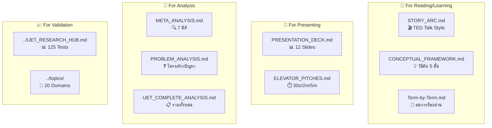

# 📚 UET Documentation Index

> **Purpose**: Master navigation hub for all UET conceptual documentation  
> **Updated**: 2026-01-13  
> **Total Docs**: 17 files across 4 categories

---

## 🗂️ Quick Navigation



---

## 🌱 Category 0: Conceptual Foundation (อ่านก่อน!)

> ⚠️ **สำคัญมาก**: อ่านหมวดนี้ก่อนอ่านสมการหรือผลทดสอบใดๆ

| Doc | Purpose | Best For | Time |
|:----|:--------|:---------|:-----|
| [🌳 CONCEPTUAL_FOUNDATION.md](CONCEPTUAL_FOUNDATION.md) | **เป้าหมายที่แท้จริง + คำเตือน** | ทุกคน | 5 min |
| [📝 AUTHOR_REFLECTION.md](AUTHOR_REFLECTION.md) | **ความโปร่งใส + AI+Human** | ทุกคน | 3 min |
| [🤝 WHY_UNITY.md](WHY_UNITY.md) | ทำไมชื่อ "Unity" + ปัญหาของวิทยาศาสตร์ | ทุกคน | 5 min |
| [🔮 PREDICTION_VS_SIMULATION.md](PREDICTION_VS_SIMULATION.md) | ทำไมการทำนายไร้สาระ | Open for debate | 5 min |
| [🔑 KEY_CONCEPTS.md](KEY_CONCEPTS.md) | **4 คำหลัก: Entity/Field/Force/Equilibrium** | ทุกคน | 5 min |
| [🌐 DOMAIN_MAPPING.md](DOMAIN_MAPPING.md) | **C/I ในแต่ละสาขา (6 domains)** | Cross-domain | 5 min |
| [💎 VALUE_EQUATION.md](VALUE_EQUATION.md) | **𝒱 = -ΔΩ — สมการ Value** | Core concept | 5 min |
| [📈 KAPPA_GUIDE.md](../core/KAPPA_GUIDE.md) | **κ varies by scale = physics!** | Parameters | 5 min |

---

## 📖 Category 1: Learning Materials

| Doc | Purpose | Best For | Time |
|:----|:--------|:---------|:-----|
| [🎬 STORY_ARC.md](STORY_ARC.md) | TED Talk narrative เล่าเรื่อง | First-time learners | 15-20 min |
| [💡 CONCEPTUAL_FRAMEWORK.md](CONCEPTUAL_FRAMEWORK.md) | วิธีคิด 5 ขั้น: Imperfection→Impact | Understanding the "why" | 10 min |
| [🔬 Term-by-Term.md](Term-by-Term.md) | แต่ละ term ในสมการ | Technical understanding | 10 min |

### 🎯 Recommended Reading Order

```
0️⃣ CONCEPTUAL_FOUNDATION.md ► เข้าใจเป้าหมายที่แท้จริง ⭐ (อ่านก่อน!)
           │
           ▼
1️⃣ WHY_UNITY.md ────────────────► ทำไมชื่อทฤษฎีนี้
           │
           ▼
2️⃣ STORY_ARC.md ────────────────► ทำความเข้าใจภาพรวม
           │
           ▼
3️⃣ CONCEPTUAL_FRAMEWORK.md ─────► เข้าใจวิธีคิด
           │
           ▼
4️⃣ Term-by-Term.md ─────────────► เข้าใจสมการ
```

---

## 🎤 Category 2: Presentation Materials

| Doc | Purpose | Best For | Formats |
|:----|:--------|:---------|:--------|
| [📊 PRESENTATION_DECK.md](PRESENTATION_DECK.md) | 12 slides สำหรับ present | Talks, Seminars | Visual |
| [⏱️ ELEVATOR_PITCHES.md](ELEVATOR_PITCHES.md) | Quick explanations | Networking, Pitches | 30s, 2m, 5m |

### 🎯 Which Format to Use

| Situation | Use This |
|:----------|:---------|
| Conference presentation | PRESENTATION_DECK.md |
| Casual conversation | ELEVATOR_PITCHES.md (30s) |
| Job interview | ELEVATOR_PITCHES.md (2m) |
| Workshop introduction | STORY_ARC.md + PRESENTATION_DECK.md |
| Written article | STORY_ARC.md |

---

## 📐 Category 3: Analytical Materials

| Doc | Purpose | Best For | Depth |
|:----|:--------|:---------|:------|
| [🔍 META_ANALYSIS.md](META_ANALYSIS.md) | วิเคราะห์ 7 มิติ ของทุกทฤษฎี | Researchers | Deep |

> 📁 **Legacy**: [PROBLEM_ANALYSIS.md](legacy_reports/PROBLEM_ANALYSIS.md), [UET_COMPLETE_ANALYSIS.md](legacy_reports/UET_COMPLETE_ANALYSIS.md) — ย้ายไป `legacy_reports/`

### 🎯 When to Use Which

| Task | Use This |
|:-----|:---------|
| Understanding why theory X failed at Y | META_ANALYSIS.md |
| Comprehensive theory comparison | META_ANALYSIS.md |

---

## 📈 Category 4: Validation & Data

| Resource | Description | Link |
|:---------|:------------|:-----|
| 📊 **Research Hub** | 125 tests, 20 domains, all results | [UET_RESEARCH_HUB.md](../UET_RESEARCH_HUB.md) |
| 🔬 **Topics Directory** | All 20 physics domains | [topics/](../topics/) |
| 📜 **Data Source Map** | 25 sources with DOIs | [DATA_SOURCE_MAP.md](../DATA_SOURCE_MAP.md) |
| ⚡ **Fluid Dynamics** | 816x speedup, animations | [0.10_Fluid_Dynamics](../topics/0.10_Fluid_Dynamics_Chaos/) |
| 🌌 **Galaxy Rotation** | 175 galaxies | [0.1_Galaxy_Rotation](../topics/0.1_Galaxy_Rotation_Problem/) |

---

## 🔑 Key Concepts Quick Reference

### The Equation

$$\Omega[C,I] = \int \left[ V(C) + \frac{\kappa}{2}|\nabla C|^2 + \beta C I \right] dx$$

### Term Quick Reference

| Term | Symbol | What It Does |
|:-----|:-------|:-------------|
| **Potential** | V(C) | Cost of being out of balance |
| **Gradient** | κ\|∇C\|² | Cost of being uneven |
| **Coupling** | βCI | Bridge between mass and info |

### Key Results

| Highlight | Value |
|:----------|:------|
| Total Tests | 125 |
| Pass Rate | 98.4% |
| Galaxies Explained | 175 (no dark matter) |
| Fluid Speedup | 816x |
| Physics Domains | 20 |

---

## 🔗 External Links

| Resource | URL |
|:---------|:----|
| **GitHub** | [github.com/unityequilibrium/UnityEquilibriumTheory](https://github.com/unityequilibrium/UnityEquilibriumTheory) |
| **SPARC Data** | [astroweb.cwru.edu/SPARC](http://astroweb.cwru.edu/SPARC/) |
| **NIST ASD** | [physics.nist.gov/asd](https://physics.nist.gov/asd) |

---

## 📁 File Structure

```
research_uet/Doc/
├── 📚 DOC_INDEX.md          ← You are here
│
├── 📖 Learning
│   ├── STORY_ARC.md
│   ├── CONCEPTUAL_FRAMEWORK.md
│   └── Term-by-Term.md
│
├── 🎤 Presentation
│   ├── PRESENTATION_DECK.md
│   └── ELEVATOR_PITCHES.md
│
├── 📐 Analysis
│   ├── META_ANALYSIS.md
│   ├── PROBLEM_ANALYSIS.md
│   └── UET_COMPLETE_ANALYSIS.md
│
└── 📂 handbook/             ← Technical handbooks
    ├── UET_EQUATION_HANDBOOK.md
    ├── UET_PHYSICS_BRIDGE.md
    └── ...
```

---

*"Documentation is not about explaining. It's about enabling understanding."*

---

**Last Updated**: 2026-01-11  
**Maintainer**: UET Research Team
