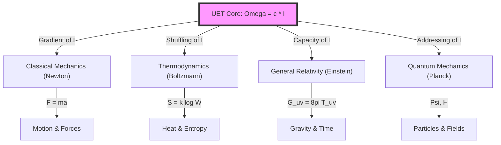
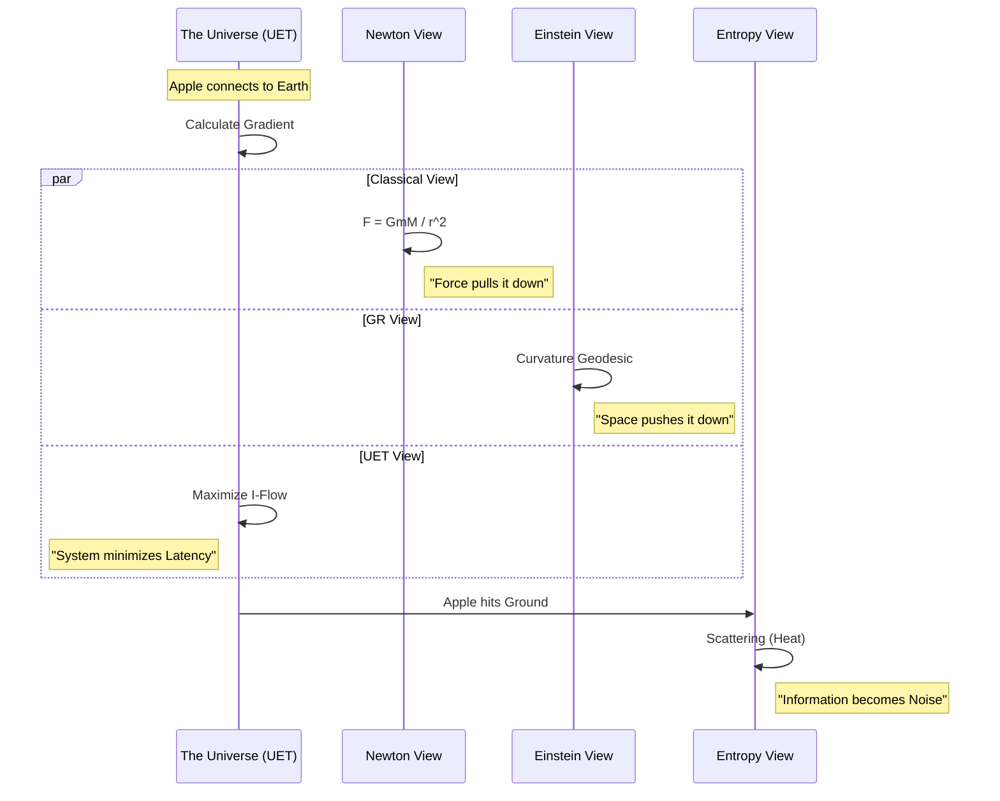

# UET Theory Map v2.1: The Complete Universe
**Purpose**: To visualize the connection between UET and **ALL** pillars of physics (Classical, Crypto/Thermo, Relativity, Quantum).

---

## 1. The Tree of Physics
UET ($\Omega = c \cdot I$) is the Root. All other theories are branches describing specific behaviors of Information Processing.

---

## 2. Concept Translation Dictionary
How "Normal World" concepts translate to "UET Information" concepts.

| Domain | Standard Concept | UET Translation | Why it matches? |
| :--- | :--- | :--- | :--- |
| **Classical** | **Force** ($F$) | **Information Gradient** ($\nabla I$) | Things move to where Information Density is lower (High $P$ to Low $P$). |
| **Classical** | **Inertia** ($m$) | **Update Latency** ($\tau$) | Heavy objects take more cycles to update position. |
| **Classical** | **Action** ($S$) | **Total Cost** | Sum of all energy usage over time. Min $S$ = Min Cost. |
| **Classical** | **Lagrangian** ($L$) | **Efficiency Rate** | How well the system balances Kinetic vs. Potential. |
| **Thermo** | **Entropy** ($S$) | **Address Scrambling** | Lost order = Harder to find the address. |
| **Thermo** | **Heat** ($Q$) | **Write Noise** | Energy released when bits are flipped. |
| **Relativity** | **Gravity** ($g$) | **Capacity Pressure** | Saturation of storage bends the path. |
| **Quantum** | **Wave** ($\Psi$) | **Search Alg** | System checking all possible addresses. |
| **Quantum** | **Collapse** | **Found Address** | System locks onto one ID. |
| **Quantum** | **Mass Gap** | **Initialization Cost** | $I_{min}$ requires energy $>0$ to exist. |
| **Cosmology** | **Volume** ($V$) | **Total Equilibrium** ($\Omega_{total}$) | $V$ is the capacity of the Universe. Max $\Omega$ requires Max $V$. |

---

## 3. The Unity System Flowchart
How the Universe processes a single event (e.g., an apple falling).

## 4. Why no Contradiction?
*   **Classical Physics** describes the **Result** (The apple fell).
*   **UET** describes the **Reason** (Why it fell: To balance Information Density).
*   They are compatible because Mechanism ($F=ma$) $\neq$ Origin ($\nabla I$).

## 5. The Critical Variable: Volume ($V$)
The user has identified that **Volume is the Key**.
*   **$V = \Omega_{Total}$ (The Big Omega)**
*   The Universe expands (increasing $V$) because it seeks to maximize its Total Equilibrium ($\Omega$).
*   **Expansion is not a force; it is a Requirement.** To store more Information ($I$) without overheating (Efficiency), the System *must* increase its storage capacity ($V$).
*   **Result**: $V \propto \sum \Omega$. We are living in a growing hard drive.

---

## 🔗 Related Documents

| Document | Description |
|:---------|:------------|
| [KAPPA_GUIDE.md](core/KAPPA_GUIDE.md) | Why κ varies by scale (3 regimes) |
| [PHILOSOPHICAL_FOUNDATION.md](Doc/PHILOSOPHICAL_FOUNDATION.md) | Core philosophy — "UET = Ethics of Coexistence" |
| [EXPLANATION_STRATEGY.md](EXPLANATION_STRATEGY.md) | Thermodynamic narrative approach |
| [Term-by-Term.md](Doc/Term-by-Term.md) | Detailed equation breakdown |
| [AUTHOR_REFLECTION.md](Doc/AUTHOR_REFLECTION.md) | AI+Human collaboration transparency |

