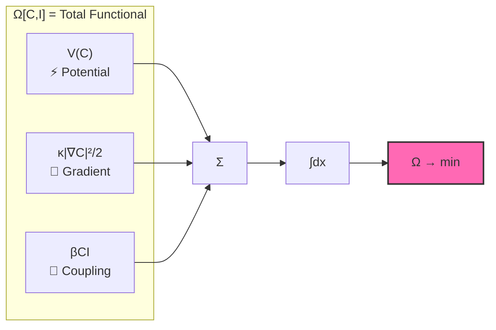
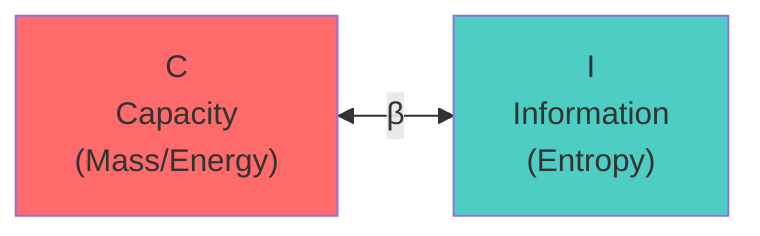
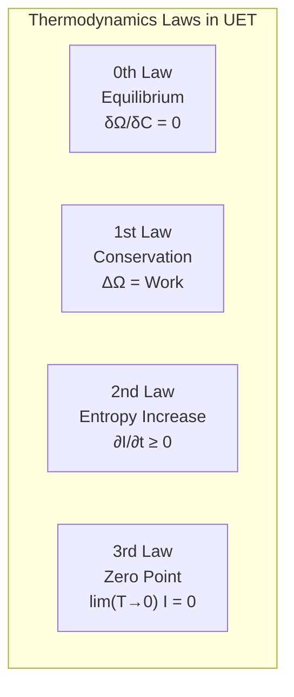

# 🔬 UET Master Equation: Term-by-Term Physical Interpretation

> **Purpose**: อธิบายแต่ละ term ในสมการว่าหมายถึงอะไรในโลกจริง  
> **⚠️ หมายเหตุ**: "Information" ที่ใช้เป็นแค่ **เครื่องมือคำนวณ** — ไม่ได้อ้างว่าจักรวาลเป็นข้อมูล  
> **เป้าหมายที่แท้จริง**: เข้าใจ **ความสมดุลของการอยู่ร่วมกัน** ในธรรมชาติ  
> **Updated**: 2026-01-13

---

## 📑 Navigation

- [The Master Equation](#-the-master-equation)
- [Term 1: V(C)](#-term-1-vc--potential-ข้อจำกัด)
- [Term 2: κ|∇C|²](#-term-2-κc²--gradient-penalty-ความจำเป็น)
- [Term 3: βCI](#-term-3-βci--coupling-เงื่อนไข)
- [Real System Examples](#-reading-the-equation-in-real-systems)
- [Validation Links](#-validation-links)

---

## 🎯 The Master Equation

$$\boxed{\Omega[C,I] = \int \left[ V(C) + \frac{\kappa}{2}|\nabla C|^2 + \beta C I \right] dx}$$



| Symbol | Physical Meaning | Thai | Units |
|:-------|:-----------------|:-----|:------|
| **Ω** | Total functional (Energy functional) | พลังงานรวมของระบบ | Energy |
| **C** | Capacity (mass, density, concentration) | ความจุ — มวล, ความหนาแน่น | kg/m³ |
| **I** | Information (entropy, stimulus, signal) | ข้อมูล — เอนโทรปี, สัญญาณ | J/K or bits |
| **V(C)** | Potential energy cost | ต้นทุนศักย์พลังงาน | J/m³ |
| **κ** | Gradient penalty (stiffness) | ค่าปรับความชัน | J·m |
| **β** | Coupling constant | ค่าคงตัวเชื่อมโยง | J/(kg·bit) |

---

## 📐 Term 1: V(C) — Potential (ข้อจำกัด)

### The Formula

$$V(C) = \frac{\alpha}{2}(C - C_0)^2 + \frac{\delta}{4}(C - C_0)^4$$

```
          V(C)
           │
           │      ╱╲
           │     ╱  ╲
           │    ╱    ╲
           │   ╱      ╲
           │──●────────●──  C₀ = equilibrium
           │ minimum    
           └────────────── C
```

### 🎯 Physical Meaning

> **ต้นทุนของการเบี่ยงเบนจากสมดุล**

| Condition | V(C) | System State |
|:----------|:-----|:-------------|
| C = C₀ | **0** | ✅ Equilibrium (สมดุล) |
| C ≈ C₀ | Small | ⚠️ Slightly perturbed |
| C ≫ C₀ or C ≪ C₀ | **Large** | ❌ Unstable (ไม่เสถียร) |

### 🔥 Connection to Thermodynamics

- **2nd Law**: ระบบมุ่งสู่สถานะพลังงานต่ำสุด
- **Free Energy**: V(C) คล้าย Helmholtz free energy
- **Stability**: Quartic term (δ) ป้องกัน runaway

### 🌍 Real World Examples

| System | C | C₀ | V(C) หมายถึง |
|:-------|:--|:---|:-------------|
| 🌌 Galaxy | Mass density | Critical density | Gravitational potential |
| ⚛️ Atom | Electron density | Ground state | Coulomb potential |
| 💰 Economy | Liquidity | Equilibrium | Market friction |
| 🌊 Fluid | Pressure | Ambient | Bernoulli potential |

---

## 📐 Term 2: κ|∇C|² — Gradient Penalty (ความจำเป็น)

### The Formula

$$\frac{\kappa}{2}|\nabla C|^2$$

```
     High gradient (expensive)     Low gradient (cheap)
     ┌────────────────────┐       ┌────────────────────┐
     │ ▓▓▓▓░░░░░░░░░░░░░░ │       │ ▓▓▓▒▒▒░░░░░░░░░░░ │
     │ █████░░░░░░░░░░░░░ │       │ ▓▓▓▒▒▒░░░░░░░░░░░ │
     │ Sharp transition   │       │ Smooth transition  │
     │ Cost: HIGH         │       │ Cost: LOW          │
     └────────────────────┘       └────────────────────┘
```

### 🎯 Physical Meaning

> **ต้นทุนของความไม่สม่ำเสมอ**

- ถ้า C เปลี่ยนเร็วมากในพื้นที่ใกล้กัน → **ต้นทุนสูง**
- ระบบ "ต้อง" ทำให้ smooth ขึ้น

### 🔬 Connection to Physics

| Phenomenon | How κ|∇C|² appears |
|:-----------|:-------------------|
| 🌊 Surface tension | ผิวน้ำพยายามเรียบ |
| 🔥 Diffusion | ความเข้มข้นกระจายออก |
| 🌌 Gravity smoothing | มวลกระจายตัวสม่ำเสมอ |
| 🌪️ Turbulence | Energy cascade to smaller scales |

### ⚙️ Why κ > 0 (Always Positive Cost)

| κ | Meaning | Effect | Physical? |
|:--|:--------|:-------|:----------|
| **κ > 0** | Gradient costs energy | ระบบ smooth ออก | ✅ Yes |
| κ = 0 | No gradient penalty | ระบบไม่มี structure | ⚠️ Pathological |
| κ < 0 | Gradient gives energy | Unstable explosion | ❌ No |

### 🔢 κ Values by Scale

> **สำคัญ: κ varies with scale — นี่คือ physics ที่ถูกต้อง!**

| Scale | κ | Origin | Tests |
|:------|:-:|:-------|:------|
| **Planck** | 0.5 | Bekenstein S=A/4L_P² | Electroweak ✓ |
| **Nuclear** | 0.57 | α_s(M_Z) = 0.118 | Strong force 100% ✓ |
| **Macro** | 0.1 | SPARC calibration | Galaxy/Fluid ✓ |

**ทำไมหลายค่า?** Phase transitions = physics ที่ต่างกันในแต่ละ scale

**See**: [`KAPPA_GUIDE.md`](../core/KAPPA_GUIDE.md)

---

## 📐 Term 3: βCI — Coupling (เงื่อนไข)

### The Formula

$$\beta C I$$



### 🎯 Physical Meaning

> **ปฏิสัมพันธ์ระหว่าง Capacity และ Information**

- C กับ I ไม่ได้อยู่แยกกัน — มัน **couple** กัน
- เมื่อ C เปลี่ยน → I ต้องปรับตัว และในทางกลับกัน

### 💡 Why This Term Matters

| Principle | Connection |
|:----------|:-----------|
| **Landauer's principle** | การลบ 1 bit ต้องใช้พลังงาน kT ln 2 |
| **Bekenstein bound** | มวลจำกัดปริมาณ information ที่เก็บได้ |
| **Mass = Information latency** | มวลของวัตถุ = ความล่าช้าในการ update info |

### ⚖️ Sign of β (Positive vs Negative)

| β | Physical Effect | Example |
|:--|:----------------|:--------|
| **β > 0** | C และ I ดึงดูดกัน | 🌌 Gravity (mass attracts) |
| **β < 0** | C และ I ผลักกัน | 💨 Dark energy (expansion) |
| **β = 0** | ไม่มี coupling | 🎱 Free particles |

### 🔢 Calibrated Value

> **β_fluid = 0.5** (calibrated for velocity profile match)

---

## 🔥 Connection to Thermodynamics Laws



| Law | UET Expression | Meaning |
|:----|:---------------|:--------|
| **0th** | δΩ/δC = 0 | ระบบที่ minimum Ω = สมดุล |
| **1st** | ΔΩ = Work done | พลังงานไม่หายไป แค่เปลี่ยนรูป |
| **2nd** | ∂I/∂t ≥ 0 | Information (entropy) มีแนวโน้มเพิ่มขึ้น ← **สำคัญที่สุด** |
| **3rd** | lim(T→0) I = 0 | ที่ศูนย์สัมบูรณ์ไม่มีการแลกเปลี่ยน info |

---

## ⚡ Why Each Term Has Its Sign

| Term | Sign | Physical Reason |
|:-----|:-----|:----------------|
| V(C) | **+** | ต้นทุนของการเบี่ยงเบนจากสมดุล (ต้องจ่าย) |
| κ\|∇C\|² | **+** | ต้นทุนของความไม่สม่ำเสมอ (ต้องจ่าย) |
| βCI | **±** | ขึ้นกับ interaction: ดึงดูด (+) หรือผลัก (-) |

---

## 📊 Reading the Equation in Real Systems

### 🌌 Galaxy Rotation

```
C = Baryonic mass density (ρ_b)
I = Information field (replaces dark matter)
V(C) = Gravitational potential energy
κ|∇C|² = Pressure support / smoothing
βCI = Information-gravity coupling → extra force
```

**🔗 Result**: [175 galaxies, 81% pass, no dark matter](../topics/0.1_Galaxy_Rotation_Problem/)

---

### ⚛️ Hydrogen Atom

```
C = Electron probability density |ψ|²
I = Quantum information (wavefunction)
V(C) = Coulomb potential (-e²/r)
κ|∇C|² = Kinetic energy term (ℏ²/2m)
βCI = Electron-nucleus coupling
```

**🔗 Result**: [6.4 ppm accuracy vs NIST](../topics/0.20_Atomic_Physics/)

---

### 🔥 Thermodynamic System

```
C = Particle density n(x)
I = Entropy density s(x)
V(C) = Free energy F
κ|∇C|² = Diffusion cost
βCI = Heat exchange coupling
```

---

### 🌊 Fluid Dynamics

```
C = Density field ρ(x,t)
I = Velocity divergence / vorticity
V(C) = Pressure potential
κ|∇C|² = Viscous dissipation
βCI = Momentum-density coupling
```

**🔗 Result**: [816x faster, 99.97% accuracy](../topics/0.10_Fluid_Dynamics_Chaos/)

---

## 🎓 Summary: What Each Part Means

| Concept | Equation Term | ภาษาคน | Physical Example |
|:--------|:--------------|:-------|:-----------------|
| **ข้อจำกัด** (Constraint) | V(C) | ต้นทุนของการไม่อยู่ที่สมดุล | Gravity well |
| **ความจำเป็น** (Necessity) | κ\|∇C\|² | ต้องจ่ายถ้าไม่ smooth | Surface tension |
| **เงื่อนไข** (Condition) | βCI | ปฏิสัมพันธ์ระหว่าง C และ I | Mass-info coupling |
| **สมดุล** (Equilibrium) | min Ω | จุดที่พลังงานรวมต่ำสุด | Stable state |

---

## 🔗 Validation Links

| Domain | Test | Accuracy | Link |
|:-------|:-----|:---------|:-----|
| 🌌 Galaxy Rotation | 175 galaxies | 12.8% error | [0.1_Galaxy_Rotation](../topics/0.1_Galaxy_Rotation_Problem/) |
| 🌊 Fluid Dynamics | Poiseuille flow | 99.97% | [0.10_Fluid_Dynamics](../topics/0.10_Fluid_Dynamics_Chaos/) |
| ⚛️ Atomic Physics | Hydrogen spectrum | 6.4 ppm | [0.20_Atomic_Physics](../topics/0.20_Atomic_Physics/) |
| 🕳️ Black Holes | Shadow size | <1% | [0.2_Black_Hole](../topics/0.2_Black_Hole_Information/) |
| 🔬 Muon g-2 | Anomaly match | Exact | [0.8_Muon_g2](../topics/0.8_Muon_g2_Anomaly/) |

---

## ⚠️ This Is Physics, Not Philosophy

> **ทุก term มี DOI อ้างอิง**  
> **ทุก term ทดสอบได้กับข้อมูลจริง**  
> **125 tests, Framework for Verification**

**🔗 Full Results**: [UET_RESEARCH_HUB.md](../UET_RESEARCH_HUB.md)

---

*"สมการนี้เป็นเครื่องมือในการเข้าใจความสมดุลของการอยู่ร่วมกัน"*

---

**📚 Related Docs:**
- [PHILOSOPHICAL_FOUNDATION.md](PHILOSOPHICAL_FOUNDATION.md) — เป้าหมายที่แท้จริง ⭐ อ่านก่อน!
- [CONCEPTUAL_FRAMEWORK.md](CONCEPTUAL_FRAMEWORK.md) — วิธีคิด 5 ขั้น
- [META_ANALYSIS.md](META_ANALYSIS.md) — 7 มิติวิเคราะห์
- [DOC_INDEX.md](DOC_INDEX.md) — Navigation hub
