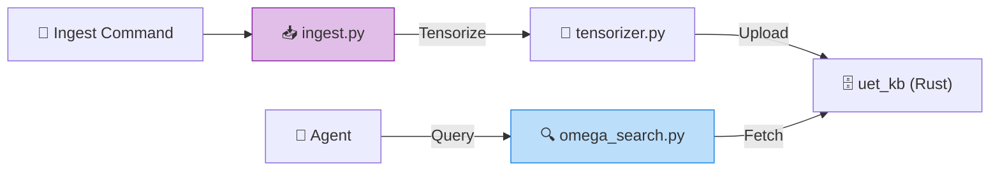

# 🧠 UET Knowledge Base Client (`research_uet.knowledge_base`)


> **"The Connector"** - ชุดเครื่องมือ (Python SDK) สำหรับเชื่อมต่อกับ `uet_kb` (Rust) และจัดการระบบ RAG ทั้งหมด.

---

## 🏛️ Components

| File | Purpose |
| :--- | :--- |
| **`config.toml`** | **Single Source of Truth** สำหรับ API Keys, Models, และ Budgets ทั้งหมด. |
| **`api_client.py`** | Client สำหรับคุยกับ OpenRouter พร้อมระบบ **Cost Tracking**. |
| **`vector_store.py`** | สะพานเชื่อม (Bridge) ไปยัง LanceDB/Postgres ผ่าน MCP. |
| **`ingest.py`** | Pipeline สำหรับอ่านไฟล์ `.md/.py` ทั้งหมด -> แปลงเป็น Vector -> ส่งเข้า Database. |
| **`tensorizer.py`** | แปลงเนื้อหาเอกสารเป็นค่า UET Vector ($\Omega, \kappa, \beta$). |

---

## 🔗 How it works



---

## 🚀 Key Commands

**1. เริ่มกระบวนการนำเข้าข้อมูล (Ingestion):**
```bash
python -m research_uet.knowledge_base.ingest
```

**2. ดูรายงานค่าใช้จ่าย (Cost Dashboard):**
```bash
python -m research_uet.knowledge_base.cost_dashboard
```
