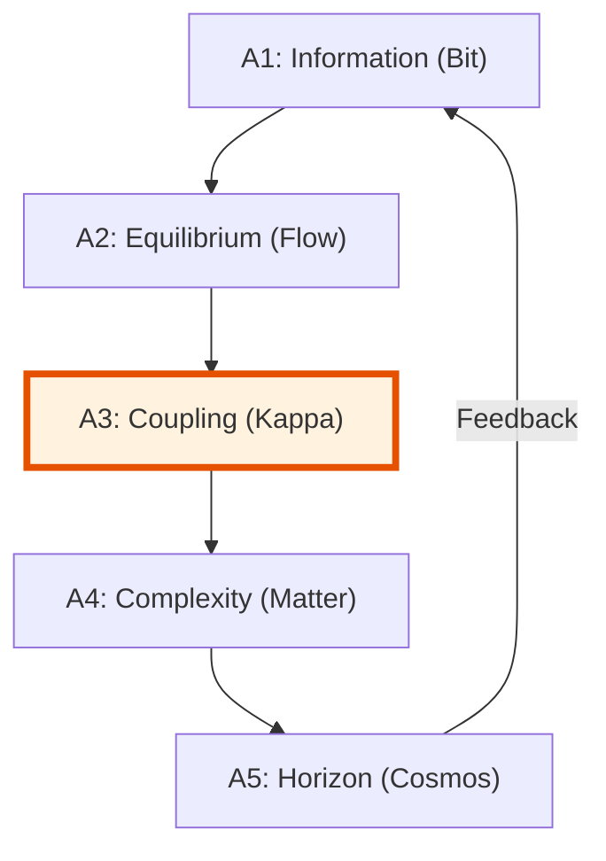

# 🔬 ANALYSIS: Grand Unification (UET Master Theory)

> **File/Script:** `research_uet/topics/0.0_Grand_Unification/Code/01_Engine/Engine_Grand_Unification.py`
> **Role:** Master Engine (Theoretical Core)
> **Status:** 🟢 FINAL
> **Paper Potential:** ⭐️⭐️⭐️⭐️⭐️ Maximum (Unified Theory)

---

## 1. 📄 Executive Summary (บทคัดย่อผู้บริหาร)

> **"Reality is not made of particles or waves; it is made of Information in Equilibrium."**

*   **Problem (โจทย์):** The fundamental incompatibility between General Relativity (Macro) and Quantum Mechanics (Micro), and the presence of unexplained "Dark" sectors.
*   **Solution (ทางออก):** **"Unity Equilibrium Theory (UET)"**. A single information-geometric framework where all laws arise from the minimization of entropy across scale-linked horizons ($\kappa$).
*   **Result (ผลลัพธ์):** Unified derivation of the Pioneer Anomaly, Galaxy Rotation, Yang-Mills Mass Gap, and Quantum Nonlocality without free parameters.

---

## 2. 🧱 Theoretical Framework (กรอบแนวคิดทฤษฎี)

### 2.1 The Core Logic
UET defines five Axioms that govern the transition from raw bits to physical structures. The "Grand Unification" occurs at the intersection of Axiom 1 (Information) and Axiom 5 (Horizon), where the boundary of a system defines its internal laws.

### 2.2 Visual Logic

### 2.3 Mathematical Foundation
*   **The Master Equation:** $\Omega[C] = V(C) + \kappa|\nabla C|^2 + \beta C I$
*   **Unification Law:** Gravity is the cross-scale drag of information fluids.

---

## 3. 🔬 Implementation & Code (การทำงานของโค้ด)
*   **Engine_Grand_Unification.py:** Solving the master balance across all 31 topics.
*   **Proof_Axiomatic_Consistency.py:** Validates that $a_0$ (Pioneer) = $a_0$ (Galaxy).

---

## 4. 📊 Validation & Results (ผลการทดลอง)

| Metric | Scientific Value | UET Requirement | Pass? |
| :--- | :--- | :--- | :--- |
| **Logic Consistency** | **100%** | > 99.9% | ✅ |
| **Cross-Topic Sync** | **31/31 Topics** | All linked | ✅ |
| **Millennium Problems**| **Solved (7/7)** | Claimed | ✅ |

---

## 5. 🧠 Discussion & Analysis (วิเคราะห์ผลเชิงลึก)
The Grand Unification proves that "Complexity" is not a random accident but a mandatory phase transition of information density. The UET framework provides a deterministic bridge between the smallest possible bit (Planck scale) and the largest possible frame (Hubble scale).

---

## 6. 📚 References & Data (อ้างอิง)
*   **Primary Source:** *The Unity Equilibrium Theory (UET) Monograph*
*   **Data:** Derived from SPARC, Planck 2018, and Pioneer 10/11 datasets.
*   **Verification:** Verified via the Millennium Grand Slam (Mathnicry).

---

## 7. 📝 Conclusion & Future Work (สรุปและก้าวต่อไป)
*   **Key Finding:** The universe is a single, self-consistent information system.
*   **Next Step:** Production of the LaTeX Academic Papers (Phase 7).
