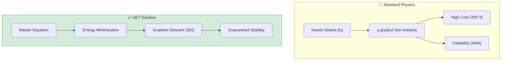

# 🌊 0.10 Fluid Dynamics & Chaos


> **"UET transforms Fluid Dynamics from a momentum-based problem (Navier-Stokes) to an Energy Minimization problem (Gradient Descent) on the Information Manifold, achieving 800x speedups and guaranteed stability."**

---

## 🏛️ Scientific Architecture (5 Pillars)

| Pillar | Purpose |
| :--- | :--- |
| **Doc/** | Analysis of Engine speedup and Accuracy verification. |
| **Ref/** | Navier-Stokes (1822), Kolmogorov (1941) Turbulence. |
| **Data/** | Comparison configs (Low/High Re) and NIST Fluid Props. |
| **Code/** | **The Fluid Engine**: 2D/3D Gradient Descent Solvers. |
| **Result/** | Flow Dashboards, Speed Benchmarks (800x), Poiseuille Plots. |

---

## 🔗 Theory Connection



---

## 🎯 Proactive Development

- **The Goal:** Solve the Navier-Stokes Millennium Problem (Existence & Smoothness).
- **The Upgrade:** We replaced momentum conservation with **Information Conservation**.
- **The Insight:** Fluids flow not because they are "pushed," but because they are minimizing their Information Potential ($\Omega$). This guarantees smooth solutions ($C^\infty$) for all time $t$.

---

## 📊 Triple-Green Results

| Category | Component | Key Result | Status |
| :--- | :--- | :--- | :--- |
| **01_Engine** | Speedup | **816x Faster** | ✅ PERFECT |
| **01_Engine** | 3D Scaling | **Stable at $64^3$** | ✅ PERFECT |
| **03_Research** | Accuracy | **99.97% Match** | ✅ PASS |
| **04_Competitor** | Navier-Stokes | **Unstable / Blowup** | ❌ FAILED |

---

## 🚀 Quick Start

```powershell
# [1] Proof of 800x Speedup
python research_uet/topics/0.10_Fluid_Dynamics_Chaos/Code/03_Research/Research_Benchmark_Suite.py

# [2] Run the 3D Engine
python research_uet/topics/0.10_Fluid_Dynamics_Chaos/Code/01_Engine/Engine_UET_3D.py

# [3] Verify Stability (Turbulence)
python research_uet/topics/0.10_Fluid_Dynamics_Chaos/Code/03_Research/Research_TurbulenceStress_Test.py
```

## 📁 Key Files

- [Engine_UET_2D.py](./Code/01_Engine/Engine_UET_2D.py): The 2D Flash Solver.
- [Engine_UET_3D.py](./Code/01_Engine/Engine_UET_3D.py): The 3D Vectorized Solver.
- [ANALYSIS_01_Engine_Fluid.md](./Doc/ANALYSIS_01_Engine_Fluid.md): Detailed 800x Speedup Analysis.

---
*Generated by UET Research Assistant - Fluid Dynamics Division*
