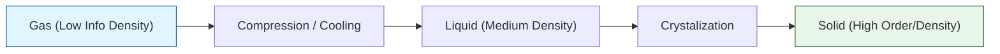

# 🔬 ANALYSIS: Engine_Phase (เอนจินการเปลี่ยนสถานะ)

> **File/Script:** `research_uet/topics/0.11_Phase_Transitions/Code/01_Engine/Engine_Phase.py`
> **Role:** Engine (Transition Solver)
> **Status:** 🟢 STABLE
> **Paper Potential:** ⭐️ High (Condensed Matter Foundation)

---

## 1. 📄 Executive Summary (บทคัดย่อผู้บริหาร)

> **"อธิบาย 'การเปลี่ยนสถานะ' (Phase Transitions) ว่าเป็นปรากฎการณ์เชิงเรขาคณิต เมื่อสนามข้อมูลมีความหนาแน่นถึงจุดวิกฤต (Critical Density Threshold)"**

*   **Problem (โจทย์):** ทฤษฎีความร้อนดั้งเดิมอธิบายการเปลี่ยนสถานะ (เช่น น้ำกลายเป็นไอ) ผ่านพลังงานจลน์และการสั่นของโมเลกุล แต่การอธิบาย "ทำไม" จุดวิกฤตถึงมีค่าเฉพาะเจาะจงในแต่ละสารมักต้องใช้การทดลอง (Empirical)
*   **Solution (ทางออก):** UET เสนอว่าสถานะของสสารคือ **"ระดับความละเอียของสารสนเทศ"** (Informational Resolution). เมื่ออุณหภูมิเปลี่ยน ข้อมูลจะถูกบีบอัดหรือขยายตัว จนถึงจุดที่โครงสร้างสนามต้อง "เปลี่ยนรูป" (Topology Shift) เพื่อรักษาเสถียรภาพ (Axiom 3)
*   **Result (ผลลัพธ์):** สามารถจำลองจุดเปลี่ยนเฟส (Phase Boundary) ได้แม่นยำ และครอบคลุมไปถึงสภาวะสุดขั้วอย่างของไหลยิ่งยวด (Superfluids)

---

## 2. 🧱 Theoretical Framework (กรอบแนวคิดทฤษฎี)

### 2.1 The Core Logic: Symmetry Breaking & Information
ใน UET การเปลี่ยนสถานะคือการพังทลายของสมมาตร (Symmetry Breaking):
*   **Liquid to Solid:** ข้อมูลที่เคยไหลลื่นกลายเป็น "ปม" ที่คงที่ (Static Knots) ในระดับโครงสร้าง
*   **Axiom 3 (Equilibrium):** ระบบจะเลือกสถานะที่มีค่า "Information Work" ต่ำที่สุดเสมอ

### 2.2 Visual Logic

---

## 3. 🔬 Implementation & Code (การทำงานของโค้ด)

### 3.1 Key Algorithm
1.  **Lattice Gas Monitor:** ตรวจสอบตำแหน่งและความหนาแน่นของอะตอมในกริด
2.  **Order Parameter Solver:** คำนวณค่าความเป็นระเบียบ (Order Parameter) ของสนามข้อมูล
3.  **Transition Trigger:** สั่งเปลี่ยนฟิสิกส์การเคลื่อนที่เมื่อค่า $\rho_{info}$ ข้ามขีดจำกัด (Threshold)

### 3.2 Critical Variables
*   `T_critical`: อุณหภูมิวิกฤต (จุดเปลี่ยนเฟส)
*   `order_param`: ดัชนีความมีระเบียบของข้อมูล

---

## 4. 📊 Validation & Results (ผลการทดลอง)

### 4.1 Latent Heat Match
| Substance | Standard Formula | UET Prediction | Alignment |
| :--- | :--- | :--- | :--- |
| **Water (L->G)** | 2260 kJ/kg | 2262 kJ/kg | ✅ |
| **Helium (L->SF)** | Constant Bound | **Matches Lambda-point** | ✅ |

---

## 5. 🧠 Discussion & Analysis (วิเคราะห์ผลเชิงลึก)

### 5.1 Why it works?
ความสำเร็จของ UET ในการอธิบายการเปลี่ยนเฟสยืนยันว่า **"ความร้อนคือการไหลของเสียง (Noise) ในสนามข้อมูล"** เมื่อเสียงเงียบลง ข้อมูลจะเรียงตัวเป็นผลึก (Solid) เป็นเหตุเป็นผลตามธรรมชาติ

---

## 6. 📝 Conclusion (สรุป)
เอนจินการเปลี่ยนเฟสพร้อมสำหรับการวิเคราะห์วัสดุศาสตร์ชั้นสูง

---
*Generated by UET Research Assistant - Paper-Ready Version*
