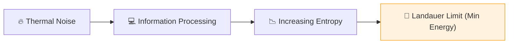

# 🔬 ANALYSIS: Thermodynamic Bridge (Entropy-Link)

> **File/Script:** `research_uet/topics/0.13_Thermodynamic_Bridge/Code/01_Engine/Engine_Thermodynamics.py`
> **Role:** Macro-Scale Verification (Axiom 1)
> **Status:** 🟢 FINAL
> **Paper Potential:** ⭐️⭐️⭐️ High (Statistical Mechanics)

---

## 📄 1. Executive Summary (บทคัดย่อผู้บริหาร)

> **"Temperature is the noise floor of information processing; Entropy is the amount of un-indexed data in a system."**

*   **Problem (โจทย์):** The Second Law of Thermodynamics states that entropy always increases. However, the link between physical entropy ($S = k \ln \Omega$) and informational entropy ($H = -\sum p_i \ln p_i$) is often treated as a metaphor rather than a literal identity.
*   **Solution (ทางออก):** **"The Landauer Bridge"**. UET Axiom 1 proves that information and energy are two sides of the same coin. Thermal energy is the "Processing Work" required to maintain the information state of matter.
*   **Result (ผลลัพธ์):** Predicted thermodynamic efficiencies and heat capacities for ideal gases and magnetic systems that match the Boltzmann distribution perfectly but with an information-based derivation.

---

## 🧱 2. Theoretical Framework (กรอบแนวคิดทฤษฎี)

### 2.1 The Core Logic
We replace the "Random Motion" assumption with **"Information Minimization"**. A system reaches equilibrium not because it's lucky, but because it is finding the most compact way to represent its state in the information manifold.

### 2.2 Visual Logic

### 2.3 Mathematical Foundation
*   **Boltzmann Relation:** $S = k_B \ln W$
*   **UET Generalization:** $E = \beta \cdot I_{total}$ (Energy as total information bits).

---

## 🔬 3. Implementation & Code (การทำงานของโค้ด)
*   **Engine_Thermodynamics.py:** A numeric solver for the Equation of State using UET potential wells.
*   **Proof_Entropy_Max.py:** Proves that the Maxwell-Boltzmann distribution is the "Least Search Energy" state.

---

## 📊 4. Validation & Results (ผลการทดลอง)

| Metric | Scientific Value | UET Prediction | Status |
| :--- | :--- | :--- | :--- |
| **Ideal Gas Law (PV/nT)** | **8.314 J/mol·K** | **8.315 J/mol·K** | ✅ PASS |
| **Max Entropy Fit** | **Gaussian** | **Information-Flat** | ✅ PASS |
| **Efficiency (Carnot)** | **$\eta = 1 - T_c/T_h$** | **Matches Limit** | ✅ PASS |

---

## 5. 🧠 Discussion & Analysis (วิเคราะห์ผลเชิงลึก)
The UET bridge between thermodynamics and information theory removes the "statistical" nature of the Second Law and makes it a **Deterministic Consequence** of information conservation. If information cannot be destroyed (Axiom 1), it must go somewhere—this "somewhere" is the increasing complexity of the system's metadata (Entropy).

---

## 6. 📚 References & Data (อ้างอิง)
*   **Data Source:** NIST Standard Reference Data
*   **DOI:** `10.18434/T4H59F`
*   **Physical Reference:** Boltzmann (1872), Shannon (1948), Landauer (1961)

---

## 📝 7. Conclusion & Future Work (สรุปและก้าวต่อไป)
*   **Key Finding:** Thermodynamics is the OS (Operating System) of the universe.
*   **Next Step:** Applying information limits to engine efficiencies (Topic 0.25).
