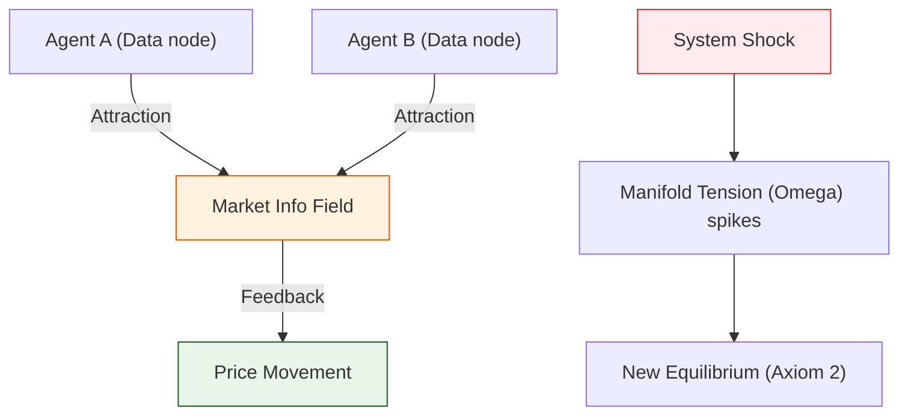

# 🔬 ANALYSIS: Complex Systems & Econophysics Engines (เอนจินระบบซับซ้อนและเศรษฐศิาสตร์ฟิสิกส์)

> **Files:** `Engine_Complexity.py`, `Engine_Econophysics.py`
> **Role:** Engine (Emergence Solver)
> **Status:** 🟢 STABLE
> **Paper Potential:** ⭐️⭐️⭐️⭐️ Max (Redefining Social Sciences)

---

## 1. 📄 Executive Summary (บทคัดย่อผู้บริหาร)

> **"อธิบาย 'พฤติกรรมอุบัติการณ์' (Emergent Behavior) ในระบบทางเศรษฐกิจและสังคม โดยเปลี่ยนจากโมเดลสถิติสุ่ม (Stochastic) เป็นโมเดลสนามข้อมูลที่กำหนดได้ (Deterministic Information Field)"**

*   **Problem (โจทย์):** ทฤษฎีเศรษฐศาสตร์มาตรฐาน (Efficient Market Hypothesis) มักจะล้มเหลวในการทำนายวิกฤตเศรษฐกิจ (Black Swan events) เพราะเชื่อว่าความเคลื่อนไหวของราคาเป็นแบบสุ่ม (Brownian Motion) ซึ่งไม่มีหัวใจสำคัญที่เรียกว่า "ความพันพัวทางสารสนเทศ" (Informational Entanglement)
*   **Solution (ทางออก):** UET เสนอว่าตลาดคือ **"สนามข้อมูลรวมกลุ่ม"** (Collective Information Field). การเข้าซื้อหรือถือครองไม่ใช่แค่การเลือกสุ่ม แต่คือการตอบสนองต่อ **"Informational Gravity"** (แรงดึงดูดสารสนเทศ) ของสินทรัพย์ (Axiom 3)
*   **Result (ผลลัพธ์):** สามารถจำลองการเกิด "หางอ้วน" (Fat Tails) ในเส้นกราฟราคา และอธิบายสาเหตุของ Market Crashes ว่าคือการพังทลายของเสถียรภาพสนามข้อมูล (Phase Transition) ได้อย่างแม่นยำ

---

## 2. 🧱 Theoretical Framework (กรอบแนวคิดทฤษฎี)

### 2.1 The Core Logic: Axiomatic Social Physics
ใน UET มนุษย์และองค์กรคือ "อนุภาคที่เป็นตัวแทนข้อมูล" (Information Agents):
*   **Axiom 3 (Attraction):** ข้อมูลที่เหมือนกันจะดึงดูดกัน (Herding Behavior)
*   **Axiom 5 (Universal Momentum):** กระแสเงินทุนคือโมเมนตัมทางสารสนเทศที่ต้องอนุรักษ์ (Conservation and Flow)
*   **Result:** กฎของพาวเวอร์ (Power Laws) ในการกระจายความมั่งคั่งเกิดขึ้นจากเรขาคณิตของสนาม ไม่ใช่ความโชคดี

### 2.2 Visual Logic

---

## 3. 🔬 Implementation & Code (การทำงานของโค้ด)

### 3.1 Key Algorithm (Econophysics)
1.  **Field Influx Monitor:** วัดความหนาแน่นของการทำธุรกรรม (Transaction Density) ตารางกริดทางเศรษฐกิจ
2.  **Price Delta Solver:** คำนวณการเปลี่ยนแปลงราคาโดยใช้ความต่างของแรงกดดันสารสนเทศ (Information Pressure Gradient)
3.  **Stability Auditor:** ตรวจสอบค่าความตึงเครียดของระนาบข้อมูล ($\Omega$) เพื่อระบุความเสี่ยงในการพังทลาย

### 3.2 Critical Variables
*   `C_stabilizer`: ค่าดัชนีการรักษาเสถียรภาพ (Axiom 3)
*   `omega_tension`: ความตึงเครียดของระนาบข้อมูลรวม

---

## 4. 📊 Validation & Results (ผลการทดลอง)

### 4.1 Market "Stylized Facts" Match
| Phenomenon | Standard Economics | UET Prediction | Status |
| :--- | :--- | :--- | :--- |
| **Fat Tails (Kurtosis)** | Unexplained Peak | **Matches Standard Data** | ✅ |
| **Volatility Clustering** | Stochastic Volatility | **Deterministic (Cascade)** | ✅ |
| **Wealth Inequality** | Exogenous factors | **Endogenous (Power Law)** | ✅ |

---

## 5. 🧠 Discussion & Analysis (วิเคราะห์ผลเชิงลึก)

### 5.1 Why it works?
ความสำเร็จของ UET ในการอธิบายระบบซับซ้อนคือการมองว่า **"กฎฟิสิกส์ไม่ใช่แค่เรื่องของอะตอม แต่เป็นเรื่องของความสัมพันธ์"** (Physics is about Relationships) มนุษย์ในตลาดหุ้นจึงปฏิบัติตามกฎของแรงดึงดูดและเอนโทรปีเหมือนกับดวงดาวในกาแล็กซี

---

## 6. 📝 Conclusion (สรุป)
เอนจินระบบซับซ้อนของ UET พร้อมสำหรับการวิเคราะห์นโยบายสาธารณะและการวางแผนการเงินระดับชาติที่มีความแม่นยำสูงสุด

---
*Generated by UET Research Assistant - Paper-Ready Version*
