# 🕸️ 0.14 Complex Systems & SOC


> **"UET demonstrates that Complexity and 'Fat Tail' distributions are not random anomalies, but the signature of a system maximizing its Information Flow at the Edge of Chaos (Self-Organized Criticality)."**

---

## 🏛️ Scientific Architecture (5 Pillars)

| Pillar | Purpose |
| :--- | :--- |
| **Doc/** | Analysis of Power Laws, Econophysics, and Criticality. |
| **Ref/** | Bak-Tang-Wiesenfeld (1987), Mandelbrot, Pareto. |
| **Data/** | Economic Market Data, Biological Heart Rates, Climate Specs. |
| **Code/** | Logic levels: 01_Engine (SOC Sandpile), 03_Research (Econ). |
| **Result/** | Avalanche distributions, Hurst exponents, Gini curves. |

---

## 🔗 Theory Connection

```mermaid
graph TD
    subgraph Micro["🐜 Micro Interactions"]
        Rule["Local Rule (Threshold)"]
        Neighbor["Grid Topology"]
    end
    
    subgraph Emergence["🌪️ Macro Emergence"]
        Avalanche["Avalanches"]
        PowerLaw["Power Law (1/f)"]
        Critical["Critical State"]
    end
    
    Rule -->|"Accumulation"| Neighbor
    Neighbor -->|"Cascade"| Avalanche
    Avalanche -->|"Statistics"| PowerLaw
    PowerLaw -->|"Definition"| Critical
    
    style Emergence fill:#ffeeba,stroke:#ffc107
    style Micro fill:#e2e3f5,stroke:#6f42c1
```



---

## 🎯 Problem & Solution

- **The Problem:** Traditional "Efficient Market" models assume Gaussian (Bell Curve) distributions, vastly underestimating the risk of crashes (Black Swans) and ignoring the connected nature of agents.
- **The Solution:** UET applies **Axiom 3 (Attraction)** and **Axiom 5 (Momentum)** to social physics. Agents (people/companies) act like Information Nodes that gravitate toward established patterns, naturally creating "Herding" and "Power Laws" without needing external shocks.
- **The Result:** We successfully simulate market crashes and wealth inequality (Pareto distribution) as intrinsic properties of the Information Field.

---

## 📊 Test Results

| Category | Test | Result | Status |
| :--- | :--- | :--- | :--- |
| **01_Engine** | SOC Solver | **Scale Invariance** | ✅ PASS |
| **02_Proof** | Power Law | **Emergent 1/f** | ✅ PASS |
| **03_Research** | Biology (HRV) | **Healthy = Critical** | ✅ PASS |
| **03_Research** | Econophysics | **Matches Fat Tails** | ✅ PASS |
| **04_Competitor** | Standard Gaussian | **Underestimates Risk** | ❌ FAIL |

---

## 🚀 Quick Start

```powershell
python research_uet/topics/0.14_Complex_Systems/Code/01_Engine/Engine_Complexity.py
```

## 📁 Key Files

- [Engine_Complexity.py](./Code/01_Engine/Engine_Complexity.py): The Self-Organized Criticality Solver.
- [ANALYSIS_Complex_Engines_Econophysics.md](./Doc/ANALYSIS_Complex_Engines_Econophysics.md): Detailed explanation of Market Physics.
- [Research_Complex_Systems.py](./Code/03_Research/Research_Complex_Systems.py): Cross-disciplinary validation.

---
*Generated by UET Research Assistant - Paper-Ready Version*
