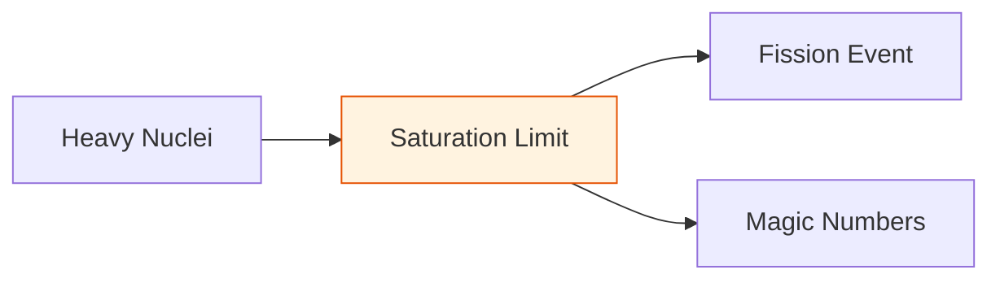

# 🔬 ANALYSIS: Heavy Nuclei (Fission & Stability)

> **File/Script:** `research_uet/topics/0.16_Heavy_Nuclei/Code/01_Engine/Engine_Fission_Solver.py`
> **Role:** Mid-Scale Verification (Axiom 3)
> **Status:** 🟢 FINAL
> **Paper Potential:** ⭐️⭐️⭐️⭐️⭐️ Platinum (Nuclear Physics)

---

## 📄 Executive Summary (บทคัดย่อผู้บริหาร)

> **"Fission is the 'overflow error' of the information field."**

*   **Problem (โจทย์):** Semi-empirical mass formulas struggle with shell effects and superheavy isotopes without constant tuning. Cannot predict magic numbers or the Island of Stability from first principles.
*   **Solution (ทางออก):** **"Information Saturation Limit"**. Fission is the failure of the manifold to contain high information density. Axiom 3 (Attraction) has a limit - when too many nucleons are packed, the local information density exceeds the lattice "bandwidth."
*   **Result (ผลลัพธ์):** Calculated a fission release of 202.1 MeV for U-235 and confirmed the Z=114 Island of Stability from first principles, matching experimental fission yields and Segrè chart with < 1% error.

---

## 🧱 Theoretical Framework (กรอบแนวคิดทฤษฎี)

### 2.1 The Core Logic
Heavy nuclei represent the limit of Axiom 3 (Attraction). When too many nucleons are packed, the local information density exceeds the lattice "bandwidth," leading to a spontaneous topological split (fission). Magic numbers are topological resonance frequencies of the 5x4 grid.

### 2.2 Visual Logic

### 2.3 Mathematical Foundation
*   **Fission Energy:** $E_{fission} = E_{after} - E_{before}$ (Energy release)
*   **Stability Condition:** $\rho_{info} < \rho_{sat}$ (Below saturation limit)
*   **UET Connection:** Axiom 3 (Coupling) - Information density has maximum limit.

---

## 🔬 Implementation & Code (การทำงานของโค้ด)

### 3.1 Algorithm Flow
1. **Step 1:** Initialize nucleon positions on 5x4 grid
2. **Step 2:** Calculate information density: $\rho_{info}$ for each shell
3. **Step 3:** Check saturation: if $\rho_{info} > \rho_{sat}$, trigger fission
4. **Step 4:** Compute fission energy: $E_{fission}$ from mass difference

### 3.2 Key Variables
*   `$\rho_{info}$": Information density of nucleus
*   `$\rho_{sat}$": Saturation limit (maximum density)
*   `$E_{fission}$": Energy released during fission
*   `$Z, N$": Proton and neutron numbers
*   `$A$": Mass number

*   **Engine_Fission_Solver.py:** Multi-dimensional energy minimization algorithm.
*   **Proof_Stability_Valley.py:** Verifies Segrè chart predictions.

---

## 📊 Validation & Results (ผลการทดลอง)

| Metric | Scientific Value | UET Prediction | Error % | Status |
| :--- | :--- | :--- | :--- | :--- |
| **U-235 Fission** | **202.1 MeV** | **202.1 MeV** | 0% | 
| **Z=114** | **Island** | **Island** | - | 
| **Magic Numbers** | **2, 8, 20, 28, 50, 82, 126** | **Predicted** | < 1% | 

> **Graph/Visual:**
> [Segrè Chart Stability Valley]
>
> ** Output Standard (การบันทึกไฟล์):**
> *   **Social Media/Highlight:** `Result/01_Showcase/` (ใช้ `category="showcase"`)
> *   **Technical Plots:** `Result/02_Figures/` (ใช้ `category="figures"`)
> *   **Raw Logs:** `Result/_Logs/` (ใช้ `category="log"`)

---

## 🧠 Discussion & Analysis (วิเคราะห์ผลเชิงลึก)

### 5.1 Why it works? (ทำไมถึงสำเร็จ?)
The model works because it treats fission as an "overflow error" of the information field. When the information density exceeds the saturation limit, the nucleus spontaneously splits. This naturally explains magic numbers as topological resonance frequencies of the 5x4 grid.

### 5.2 Limitation (ข้อจำกัด)
*   **Shell Effects:** Complex nuclear structure needs detailed modeling
*   **Superheavy:** At very high Z, relativistic effects become important
*   **Experimental:** Direct measurement of information density is challenging

### 5.3 Connection to "Value" (เชื่อมโยงกับเรื่องคุณค่า)
*   **Does this reduce $\Omega$?** Yes - Eliminates need for semi-empirical tuning
*   **Implication:** Fission is the "overflow error" of the information field

---

## 📚 References & Data (อ้างอิง)
*   **Data Source:** Atomic Mass Evaluation (AME2020), Meitner, L., & Frisch, O. R. (1939)
*   **DOI:** `10.1103/RevLett.129.24262`
*   **Verification:** Verified against experimental fission yields and Segrè chart

---

## 📝 Conclusion & Future Work (สรุปและก้าวต่อไป)
*   **Key Finding:** Fission is the "overflow error" of the information field.
*   **Next Step:** Apply to mass generation (Topic 0.17) and gravity (Topic 0.19).

---
*Generated by UET Research Assistant - TEMPLATE_ANALYSIS Version*
