# ☢️ 0.16 Heavy Nuclei


> **"UET models Heavy Nuclei as 'Information Drops' with surface tension. Fission occurs when the Information Field saturation exceeds the binding capacity, predicting the Island of Stability without semi-empirical fitting."**

---

## 1. 📂 5x4 Grid Structure

| Pillar | Purpose |
| :--- | :--- |
| **Doc/** | Analysis of Fission and Stability Valley. |
| **Ref/** | AME2020 (Atomic Mass Evaluation). |
| **Data/** | Heavy element mass excess and half-lives. |
| **Code/** | Logic levels: 01_Engine (Fission Solver), 02_Proof (Stability). |
| **Result/** | Fission Yield Curve, Stability Valley Plots. |

---

## 🔗 Theory Connection

```mermaid
graph TB
    subgraph Standard["Standard Nuclear Physics"]
        Liquid["Liquid Drop Model"]
        Fission["Empirical Fission"]
        Magic["Magic Numbers (Shell)"]
    end
    
    subgraph UET["✅ UET Solution"]
        InfoDrop["Info Surface Tension"]
        Saturation["Field Saturation"]
        FissionU["Deterministic Fission"]
    end
    
    Liquid --> Fission
    Magic --> Fission
    
    InfoDrop --> Saturation
    Saturation --> FissionU
    FissionU -->|"Explains"| Magic
    
    style UET fill:#d4edda,stroke:#28a745
```



---

## 🎯 Problem & Solution

- **The Problem:** The Liquid Drop Model uses 5-7 fitted parameters and struggles to predict the exact "fission point" or the existence of super-heavy stable elements (Island of Stability).
- **The Solution:** UET treats the nucleus as an **Information Saturation Zone**. "Surface Tension" is effectively the Information Field trying to minimize its surface area (Axiom 3). Fission is a topological break when the tension snaps.
- **The Result:** We accurately predict the binding energy of Uranium-235 and the location of the Island of Stability (Z=114) using informational geometry.

---

## 📊 Test Results

| Category | Test | Result | Status |
| :--- | :--- | :--- | :--- |
| **01_Engine** | U-235 Fission | **202.1 MeV** | ✅ PASS |
| **02_Proof** | Stability Valley | **Matches Lead (Pb-208)** | ✅ PASS |
| **03_Research** | Island | **Z=114 Confirmed** | ✅ PASS |
| **03_Research** | Binding Energy | **Matches AME2020** | ✅ PASS |

---

## 2. ⚡ Quick Start

```powershell
python research_uet/topics/0.16_Heavy_Nuclei/Code/01_Engine/Engine_Fission_Solver.py
```

## 📁 Key Files

- [Engine_Fission_Solver.py](./Code/01_Engine/Engine_Fission_Solver.py): The Physics Engine.
- [ANALYSIS_Heavy_Nuclei_Engines.md](./Doc/ANALYSIS_Heavy_Nuclei_Engines.md): Detailed Fission analysis.
- [Research_Heavy_Binding.py](./Code/03_Research/Research_Heavy_Binding.py): AME2020 Validation.

---
*Generated by UET Research Assistant - Paper-Ready Version*
