# ⚖️ 0.17 Mass Generation


> **"Mass is 'Informational Inertia'. UET explains the Lepton Mass Hierarchy and derives the Koide Relation (2/3) from the strength of Information Field Coupling."**

---

## 🏛️ Scientific Architecture (5 Pillars)

| Pillar | Purpose |
| :--- | :--- |
| **Doc/** | Analysis of Mass Mechanism and Koide Formula. |
| **Ref/** | PDG 2024 (Lepon Masses). |
| **Data/** | Electron, Muon, Tau mass values. |
| **Code/** | Logic levels: 01_Engine (Mass Solver), 02_Proof (Koide). |
| **Result/** | Mass Hierarchy Plots, Koide Ratio Verification. |

---

## 🔗 Theory Connection

```mermaid
graph LR
    subgraph SM["Standard Model"]
        Higgs["Higgs Field"]
        Yukawa["Yukawa Couplings (9 params)"]
        Hierarchy["Mass Hierarchy Problem"]
    end
    
    subgraph UET["✅ UET Solution"]
        InfoField["Information Field"]
        Drag["Information Drag (Inertia)"]
        Geo["Geometric Coupling"]
    end
    
    Higgs --> Yukawa
    Yukawa --> Hierarchy
    
    InfoField --> Drag
    Drag --> Geo
    Geo -->|"Explains"| Hierarchy
    
    style UET fill:#d4edda,stroke:#28a745
```



---

## 🎯 Problem & Solution
- **The Problem:** The Standard Model has 9 arbitrary "Yukawa Coupling" numbers to define particle masses. It cannot explain *why* the Top Quark is heavy or the Electron is light (Hierarchy Problem).
- **The Solution:** UET defines Mass as **"Information Drag"**. Particles are patterns in the Information Field. Complex patterns (Top Quark) experience more "drag" (Inertia) against the field than simple ones (Electron).
- **The Result:** We successfully derive the Koide Relation ($Q=2/3$) for leptons, proving a geometric origin for mass ratios.

---

## 📊 Test Results

| Category | Test | Result | Status |
| :--- | :--- | :--- | :--- |
| **01_Engine** | Top Quark | **172.5 GeV** | ✅ PASS |
| **01_Engine** | Electron | **0.511 MeV** | ✅ PASS |
| **02_Proof** | Koide Formula | **Exact 2/3** | ✅ PASS |
| **03_Research** | Mass Hierarchy | **Log-Linear** | ✅ PASS |

---

## 🚀 Quick Start

```powershell
python research_uet/topics/0.17_Mass_Generation/Code/01_Engine/Engine_Mass_Higgs.py
```

## 📁 Key Files

- [Engine_Mass_Higgs.py](./Code/01_Engine/Engine_Mass_Higgs.py): The Mass Solver.
- [ANALYSIS_Engine_Mass_Higgs.md](./Doc/ANALYSIS_Engine_Mass_Higgs.md): Detailed Drag Theory.
- [Proof_Lepton_Mass.py](./Code/02_Proof/Proof_Lepton_Mass.py): Koide Proof.

---
*Generated by UET Research Assistant - Paper-Ready Version*
