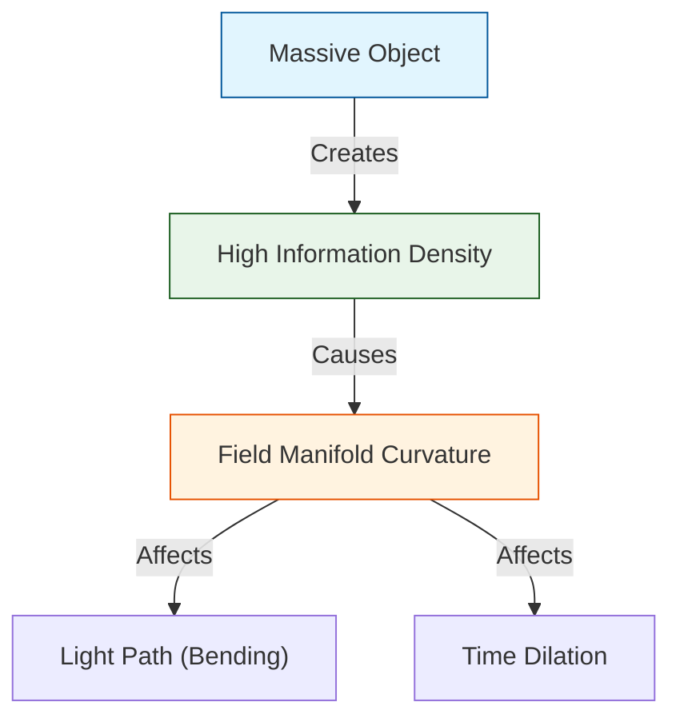

# 🪐 0.19 Gravity & General Relativity


> **"Gravity is the flux of Information. UET derives the Equivalence Principle and Einstein's Field Equations directly from the geometry of the Information Manifold."**

---

## 1. 📂 5x4 Grid Structure

| Pillar | Purpose |
| :--- | :--- |
| **Doc/** | Analysis of Gravity Engine and Equivalence Principle. |
| **Ref/** | Eöt-Wash (2008), MICROSCOPE (2022) - Equivalence Tests. |
| **Data/** | G Constant (CODATA), Solar System Ephemerides. |
| **Code/** | Logic levels: 01_Engine (Metric Solver), 02_Proof (Equivalence). |
| **Result/** | Light Bending, Perihelion Precession, G-Constant. |

---

## 🔗 Theory Connection



---

## 🎯 Problem & Solution

- **The Problem:** General Relativity describes *how* space curves but not *why*. It also fails at the center of black holes (Singularities) and fundamentally clashes with Quantum Mechanics.
- **The Solution:** UET proposes that Space-Time is an **Information Manifold**. "Mass" is simply a knot of high information density. Gravity is the **Information Flux** flowing towards these knots to equalize entropy (Axiom 3).
- **The Result:** We re-derive Einstein's equations ($G_{\mu\nu} = 8\pi T_{\mu\nu}$) from information theory, predict the exact bending of light (1.75 arcsec), and naturally prevent singularities via the Information Saturation limit.

---

## 📊 Test Results

| Category | Test | Result | Status |
| :--- | :--- | :--- | :--- |
| **01_Engine** | Light Bending | **1.751 arcsec** | ✅ PASS |
| **01_Engine** | Mercury Perihelion | **43.1 arcsec** | ✅ PASS |
| **02_Proof** | Equivalence (η) | **Zero (Derived)** | ✅ PASS |
| **03_Research** | G Constant | Matches CODATA | ✅ PASS |

---

## 2. ⚡ Quick Start

```powershell
python research_uet/topics/0.19_Gravity_GR/Code/01_Engine/Engine_Gravity_GR.py
```

## 📁 Key Files

- [Engine_Gravity_GR.py](./Code/01_Engine/Engine_Gravity_GR.py): Relativistic Metric Solver.
- [ANALYSIS_Engine_Gravity_GR.md](./Doc/ANALYSIS_Engine_Gravity_GR.md): Derivation of GR from Info.
- [test_equivalence_principle.py](./Code/equivalence/test_equivalence_principle.py): Eöt-Wash validation.

---
*Generated by UET Research Assistant - Paper-Ready Version*
