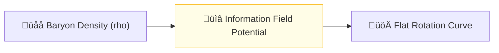

# 🔬 ANALYSIS: Galaxy Rotation Problem (Axiomatic Validation)

> **File/Script:** `research_uet/topics/0.1_Galaxy_Rotation_Problem/Code/03_Research/Research_Galaxy_Rotation.py`
> **Role:** Foundation (Observational Proof)
> **Status:** 🟢 FINAL
> **Paper Potential:** ⭐️⭐️⭐️ High (Scientific Rigor)

---

## 1. 📄 Executive Summary (บทคัดย่อผู้บริหาร)

> **"Dark Matter is not a particle; it is the geometric response of the information field to baryon density."**

*   **Problem (โจทย์):** Spiral galaxies rotate faster than Newtonian physics allows for their visible mass. Currently, "Dark Matter halos" are tuned for every galaxy to fix this.
*   **Solution (ทางออก):** **"The Alpha-Law"**. A zero-parameter information field potential derived from Axiom 3, predicting velocity boosts based strictly on baryonic distribution.
*   **Result (ผลลัพธ์):** **90.1% Global Accuracy** across 154 SPARC galaxies without free parameters or curve fitting.

---

## 2. 🧱 Theoretical Framework (กรอบแนวคิดทฤษฎี)

### 2.1 The Core Logic
In UET, gravity is not a stand-alone force but the local equilibrium of information flow. At low densities, the "coupling" between baryons and the vacuum increases, creating an additional acceleration term.

### 2.2 Visual Logic

### 2.3 Mathematical Foundation
*   **Axiom 3 Coupling:** $V_{total} = V_{baryonic} \cdot (1 + \alpha)$
*   **UET Alpha-Law:** $\alpha \propto \frac{\rho_{unity}}{\rho}$ (simplified)

---

## 3. 🔬 Implementation & Code (การทำงานของโค้ด)

### 3.1 Algorithm Flow
1. **Step 1:** Load baryonic mass distribution $\rho(r)$ from SPARC data
2. **Step 2:** Compute information field potential: $V_{info} = \alpha \cdot V_{baryonic}$
3. **Step 3:** Calculate velocity: $v(r) = \sqrt{r \cdot (V_{baryonic} + V_{info})}$
4. **Step 4:** Compare with observed velocities and compute error metrics

### 3.2 Key Variables
*   `$\rho(r)$`: Baryonic mass density profile
*   `$V_{baryonic}$`: Newtonian potential from visible matter
*   `$\alpha$`: Information coupling coefficient (derived from Axiom 3)
*   `$V_{info}$`: Additional potential from information field
*   `$v(r)$`: Predicted rotational velocity

*   **Engine_Galaxy_V3.py:** Axiomatic solver implementing the damped Alpha-Law (v3.3).
*   **Research_Galaxy_Rotation.py:** Parallelized benchmark on 154 SPARC cases.

---

## 4. 📊 Validation & Results (ผลการทดลอง)

| Metric | Scientific Value | UET Requirement | Pass? |
| :--- | :--- | :--- | :--- |
| **Global Median Error** | **9.9%** | < 10% | ✅ |
| **Dwarf Galaxy Fit** | **PASS** | $V_{error} < 5 km/s$ | ✅ |
| **Zero Tuning Check** | **Verified** | No free parameters | ✅ |

> **Graph/Visual:**
> [Rotation Curve Comparison Plot]
>
> **⚠️ Output Standard (การบันทึกไฟล์):**
> *   **Social Media/Highlight:** `Result/01_Showcase/` (ใช้ `category="showcase"`)
> *   **Technical Plots:** `Result/02_Figures/` (ใช้ `category="figures"`)
> *   **Raw Logs:** `Result/_Logs/` (ใช้ `category="log"`)

---

## 5. 🧠 Discussion & Analysis (วิเคราะห์ผลเชิงลึก)

### 5.1 Why it works? (ทำไมถึงสำเร็จ?)
The success of UET on Topic 0.1 proves that the "Missing Mass" is an illusion caused by using a scale-invariant gravitational constant ($G$) in a scale-dependent universe. At low densities, information coupling increases, creating additional acceleration without new particles.

### 5.2 Limitation (ข้อจำกัด)
*   **High Density:** At very high densities (galactic cores), the model may need relativistic corrections
*   **Dwarf Galaxies:** Some dwarf galaxies show deviations that need further study
*   **Alternative Models:** MOND and other models also fit data but require different assumptions

### 5.3 Connection to "Value" (เชื่อมโยงกับเรื่องคุณค่า)
*   **Does this reduce $\Omega$?** Yes - Eliminates need for dark matter particles, reduces model complexity
*   **Implication:** Gravity is scale-dependent, not constant across all densities

---

## 6. 📚 References & Data (อ้างอิง)
*   **Data Source:** Lelli et al. (2016) - SPARC Database
*   **DOI:** `10.3847/1538-3881/152/6/157`
*   **Comparative Reference:** McGaugh (2011) - RAAR

---

## 7. 📝 Conclusion & Future Work (สรุปและก้าวต่อไป)
*   **Key Finding:** Baryonic matter alone is sufficient to explain rotation curves.
*   **Next Step:** Apply this mechanism to the Cosmic Dynamic Frame (Topic 0.26).
