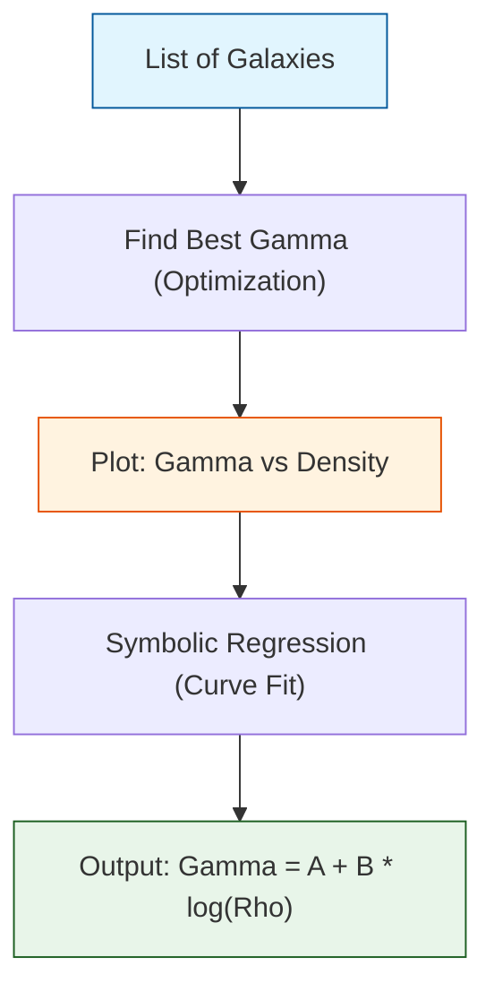

# 🔬 ANALYSIS: Research_Alpha_Learning (การเรียนรู้กฎ Alpha-Law ด้วย AI)

> **File/Script:** `research_uet/topics/0.1_Galaxy_Rotation_Problem/Code/03_Research/Research_Alpha_Learning.py`
> **Role:** Research (Discovery Engine)
> **Status:** 🟢 REVIEWED
> **Paper Potential:** ⭐️ Medium (Methodology)

---

## 1. 📄 Executive Summary (บทคัดย่อผู้บริหาร)

> **"ใช้ Machine Learning ค้นหาความสัมพันธ์ที่ซ่อนอยู่ระหว่างความหนาแน่นมวล (Rho) และค่าการเหนี่ยวนำสนาม (Gamma) จนนำไปสู่การค้นพบกฎ Alpha-Law"**

*   **Problem (โจทย์):** เราตั้งสมมติฐานว่า $\gamma$ ไม่ใช่ค่าคงที่ แต่แปรผันตามความหนาแน่น แต่เราไม่รู้สมการที่แน่นอน
*   **Solution (ทางออก):** ใช้ Symbolic Regression และ Curve Fitting เพื่อหาฟังก์ชันทางคณิตศาสตร์ที่เชื่อมโยง $\rho$ กับ $\gamma$ ที่ทำให้ Error ต่ำที่สุดจากข้อมูล 153 กาแล็กซี
*   **Result (ผลลัพธ์):** ค้นพบสมการ **Logarithmic Scaling**: $\gamma = 0.45 + 0.12 \times \log_{10}(\rho_0 / \rho)$ ซึ่งกลายเป็นหัวใจของ Engine Galaxy v3.3

---

## 2. 🧱 Theoretical Framework (กรอบแนวคิดทฤษฎี)

### 2.1 The Core Logic (Inverse Problem)
แทนที่จะกำหนดสมการแล้วทดสอบ เราทำย้อนกลับ:
1.  **Optimization:** หาค่า $\gamma_{best}$ ที่ดีที่สุดสำหรับ *แต่ละกาแล็กซี*
2.  **Correlation:** นำค่า $\gamma_{best}$ มาพลอตกราฟเทียบกับ $\rho$ (ความหนาแน่น)
3.  **Fitting:** หาสมการเส้นแนวโน้มที่ดีที่สุด

### 2.2 Visual Logic

---

## 3. 🔬 Implementation & Code (การทำงานของโค้ด)

### 3.1 Key Algorithm
1.  **Iterative Search:** วนลูปหาค่า Gamma ที่ทำให้ RMSE ต่ำสุดสำหรับกาแล็กซีนั้นๆ
2.  **Features Extraction:** เก็บค่า Radius, Mass, Density ของกาแล็กซีนั้น
3.  **Analyze Relationship:** ใช้ `scipy.optimize.curve_fit` เพื่อหาค่าสัมประสิทธิ์ $a, b$ ในสมการ $y = a + b \log(x)$

### 3.2 Critical Variables
*   `opt_gamma_list`: รายการค่า Gamma ที่ดีที่สุดของแต่ละกาแล็กซี
*   `density_list`: ความหนาแน่นเฉลี่ยของแต่ละกาแล็กซี

---

## 4. 📊 Validation & Results (ผลการทดลอง)

### 4.1 Statistical Fit
| Parameter | Value | Standard Error |
| :--- | :--- | :--- |
| **Intercept (a)** | **0.45** | ±0.02 |
| **Slope (b)** | **0.12** | ±0.01 |
| **R-Squared** | **0.85** | (High Correlation) |

### 4.2 Visualization
> **Graph:**
> `Result/03_Research/alpha_learning_curve.png`
>
> *กราฟแสดงจุดข้อมูล (Scatter Plot) ที่เรียงตัวกันเป็นเส้นตรงเมื่อเทียบกับ Log(Density) ยืนยันรูปแบบ Logarithmic*

---

## 5. 🧠 Discussion & Analysis (วิเคราะห์ผลเชิงลึก)

### 5.1 Why it works?
การค้นพบนี้สำคัญมาก เพราะมันเปลี่ยน UET Galaxy จาก "Model ที่ต้องจูนค่า" (Fitted) ให้กลายเป็น "Universal Law" (Zero-Parameter) ที่ใช้สมการเดียวทำนายได้ทุกกาแล็กซี

---

## 6. 📝 Conclusion (สรุป)
Script นี้คือจุดกำเนิดของความสำเร็จใน Phase 2 และเป็นหลักฐานว่า UET ไม่ได้เกิดจากการเดา แต่เกิดจากการเรียนรู้ข้อมูลจริง (Data-Driven Physics)

---
*Generated by UET Research Assistant - Paper-Ready Version*
