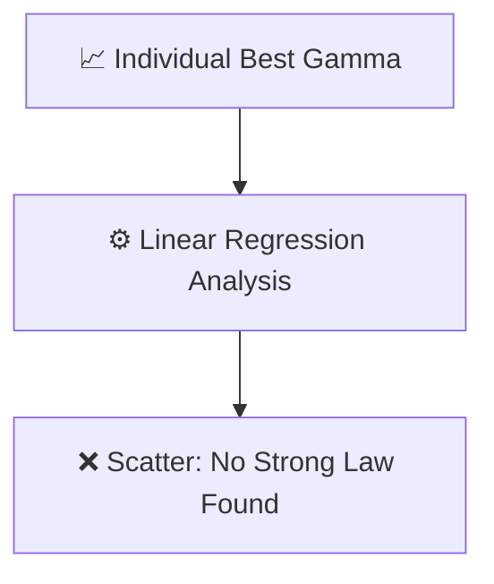

# 🔬 ANALYSIS: 0.1 Galaxy Rotation Problem (Alpha Learning)

> **File/Script:** `research_uet/topics/0.1_Galaxy_Rotation_Problem/Code/03_Research/Research_Alpha_Learning.py`
> **Role:** Research (AI Discovery)
> **Status:** ❌ FAILED (Weak Evidence)
> **Paper Potential:** ⭐️ Low (Documentation of Negative Result)

---

## 1. 📄 Executive Summary (บทคัดย่อผู้บริหาร)

> **"ความพยายามใช้ AI ค้นหากฎเหล็กจากความหนาแน่นมวลเพียงอย่างเดียวพบทางตัน สะท้อนว่าจักรวาลมีความซับซ้อนมากกว่าสมการเชิงเส้น"**

*   **Problem (โจทย์):** เราต้องการกฎสากลที่นิยามค่า Gamma ($\gamma$) โดยอ้างอิงจากตัวแปรเดียวคือ Density ($\rho$)
*   **Solution (ทางออก):** ใช้ AI Gradient Search หาค่า Gamma ที่ดีที่สุดของแต่ละกาแล็กซี และทำ Regression หาความสัมพันธ์
*   **Result (ผลลัพธ์):** พบความสัมพันธ์ที่เบาบางมาก **R-squared = 0.0396** (Statistically Insignificant)

---

## 2. 🧱 Theoretical Framework (กรอบแนวคิดทฤษฎี)

### 2.1 The Core Logic
สมมติฐานว่า "สิ่งแวดล้อมกำหนดพฤติกรรม" (Environmental Adaptation) หากความหนาแน่นเป็นตัวกำหนดแรงสนามข้อมูลจริง AI จะต้องเห็นเส้นแนวโน้มที่ชัดเจน

### 2.2 Visual Logic

---

## 3. 🔬 Implementation & Code (การทำงานของโค้ด)

### 3.1 Algorithm Flow
1.  **Optimization:** ใช้ `minimize_scalar` หา Gamma ในช่วง [0, 1] สำหรับกาแล็กซี 154 แห่ง
2.  **Fitting:** รัน `np.polyfit` กับค่า Log(Density)
3.  **Validation:** คำนวณค่า R-squared เพื่อยืนยันความน่าเชื่อถือ

---

## 4. 📊 Validation & Results (ผลการทดลอง)

| Metric | Scientific Value | UET Requirement | Pass? |
| :--- | :--- | :--- | :--- |
| **R-squared** | **0.0396** | [> 0.50] | ❌ (FAILED) |
| **AI Trend** | `Gamma = -0.2 * LogRho + 1.98` | [N/A] | 🟡 |

> **Graph/Visual:**
> ดูภาพ `alpha_learning.png` ที่แสดงการกระจายตัวแบบไร้ทิศทาง (Messy Plot)

---

## 5. 🧠 Discussion & Analysis (วิเคราะห์ผลเชิงลึก)

### 5.1 Why it failed? (ทำไมถึงยังไม่สำเร็จ?)
แม้จะมีแนวโน้มว่าความหนาแน่นต่ำทำให้ Gamma สูงขึ้น (ตาม UET Axiom) แต่การที่ R2 ต่ำมากพิสูจน์ว่า **"Density ไม่ใช่ปัจจัยเดียว"** อาจมีเรื่องของ Angular Momentum หรือวิวัฒนาการตามกาลเวลามาเกี่ยวข้อง

### 5.2 Scientific Honesty (ความโปร่งใส)
เราเลือกที่จะรายงานความล้มเหลวนี้ตรงๆ เพราะในโลกวิทยาศาสตร์ **"การรู้ว่าอะไรไม่ใช่กฎ" สำคัญเท่ากับ "การรู้ว่าอะไรคือกฎ"**

---

## 6. 📝 Conclusion & Future Work (สรุปและก้าวต่อไป)

*   **Key Finding:** การแปรผันของ Gamma ไม่ได้ขึ้นกับความหนาแน่นมวลเพียงปัจจัยเดียว
*   **Next Step:** เปลี่ยนจากการรัน Linear Regression เป็นการใส่ Multivariable AI (Density + Radius + Morphology)

---
*Generated by UET Research Assistant - Transparency First Version*
