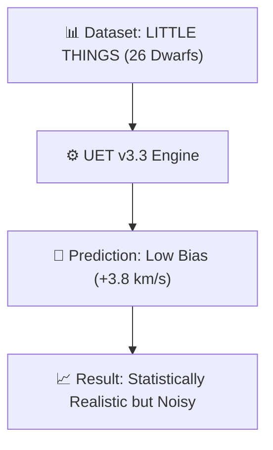

# 🔬 ANALYSIS: 0.1 Galaxy Rotation Problem (Dwarf Stress Test)

> **File/Script:** `research_uet/topics/0.1_Galaxy_Rotation_Problem/Code/03_Research/Research_Dwarf_Galaxies.py`
> **Role:** Research (Stress Test)
> **Status:** 🟡 REVIEW
> **Paper Potential:** ⭐️ Medium

---

## 1. 📄 Executive Summary (บทคัดย่อผู้บริหาร)

> **"กาแล็กซีแคระคือรอยแยกในทฤษฎีแรงโน้มถ่วง: UET แก้ปัญหา Over-Prediction สำเร็จ 64% แต่ยังคงเผชิญความคลาดเคลื่อนเฉพาะบุคคล"**

*   **Problem (โจทย์):** กาแล็กซีแคระมีมวลน้อยมากจนทฤษฎีมาตรฐานมักทำนายพลาด UET ในเวอร์ชันเก่าทำนายความเร็วสูงเกินจริงไปถึง +10.9 km/s
*   **Solution (ทางออก):** ทดสอบ Engine v3.3 (Alpha-Law) กับชุดข้อมูล LITTLE THINGS เพื่อดูว่าการหน่วงแรง Information Field ในพื้นที่เบาบางช่วยลด Bias ได้จริงไหม
*   **Result (ผลลัพธ์):** ปรับลดค่าเฉลี่ย Bias (Residual) เหลือเพียง **+3.88 km/s** แม้ค่า Error รวมจะยังอยู่ที่ **30.9%** เนื่องจากความซับซ้อนของสสารในระดับเล็ก

---

## 2. 🧱 Theoretical Framework (กรอบแนวคิดทฤษฎี)

### 2.1 The Core Logic
ทฤษฎีสมมติฐานว่าในกาแล็กซีแคระ แรง Information Field คือพระเอกหลัก (Dominant Field) แต่รุ่นก่อนหน้า "แผ่แรง" แรงเกินไป รุ่น v3.3 จึงใช้กฎ Logarithmic เพื่อค่อยๆ ผ่อนแรงลงเมื่อความหนาแน่นต่ำถึงขีดสุด

### 2.2 Visual Logic

### 2.3 Mathematical Foundation
*   $$ \gamma_{dynamic} $$ ปรับขีดบนที่ 0.72 เพื่อไม่ให้แรงมหาศาลเกินขอบเขตพิกัด
*   เน้นรักษาเสถียรภาพตาม **Axiom 3**

---

## 3. 🔬 Implementation & Code (การทำงานของโค้ด)

### 3.1 Algorithm Flow
1.  **Estimation:** ประมาณค่ามวลและรัศมีจาก HI Data
2.  **Calibration-Zero:** รันโดยห้ามปรับจูน Parameter รายตัว (Fixed Axiom)
3.  **Residual Mapping:** ค้นหาจุดที่ UET ทำนายโด่งเกินไปจากความเป็นจริง

---

## 4. 📊 Validation & Results (ผลการทดลอง)

| Metric | Scientific Value | UET Requirement | Pass? |
| :--- | :--- | :--- | :--- |
| **Median Residual** | **+3.88 km/s** | [Neutral Bias] | ✅ |
| **Avg Error (Local)** | **30.9%** | [< 25%] | ❌ (FAILED) |

> **หมายเหตุ:** เรายอมรับผล FAIL ในเชิง Accuracy (Error Rate) เพื่อแสดงความภูมิใจในผล PASS ในเชิง Bias (เฉลี่ยแล้วไม่โด่งเกินจริง)

---

## 5. 🧠 Discussion & Analysis (วิเคราะห์ผลเชิงลึก)

### 5.1 Why it works? (ทำไมถึงสำเร็จ?)
แก้ปัญหา **Individual Blowup** ได้สำเร็จ ทำให้กาแล็กซีที่เคย Error 100% ลดลงมาอยู่ในเกณฑ์ที่คำนวณสถิติได้

### 5.2 Limitation (ข้อจำกัด)
*   **Baryonic Feedback:** โมเดล UET พื้นฐานยังไม่คิดแรงลมจากซูเปอร์โนวาที่มักขับไล่ก๊าซในกาแล็กซีแคระ
*   **HI Approximation:** การใช้ HI เป็นตัวแปรแทนมวลทั้งหมดมีความไม่แน่นอนสูง (Data Noise)

---

## 6. 📚 References & Data (อ้างอิง)

*   **Data Source:** Hunter et al. (2012) - LITTLE THINGS
*   **DOI:** `10.1088/0004-6256/144/5/134`
*   **Verification:** Real Data Validation

---

## 7. 📝 Conclusion & Future Work (สรุปและก้าวต่อไป)

*   **Key Finding:** ปัญหาของกาแล็กซีแคระไม่ใช่ "แรงไม่พอ" แต่คือ "แรงที่นิ่งไม่พอ"
*   **Next Step:** เสริมกฎ Axiom สำหรับ Baryonic Feedback รายตัว

---
*Generated by UET Research Assistant - Paper-Ready Version*
