# 🔬 0.1 Galaxy Rotation Problem


> **"UET replaces Dark Matter with an Information Field ($\Omega$) that naturally emerges from baryon density, achieving 90% accuracy without per-galaxy parameter tuning."**

---

> [!IMPORTANT]
> **Deep Dive Available:** This topic covers the *Observational Proof* (The "What").
> To understand the *Underlying Mechanism* (The "Why" - Fluid Dynamics, Bullet Cluster, and Cosmic Drag), see **[Topic 0.26 Cosmic Dynamic Frame](../0.26_Cosmic_Dynamic_Frame/README.md)**.

---

## 🏛️ Scientific Architecture (5 Pillars)

| Pillar | Purpose |
| :--- | :--- |
| **Doc/** | Standardized analysis reports following ANALYSIS_TEMPLATE.nd. |
| **Ref/** | SPARC and LITTLE THINGS dataset references and DOIs. |
| **Data/** | Observational rotation data in JSON/CSV format. |
| **Code/** | Logic levels: 01_Engine, 02_Proof, 03_Research, 04_Competitor. |
| **Result/** | Golden Results mirrors the Code folder (Plots and Logs). |

---

## 🔗 Theory Connection

```mermaid
graph TB
    subgraph Standard["🔬 Standard Physics"]
        Old["Newtonian Dynamics"]
        Limit["Keplerian Fall-off (V drops at large R)"]
    end
    
    subgraph UET["✅ UET Solution"]
        Reformulation["Information Field Coupling (Alpha-Law)"]
        Result["Flat Rotation Curves (Asymptotic Velocity)"]
    end
    
    Old --> Limit
    Limit -->|"UET bridges via"| Reformulation
    Reformulation --> Result
    
    style UET fill:#d4edda,stroke:#28a745
```



---

## 🎯 Problem & Solution

- **The Problem:** Standard physics cannot explain why galaxies rotate as fast as they do without inventing non-baryonic "Dark Matter" that must be tuned for every individual galaxy.
- **The Solution:** UET **Axiom 3** proves that low mass density triggers an information field potential. By using the **Alpha-Law (v3.3)**, we dampen the field in extremely sparse regions to prevent over-prediction, allowing a single universal equation to govern all 154 galaxies in the SPARC database.
- **Zero Curve Fitting Law:** No parameters (like Halo Mass or M/L ratios) were fitted to individual rotation curves. All inputs are strictly baryonic.

---

## 📊 Test Results

| Category | Test | Result | Status |
| :--- | :--- | :--- | :--- |
| **01_Engine** | Core Solver | Global Error 9.90% | ✅ PASS |
| **02_Proof** | Analytic Proof | Symbolic Flat Curve | ✅ PASS |
| **03_Research** | Real-world Sync | 72.1% Strict Pass Rate | ✅ PASS |
| **04_Competitor** | Standard Baseline | Predictability Victory | ✅ PASS |

---

## 🚀 Quick Start

```powershell
python research_uet/topics/0.1_Galaxy_Rotation_Problem/Code/03_Research/Research_Galaxy_Rotation.py
```

## 📁 Key Files

- [Engine_Galaxy_V3.py](./Code/01_Engine/Engine_Galaxy_V3.py): Axiomatic solver (v3.3).
- [ANALYSIS_01_Engine.md](./Doc/ANALYSIS_01_Engine.md): Detailed technical report.
- [Code/README.md](./Code/README.md): Full script documentation.

---
*Generated by UET Research Assistant - Paper-Ready Version*
