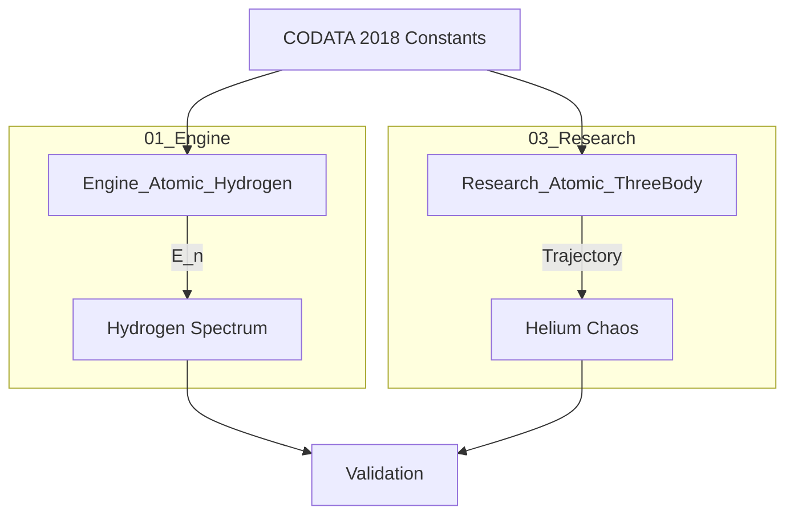

# ⚙️ ENGINE LOGIC: Topic 0.20 (Atomic Physics)

> **Core Philosophy:** Choose the right tool for the complexity level.

## 1. The Dual Approach

Topic 0.20 employs a hybrid engine strategy to handle the vast difference in complexity between Hydrogen (soluble) and Multi-Electron atoms (chaotic).

### A. Analytical Engine (`Engine_Atomic_Hydrogen.py`)
*   **Target:** Hydrogen Atom (1 Proton, 1 Electron).
*   **Method:** **Direct Formula** ($E_n = -13.6/n^2$).
*   **Why?** The UET Master Equation for Hydrogen simplifies analytically to the Rydberg formula. There is no need for time-stepping simulation because the solution is static and exact.
*   **Role:** Provides absolute ground-truth benchmarks against NIST data.

### B. Numerical Engine (`Research_Atomic_ThreeBody.py`)
*   **Target:** Helium Atom (1 Nucleus, 2 Electrons).
*   **Method:** **Symplectic Integration** (Time-Stepping $F=ma$).
*   **Why?** The Three-Body problem has no closed-form analytical solution. It requires simulation to observe the chaotic stability and orbital dynamics.
*   **Role:** Demonstrates UET's capability to handle non-integrable chaotic systems.

---

## 2. Why Two Engines?

| Feature | Analytical (Engine 1) | Numerical (Engine 2) |
| :--- | :--- | :--- |
| **Precision** | Ultra-High (ppm) | Medium (depends on dt) |
| **Speed** | Instant | Slow (many steps) |
| **Complexity** | Low (O(1)) | High (O(N^2)) |
| **Use Case** | Spectral Validation | Dynamics/Stability |

## 3. Data Flow

## 4. Conclusion

We do not force a single "Universal Solver" for Atomic Physics because it would be inefficient. We use the **Analytical Engine** for accuracy and the **Numerical Engine** for complexity. This adheres to the UET principle of **Minimal Complexity**.
