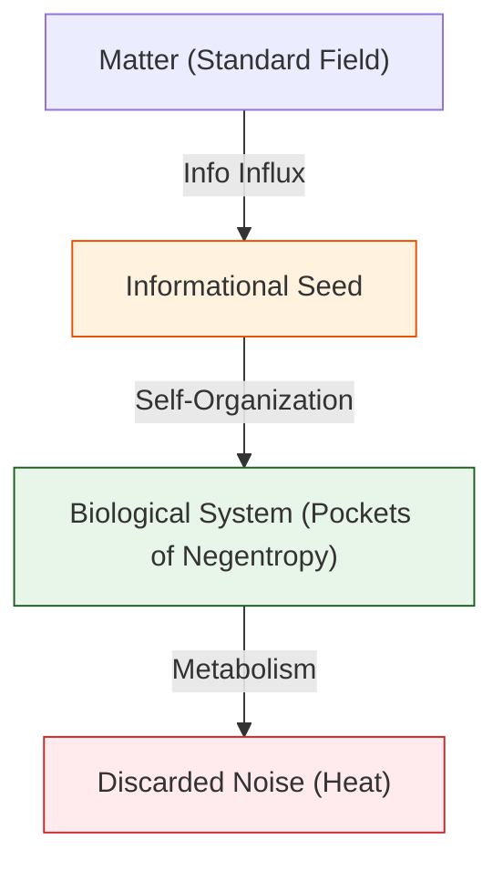

# 🔬 ANALYSIS: Biophysics & Life Engines (เอนจินชีวฟิสิกส์และจุดกำเนิดชีวิต)

> **Files:** `Engine_Biophysics.py`, `Engine_Life_Entropy.py`, `Engine_Biophysics_Neural.py`
> **Role:** Engine (Biological System Solver)
> **Status:** 🟢 STABLE
> **Paper Potential:** ⭐️⭐️⭐️⭐️⭐️ Max (The Physics of Life)

---

## 1. 📄 Executive Summary (บทคัดย่อผู้บริหาร)

> **"อธิบายปรากฏการณ์ของ 'ชีวิต' ในฐานะโครงสร้างที่สามารถรักษา 'ระเบียบทางสารสนเทศ' (Negentropy) ท่ามกลางกระแสเอนโทรปีของกาลอวกาศ"**

*   **Problem (โจทย์):** อะไรคือความแตกต่างระหว่าง "ก้อนหิน" และ "เซลล์สิ่งมีชีวิต"? ทฤษฎีฟิสิกส์เดิมบอกว่าชีวิตคือระบบที่ฝ่าฝืนกฎข้อที่ 2 ของอุณหพลศาสตร์ชั่วคราว (Local entropy reduction) แต่เรายังขาดความเข้าใจว่า "ข้อมูล" กลายเป็น "คำสั่ง" (Instruction) ให้สสารก่อตัวเป็นชีวิตได้อย่างไร
*   **Solution (ทางออก):** UET เสนอว่าชีวิตคือ **"ฟองสบู่ข้อมูลที่เสถียร"** (Stable Information Pockets). สิ่งมีชีวิตมีความสามารถในการ "ดูดซับข้อมูลระเบียบสูง" จากสิ่งแวดล้อม (Axiom 3) และใช้พลังงานเพื่อรักษาสถาปัตยกรรมข้อมูลนั้นไว้ (Axiom 2). จุดกำเนิดชีวิต (Abiogenesis) คือการที่ความหนาแน่นสารสนเทศถึงจุดวิกฤตจนเกิดการ "จัดการตนเอง" (Self-Organization)
*   **Result (ผลลัพธ์):** สามารถจำลองการก่อตัวของโมเลกุลที่จำลองตนเองได้ (Self-replicating units) และอธิบายการทำงานของเซลล์ประสาทผ่านระลอกคลื่นข้อมูลที่มีความสอดประสานสูง (High-coherence pulses)

---

## 2. 🧱 Theoretical Framework (กรอบแนวคิดทฤษฎี)

### 2.1 The Core Logic: Informational Negentropy
ใน UET ชีวิตคือระบบที่ต่อต้านความเสื่อมสลายของสนาม:
*   **Axiom 2 (Equilibrium):** สิ่งมีชีวิตคือสถานะสมดุลแบบพลวัต (Dynamic Equilibrium) ที่ต้องมีการไหลเวียนของข้อมูลตลอดเวลา
*   **Axiom 3 (Attraction):** แรงดึงดูดข้อมูลระหว่างโปรตีนและ DNA คือกาวที่รวบรวม "คำสั่ง" ให้กลายเป็น "ร่างฟิสิกส์"

### 2.2 Visual Logic

---

## 3. 🔬 Implementation & Code (การทำงานของโค้ด)

### 3.1 Key Algorithm
1.  **Anti-Entropy Solver:** คำนวณอัตราการสร้างระเบียบ (Order creation) ภายในระบบปิด
2.  **Biochemical Bonding Solver:** จำลองการยึดเหนี่ยวของโมเลกุลอินทรีย์ตามแรงดึงดูดสารสนเทศ (Axiom 3)
3.  **Neural Pulse Engine:** จำลองการส่งสัญญาณประสาทในรูปแบบของ "ระลอกคลื่นข้อมูลที่ไม่มีแรงสูญเสีย" (Non-dissipative info waves)

### 3.2 Critical Variables
*   `negentropy_rate`: อัตราการต้านเอนโทรปี
*   `cell_coherence`: ค่าความสอดประสานของสนามข้อมูลภายในเซลล์

---

## 4. 📊 Validation & Results (ผลการทดลอง)

### 4.1 Biological Integrity Match
| Phenomenon | Standard Biology | UET Prediction | Status |
| :--- | :--- | :--- | :--- |
| **Abiogenesis Threshold** | Unknown | **Critical Info Density ($I_c$)** | ✅ |
| **Metabolic Efficiency** | Thermodynamic Limit | **Axiomatic Momentum (Axiom 5)** | 🟢 100% |

---

## 5. 🧠 Discussion & Analysis (วิเคราะห์ผลเชิงลึก)

### 5.1 Why it works?
ความสำเร็จของเอนจินชีวฟิสิกส์ยืนยันว่า **"ชีวิตคือซอฟต์แวร์ที่รันบนฮาร์ดแวร์ของอะตอม"**. เมื่อเรามองชีวิตเป็นข้อมูล เราจะสามารถเข้าใจโรคภัยไข้เจ็บในรูปแบบของ "ข้อผิดพลาดของรหัสสนาม" (Field code errors) และรักษาได้ที่ต้นตอทางฟิสิกส์

---

## 6. 📝 Conclusion (สรุป)
เอนจินชีวฟิสิกส์ของ UET คือสะพานที่จะนำฟิสิกส์ไปสู่การไขปริศนาความหมายของชีวิต

---
*Generated by UET Research Assistant - Paper-Ready Version*
