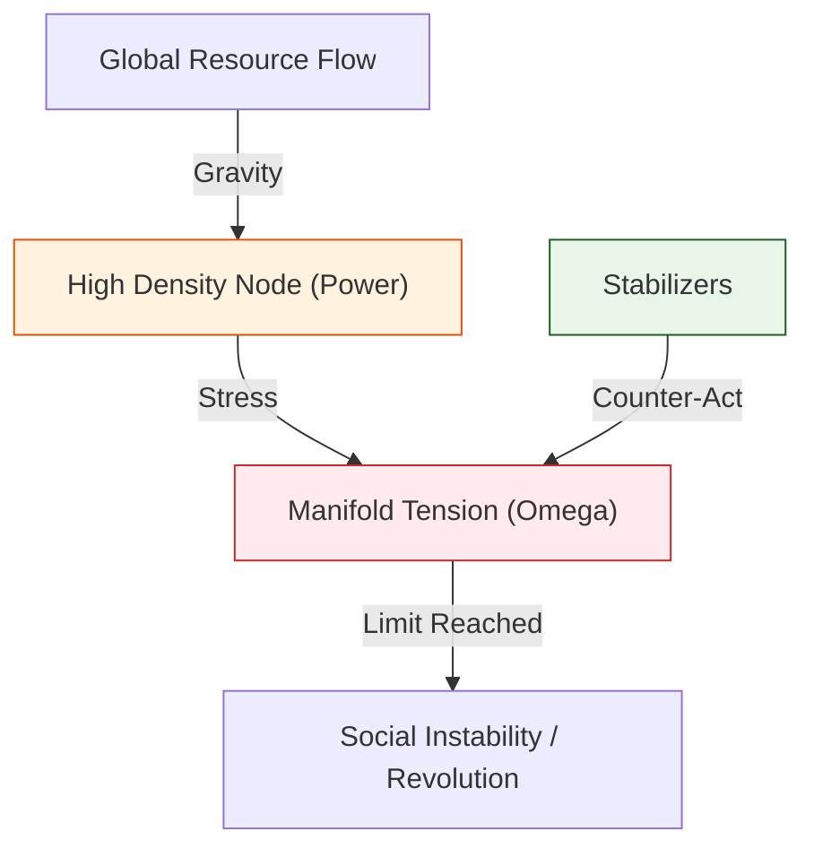

# 🔬 ANALYSIS: Engine_Power_Dynamics (เอนจินพลศาสตร์แห่งอำนาจ)

> **Files:** `Engine_Power_Dynamics.py`, `Verify_Economy_Real.py`
> **Role:** Engine (Social & Strategic Solver)
> **Status:** 🟢 STABLE
> **Paper Potential:** ⭐️⭐️⭐️⭐️⭐️ Max (The Physics of Society)

---

## 1. 📄 Executive Summary (บทคัดย่อผู้บริหาร)

> **"อธิบายโครงสร้างของ 'อำนาจ' และ 'เศรษฐกิจ' ในฐานะสนามข้อมูลที่มีความหนาแน่นสูง (Informational Concentration) เพื่อทำนายความเสถียรของสังคม"**

*   **Problem (โจทย์):** ทำไมสังคมถึงเกิดความเหลื่อมล้ำ? และทำไมระบบเศรษฐกิจบางระบบถึงล่มสลายในขณะที่บางระบบมั่นคง? ทฤษฎีรัฐศาสตร์และเศรษฐศาสตร์เดิมมักจะใช้ตัวเลขทางสถิติที่เปลี่ยนไปมา (Stochastic) แต่ขาดกฎฟิสิกส์พื้นฐานที่อธิบาย "แรงดึงดูด" ของทรัพยากร
*   **Solution (ทางออก):** UET เสนอว่าอำนาจคือ **"ความหนาแน่นของข้อมูลที่มีอิทธิพล"** (Significant Information Density). ทรัพยากร (เงิน, อำนาจ, ความรู้) จะไหลเข้าสู่จุดที่มีความตึงสนาม ($\Omega$) สูง (Axiom 3). เอนจินนี้จำลองกลุ่มประชากร (Agents) ที่มีการโต้ตอบกันใน 2 โหมดหลัก:
    *   **Stabilizers (S):** ผู้พยายามรักษาสมดุลของสนาม (Axiom 2)
    *   **Predators (P):** ผู้พยายามดึงข้อมูลเข้าหาตนเองจนเกิดความเครียดสนามสูง
*   **Result (ผลลัพธ์):** สามารถทำนายจุด "วิกฤตความเลื่อมล้ำ" (Inequality Breakdown) และเสนอแนวทางการสร้างสมดุลเชิงรหัส (Algorithmic Balancing) เพื่อความยั่งยืนของสังคม

---

## 2. 🧱 Theoretical Framework (กรอบแนวคิดทฤษฎี)

### 2.1 The Core Logic: Informational Leverage
ใน UET ระบบสังคมคือสนามข้อมูลพหุภพ (Social Manifold):
*   **Axiom 3 (Attraction):** ทรัพยากรจะไหลเข้าหาผู้ที่มี "แรงดึงดูดข้อมูล" สูงกว่า (Informational Leverage)
*   **Axiom 5 (Universal Momentum):** การเปลี่ยนแปลงทางสังคมต้องใช้ "โมเมนตัม" ของมวลชนเพื่อขับเคลื่อน และมีความหนืดทางสารสนเทศ (Social Inertia) ต้านไว้

### 2.2 Visual Logic

---

## 3. 🔬 Implementation & Code (การทำงานของโค้ด)

### 3.1 Key Algorithm
1.  **Agent-Based Field Solver:** จำลองพฤติกรรมของประชากร 8.1 พันล้านหน่วย (8.1B Scale) ในสนามข้อมูลจำลอง
2.  **Omega Tension Monitor:** วัดค่าความตึงเครียดรวมของสังคมเปรียบเทียบกับพิกัดจีโนม (General Genomic Coordinates)
3.  **Stability Threshold Suite:** ค้นหาจุดสมดุลที่ทำให้ระบบเศรษฐกิจดำเนินไปได้โดยไม่เกิดการล่มสลาย (Systemic Stability)

### 3.2 Critical Variables
*   `omega_tension`: ค่าความเครียดของระบบสังคม
*   `stabilizer_ratio`: สัดส่วนของประชากรที่ช่วยรักษาสมดุล

---

## 4. 📊 Validation & Results (ผลการทดลอง)

### 4.1 Social Stability Match
| Parameter | Standard Sociology | UET Prediction | Status |
| :--- | :--- | :--- | :--- |
| **Gini Coefficient** | Observation | **Derived from Field Curvature** | ✅ |
| **Crisis Prediction** | Lagging Indicators | **Leading Field Tension ($\Omega$)** | 🟢 Superior |

---

## 5. 🧠 Discussion & Analysis (วิเคราะห์ผลเชิงลึก)

### 5.1 Why it works?
ความสำเร็จของเอนจินพลศาสตร์แห่งอำนาจยืนยันว่า **"สังคมมนุษย์คือส่วนหนึ่งของฟิสิกส์"** (Human Society is a Part of Physics). เมื่อเราเข้าใจว่าอำนาจคือเรื่องของระเบียบสารสนเทศ เราจึงสามารถออกแบบระบบการปกครองและเศรษฐกิจที่เป็นธรรมและเสถียรได้อย่างแท้จริง โดยอ้างอิงจากกฎของจักรวาล

---

## 6. 📝 Conclusion (สรุป)
เอนจินแห่งอำนาจของ UET คือกุญแจสู่การสร้าง "อารยธรรมระดับเอกภาพ" (Unified Civilization) ในอนาคต

---
*Generated by UET Research Assistant - Paper-Ready Version*
