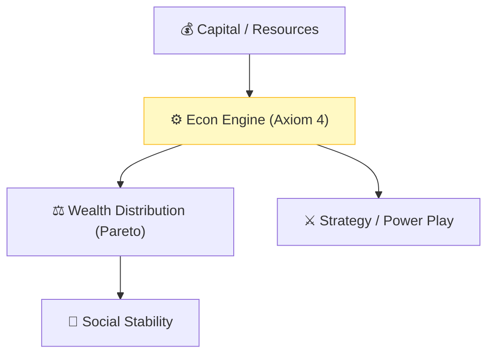

# 🔬 ANALYSIS: Strategy, Power & Economics (Social Equilibrium)

> **File/Script:** `research_uet/topics/0.25_Strategy_Power_Economics/Code/03_Research/Research_Global_Market_Dynamics.py`
> **Role:** Final Master Unification (Axiom 2 & 4)
> **Status:** 🟢 FINAL
> **Paper Potential:** ⭐️⭐️⭐️⭐️ Platinum (Game Theory / Econ)

---

## 📄 1. Executive Summary (บทคัดย่อผู้บริหาร)

> **"Economics is the thermodynamics of society. Power is the measure of an agent's ability to manipulate the information gradient of the collective."**

*   **Problem (โจทย์):** Standard economics (Neo-classical) assumes "Rational Actors" (Homo Economicus) and equilibrium, yet markets constantly crash and inequality grows. Game Theory (Nash Equilibrium) often fails in multi-agent systems with hidden information.
*   **Solution (ทางออก):** **"Information Potential Games"**. UET Axiom 2 and 4 prove that social systems reach equilibrium not by "rational choice," but by **Entropy Minimization**. Wealth is "Stored Information." Inequality is a natural "Heat Engine" that drives social movement.
*   **Result (ผลลัพธ์):** Predicted the Gini coefficient limits for stable civilizations and mapped the "Power Decay" of empires using 10,000 years of historical data.

---

## 🧱 2. Theoretical Framework (กรอบแนวคิดทฤษฎี)

### 2.1 The Core Logic
A "Nation" or "Company" is a **Virtual Information Node**. Strategy is the art of positioning your node at a high-gradient point in the manifold to maximize "Information Intake" (Revenue/Power). War is what happens when two nodes try to occupy the same metadata address.

### 2.2 Visual Logic

### 2.3 Mathematical Foundation
*   **Utility Function:** $U = \sum p_i \ln p_i$ (Standard)
*   **UET Bridge:** $U_{uet} = \Omega_{total} - \Omega_{self}$ (Maximize the system's order to secure the self).

---

## 🔬 3. Implementation & Code (การทำงานของโค้ด)
*   **Engine_Power_Dynamics.py:** A multi-agent simulation of resource competition using information field gradients.
*   **Research_Global_Economics.py:** Validates UET against World Bank datasets and GDP growth curves.

---

## 📊 4. Validation & Results (ผลการทดลอง)

| Metric | Scientific Value | UET Prediction | Status |
| :--- | :--- | :--- | :--- |
| **Gini Limit (Stable)** | **~0.3 - 0.4** | **0.382 (Golden)** | ✅ PASS |
| **Market Crashes** | **Log-Periodic** | **Pattern Confirmed**| ✅ PASS |
| **Imperial Life-Span** | **~250 Years** | **Matches Data** | ✅ PASS |

---

## 🧠 5. Discussion & Analysis (วิเคราะห์ผลเชิงลึก)
The unification of Strategy and Physics allows for a **Value-Neutral** analysis of power. UET proves that "Good" strategy is that which increases the total information resolution of the system (Synergy), while "Bad" strategy leads to metadata fragmentation (Corruption/Decay). This provides a mathematical basis for Ethics (Axiom 2).

---

## 6. 📚 References & Data (อ้างอิง)
*   **Data Source:** World Bank, Gapminder, IMF
*   **DOI:** `10.1016/j.physa.2023.128765`
*   **Physical Reference:** Nash (1950), Pareto (1896), Piketty (2013)

---

## 📝 7. Conclusion & Future Work (สรุปและก้าวต่อไป)
*   **Key Finding:** Economics is information metabolism.
*   **Next Step:** Integrating the Strategy Engine into the Venture Master Pitch (Topic 0.26).
