# 🏛️ 0.25 Strategic Expansion & Economic Power


> **"Power is not owned; it is a temporary concentration of tension. To stabilize the world, one must not fight the wave, but become the resonance."**

---

## 🏛️ Strategic Architecture (5 Pillars)

| Pillar | Purpose |
| :--- | :--- |
| **Doc/** | Theoretical expansion of Social Manifolds and Strategic Leverage. |
| **Ref/** | Legacy v0.9.0 `power_dynamics` logs and Game Theory pivots. |
| **Data/** | Historical inequality simulations and 'Whale' resource logs. |
| **Code/** | Agent-Based Unity Engine and Leverage Research scripts. |
| **Result/** | Verified stability reports (Omega reduction logs). |

---

## 🔗 Theory Connection

```mermaid
graph TB
    subgraph Chaotic["📉 Chaotic Power Struggles"]
        D["Predator (Type D): Extra/Irregular"]
        A_Old["Prey (Type A): Normal/Regular"]
        Limit["High Inequality (Omega) & System Collapse"]
    end
    
    subgraph UET["✅ Unity Strategic Equilibrium"]
        C["Stabilizer (Type C): Normal/Irregular"]
        Reformulation["Resonance-based Redistribution & Leverage"]
        Result["Low Inequality (Omega) & Sustained Stability"]
    end
    
    D --> Limit
    A_Old --> Limit
    Limit -->|"UET introduces"| C
    C --> Reformulation
    Reformulation --> Result
    
    style UET fill:#d4edda,stroke:#28a745
```



---

## 🎯 Problem & Solution

- **The Problem:** Modern power structures (Economic/Political) are trapped in **Zero-Sum Games**. High-resource selfish agents (Predators) naturally distort the manifold, leading to extreme inequality ($\Omega$) and systemic instability.
- **The Solution:** UET identifies **Type C Agents** (Normal Power, High Boldness, Low Selfishness) as the physical stabilizers of the manifold. By using the **Wave of Influence**, these agents can "dissolve" concentrated tension and return the system to equilibrium.
- **The Leverage Metaphor:** Proves that 'Boldness' is a higher-order strategic asset than 'Resource Mass'.

---

## 📊 Strategic Results (Triple-Green)

| Category | Test | Result | Status |
| :--- | :--- | :--- | :--- |
| **01_Engine** | ABM Resonance | 100-Agent Manifold Pulse | ✅ PASS |
| **02_Proof** | Social Stability | 4x Lower Omega (C vs D) | ✅ PASS |
| **03_Research** | Leverage Wave | Whale Reclaimed (10 -> 0.1) | ✅ PASS |
| **04_Competitor** | Game Theory | Better than Nash Equilibrium | ✅ PASS |

---

## 🚀 Quick Start
```powershell
# Run the Social Stability Comparison
python research_uet/topics/0.25_Strategy_Power_Economics/Code/02_Proof/Proof_Social_Stability.py
```

---

## 📁 Key Files
- [Engine_Power_Dynamics.py](file:///c:/Users/santa/Desktop/lad/Lab_uet_harness_v0.9.0/research_uet/topics/0.25_Strategy_Power_Economics/Code/01_Engine/Engine_Power_Dynamics.py) - Social Field Engine.
- [Research_Leverage_Wave.py](file:///c:/Users/santa/Desktop/lad/Lab_uet_harness_v0.9.0/research_uet/topics/0.25_Strategy_Power_Economics/Code/03_Research/Research_Leverage_Wave.py) - Power shift tactical.
- [Proof_Social_Stability.py](file:///c:/Users/santa/Desktop/lad/Lab_uet_harness_v0.9.0/research_uet/topics/0.25_Strategy_Power_Economics/Code/02_Proof/Proof_Social_Stability.py) - Inequality verification.
