# 🔬 0.26 Cosmic Dynamic Frame


> **"Space is not empty; it is a viscous information fluid. What we call 'Dark Matter' is simply the drag from this fluid, and the 'Bullet Cluster' is its Hydrodynamic Wake."**

---

## 📋 Scientific Architecture (5 Pillars)

| Pillar | Purpose |
| :--- | :--- |
| **Doc/** | Analysis of the Dynamic Frame and Hydrodynamic Wakes (Bullet Cluster explanation). |
| **Ref/** | Sources for Pioneer Anomaly (Anderson 1998) and Bullet Cluster (Clowe 2006). |
| **Data/** | Uses standard SPARC data (shared with Topic 0.1) and Pioneer data. |
| **Code/** | `Research_Unified_Cosmic_Theory.py` (Fluid Drag Solver). |
| **Result/** | Validation plots showing $V_{total} = V_{baryon} + V_{drag}$. |

---

## 🔗 Theory Connection

```mermaid
graph TB
    subgraph Standard["🔬 Standard Physics"]
        Old["Static Space Time"]
        DM["Dark Matter (Halo)"]
        Bullet["Bullet Cluster Anomaly"]
    end
    
    subgraph UET["✅ UET Solution"]
        Fluid["Space as Viscous Fluid"]
        Drag["Cosmic Drag (Pioneer Effect)"]
        Wake["Hydrodynamic Wake (Signal Lag)"]
    end
    
    Old --> DM
    DM --> Bullet
    Bullet -->|"Signal Lag explains Offset"| Wake
    Drag -->|"Explains Rotation"| Standard
    Fluid --> Drag
    
    style UET fill:#d4edda,stroke:#28a745
```



---

## 🎯 Problem & Solution

### The Problem: The Dark Matter "Patch"
Standard Physics requires **Dark Matter** to explain:
1.  **Galaxy Rotation**: Stars move too fast.
2.  **Bullet Cluster**: Lensing mass is offset from visible mass.
3.  **Pioneer Anomaly**: Spacecraft slow down unexpectedly.

These require *three different patches* (Halo, WIMP, Unruh radiation).

### The Solution: The Dynamic Frame (Topic 0.26)
UET posits a single cause: **Space is a Dynamic Information Fluid**.
- **Rotation**: The galaxy drags the fluid, creating a "viscous lock" that boosts velocity ($V_{drag}$).
- **Bullet Cluster**: The collision creates a **Hydrodynamic Wake**. The "Dark Matter" offset is just the *turbulence* (Entropy Wake) trailing the baryonic mass, causing lensing delay.
- **Pioneer**: The drag ($a_0$) is exactly the fluid resistance calculated in `Research_Pioneer_Drag.py`.

### Zero Curve Fitting Law
We use the **Pioneer Acceleration** ($a_0 \approx 8.74 \times 10^{-10} m/s^2$) as a **Measured Constant** to derive the Galaxy Rotation curves. No free parameters are tuned for individual galaxies.

---

## 📊 Test Results

| Category | Test | Result | Status |
| :--- | :--- | :--- | :--- |
| **01_Engine** | `CosmicDynamicSolver` | Correctly implements Relativistic Fluid Drag | ✅ PASS |
| **03_Research** | `Unified_Theory` | Matches SPARC data for LSB Galaxies | ✅ PASS |
| **03_Research** | `Pioneer_Drag` | Recovers $a_0$ from fluid viscosity | ✅ PASS |
| **03_Research** | `Toroidal_Cycle` | Explains Frame Dragging evolution | ✅ PASS |

---

## 🚀 Quick Start & Files

### Quick Start
Verify the Unified Theory against SPARC Benchmarks:
```bash
python Code/03_Research/Research_Unified_Cosmic_Theory.py
```

### Key Files

| File | Purpose |
| :--- | :--- |
| [`Code/03_Research/Research_Unified_Cosmic_Theory.py`](./Code/03_Research/Research_Unified_Cosmic_Theory.py) | Main validation script using Fluid Drag. |
| [`Code/03_Research/Research_Pioneer_Drag.py`](./Code/03_Research/Research_Pioneer_Drag.py) | Calculates the fundamental drag coefficient. |
| [`Code/03_Research/Proof_Toroidal_Cycle.py`](./Code/03_Research/Proof_Toroidal_Cycle.py) | Geometrical proof of the dynamic frame. |

---

> **Note:** This topic provides the *Mechanism* (Fluid Dynamics) for the *Observation* in Topic 0.1 (Galaxy Rotation), unifying them under a single physical law.
