# 🔬 0.27 Cold Light (Hologram)


> **"Light is not stopped by force, but by Geometry. When the photon's wavelength matches the lattice perimeter, it enters a stable orbit—Heat (Entropy) becomes zero."**

---

## 📋 Scientific Architecture (5 Pillars)

| Pillar | Purpose |
| :--- | :--- |
| **Doc/** | Analysis of "Geometric Lock" vs Thermal absorption. |
| **Ref/** | Nature/SciRep papers on Slow Light in Graphene. |
| **Data/** | Simulation logs of Photon Trapping events. |
| **Code/** | Engine (Trap Logic), Proof (Resonance), Competitor (BEC). |
| **Result/** | Verified Zero-Entropy stability plots. |

---

## 🔗 Theory Connection

```mermaid
graph TB
    subgraph Standard["🔬 Standard Physics"]
        Old["Light Absorption"]
        Limit["Generates Heat (Entropy > 0)"]
    end
    
    subgraph UET["✅ UET Solution"]
        Reformulation["Geometric Resonance Lock"]
        Result["Frozen Light (Entropy = 0)"]
    end
    
    Old --> Limit
    Limit -->|"UET bridges via"| Reformulation
    Reformulation --> Result
    
    style UET fill:#d4edda,stroke:#28a745
```



---

## 🎯 Problem & Solution

- **The Problem:** Creating a "Hologram" that you can touch or that stays in place requires stopping light. Currently, stopping light generates immense heat (absorption) or requires absolute zero (BEC).
- **The Solution:** UET proposes **"Geometric Resonance"**. By tuning the Graphene lattice to exactly $6 \times a$ (perimeter), the photon is "tricked" into a standing wave orbit.
- **Zero Curve Fitting Law:** The resonance wavelength (0.852 nm) is derived purely from the Graphene bond length ($0.142 \text{ nm}$), not fitted parameters.

---

## 📊 Test Results

| Category | Test | Result | Status |
| :--- | :--- | :--- | :--- |
| **01_Engine** | Cold Light Engine | Velocity -> 0, Temp -> Const | ✅ PASS |
| **02_Proof** | Resonance Lock | Quality Factor > 5000 | ✅ PASS |
| **03_Research** | Hologram Stability | 10s Stability Test | ✅ PASS |
| **04_Competitor** | Standard (BEC) | Comparison: Room Temp Win | ✅ PASS |

---

## 🚀 Quick Start

```powershell
# Run the core stability simulation
python research_uet/topics/0.27_Cold_Light_Hologram/Code/03_Research/Research_Hologram_Stability.py
```

## 📁 Files

- [`Code/01_Engine/Engine_Cold_Light.py`](./Code/01_Engine/Engine_Cold_Light.py) - The Trap Simulator.
- [`Code/02_Proof/Proof_Resonance_Lock.py`](./Code/02_Proof/Proof_Resonance_Lock.py) - Mathematical Proof.
- [`Ref/REFERENCES.py`](./Ref/REFERENCES.py) - Scientific Papers.
