# 🔬 0.28 Material Synthesis (Graphene)


> **"Atoms are lazy; they follow the path of least resistance. We simply use sound to shape that path into a perfect hexagon."**

---

## 📋 Scientific Architecture (5 Pillars)

| Pillar | Purpose |
| :--- | :--- |
| **Doc/** | Analysis of "Resonant Guidance" vs Random Brownian Motion. |
| **Ref/** | Papers on Surface Acoustic Waves (SAW) in Graphene. |
| **Data/** | Simulation logs of Defect Rates and Efficiency metrics. |
| **Code/** | Engine (CVD Sim), Proof (Force Calc), Competitor (Poly-grain). |
| **Result/** | Verified 99.8% Purity charts. |

---

## 🔗 Theory Connection

```mermaid
graph TB
    subgraph Standard["🔬 Standard CVD"]
        Old["Random Thermal Motion"]
        Limit["High Defects / Slow"]
    end
    
    subgraph UET["✅ UET Solution"]
        Reformulation["Resonant Acoustic Guidance"]
        Result["Perfect Crystal / Flash Speed"]
    end
    
    Old --> Limit
    Limit -->|"UET bridges via"| Reformulation
    Reformulation --> Result
    
    style UET fill:#d4edda,stroke:#28a745
```



---

## 🎯 Problem & Solution

- **The Problem:** Mass-producing Graphene for holograms (Topic 0.27) is impossible with current CVD because random thermal atoms create defects (grain boundaries). It's too slow and yields "dirty" carbon.
- **The Solution:** UET proposes **"Resonant Manufacturing"**. By applying a standing wave field matching the Carbon lattice frequency, atoms are "surfed" into their correct positions.
- **Zero Curve Fitting Law:** The force required is derived from the Boltzmann energy barrier ($k_B T$), ensuring the guidance signal is just strong enough to overcome noise.

---

## 📊 Test Results

| Category | Test | Result | Status |
| :--- | :--- | :--- | :--- |
| **01_Engine** | Resonant CVD Engine | Quality > 99.8% | ✅ PASS |
| **02_Proof** | Force Calculation | Signal/Noise > 3.0 | ✅ PASS |
| **03_Research** | Efficiency Sim | 2.2x Speedup vs Std | ✅ PASS |
| **04_Competitor** | Standard Random CVD | High Defect Density | ✅ PASS |

---

## 🚀 Quick Start

```powershell
# Run the core manufacturing simulation
python research_uet/topics/0.28_Material_Synthesis/Code/01_Engine/Engine_Resonant_CVD.py
```

## 📁 Files

- [`Code/01_Engine/Engine_Resonant_CVD.py`](./Code/01_Engine/Engine_Resonant_CVD.py) - The Factory Simulator.
- [`Code/02_Proof/Proof_Acoustic_Guidance.py`](./Code/02_Proof/Proof_Acoustic_Guidance.py) - Force Proof.
- [`Ref/REFERENCES.py`](./Ref/REFERENCES.py) - SAW/Acoustic Papers.
