# 🔬 0.28 Material Synthesis (Graphene)


> **"Surfaces that Think and Power themselves."**
> **Concept:** Self-Powered Perovskite-Graphene Sheets for Smart Home & Infrastructure.

---

| Pillar | Purpose |
| :--- | :--- |
| **Doc/** | Synthesis methods (LARP), Stability reports, Degradation logs. |
| **Ref/** | Mahidol University (Thailand) Perovskite Research synergy. |
| **Data/** | Conversion efficiency and Material lifetime datasets. |
| **Code/** | Engine (CVD/LARP), Proof (Efficiency), Research (Durability). |
| **Result/** | Verified 15-year stability simulation results. |

| Pillar | Purpose |
| :--- | :--- |
| **Doc/** | Analysis of "Resonant Guidance" vs Random Brownian Motion. |
| **Ref/** | Papers on Surface Acoustic Waves (SAW) in Graphene. |
| **Data/** | Simulation logs of Defect Rates and Efficiency metrics. |
| **Code/** | Engine (CVD Sim), Proof (Force Calc), Competitor (Poly-grain). |
| **Result/** | Verified 99.8% Purity charts. |

---

## 🔗 Theory Connection

```mermaid
graph TB
    subgraph Standard["🔬 Standard CVD"]
        Old["Random Thermal Motion"]
        Limit["High Defects / Slow"]
    end
    
    subgraph UET["✅ UET Solution"]
        Reformulation["Resonant Acoustic Guidance"]
        Result["Perfect Crystal / Flash Speed"]
    end
    
    Old --> Limit
    Limit -->|"UET bridges via"| Reformulation
    Reformulation --> Result
    
    style UET fill:#d4edda,stroke:#28a745
```



---

## 🎯 Problem & Solution

- **The Problem:** Modern surfaces (windows, fridge doors) are passive. Turning them into active displays requires toxic materials, external power, and rare-earth mining.
- **Goal 1: Zero-Mining Materials.** Replacing Rare Earth Elements (REEs) and Copper with Graphene (from agricultural waste) and Perovskite (from recycled sources).
- **Goal 2: Zero-Waste Manufacturing.** Implementing "Urban Mining" and closed-loop systems to prevent toxic runoff into rivers.
- **Goal 3: Geometric Doping.** Using UET's Axiom 3 (Information Trap) to create "virtual doping" in chips, eliminating the need for heavy metal dopants.
 and projection capabilities.
- **Zero-Mining Law:** High-purity Perovskite is "grown" from simple chemical precursors (Mahidol Style), not mined, using Acoustic Resonance to align the lattice.

---

## 📊 Test Results

| Category | Test | Result | Status |
| :--- | :--- | :--- | :--- |
| **01_Engine** | Resonant CVD Engine | Quality > 99.8% | ✅ PASS |
| **02_Proof** | Force Calculation | Signal/Noise > 3.0 | ✅ PASS |
| **03_Research** | Efficiency Sim | 2.2x Speedup vs Std | ✅ PASS |
| **04_Competitor** | Standard Random CVD | High Defect Density | ✅ PASS |

---

## 2. ⚡ Quick Start (Run Commands)

```powershell
# Run the core manufacturing simulation
python research_uet/topics/0.28_Material_Synthesis/Code/01_Engine/Engine_Resonant_CVD.py
```

## 📁 Files

- [`Code/01_Engine/Engine_Resonant_CVD.py`](./Code/01_Engine/Engine_Resonant_CVD.py) - The Factory Simulator.
- [`Code/02_Proof/Proof_Acoustic_Guidance.py`](./Code/02_Proof/Proof_Acoustic_Guidance.py) - Force Proof.
- [`Ref/REFERENCES.py`](./Ref/REFERENCES.py) - SAW/Acoustic Papers.
