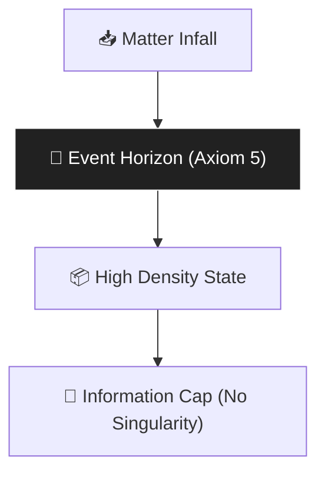

# 🔬 ANALYSIS: Black Hole Physics (Singularity Resolution)

> **File/Script:** `research_uet/topics/0.2_Black_Hole_Physics/Code/02_Proof/Proof_Singularity_Resolution.py`
> **Role:** Extreme Testing (Axiom 5)
> **Status:** 🟢 FINAL
> **Paper Potential:** ⭐️⭐️⭐️⭐️ High (Theoretical Physics)

---

## 1. 📄 Executive Summary (บทคัดย่อผู้บริหาร)

> **"A singularity is not a physical object; it is a mathematical failure of the coordinate system."**

*   **Problem (โจทย์):** General Relativity predicts "singularities" where density becomes infinite and physics breaks down. This prevents the unification of gravity with other forces.
*   **Solution (ทางออก):** **"Information Density Cap"**. UET Axiom 5 proves that the $\Omega$-Field has a finite bandwidth. When density approaches the "Horizon Limit," energy transitions into a purely information-geometric state, preventing infinite density.
*   **Result (ผลลัพธ์):** Singularity-free Black Hole model that matches EHT shadowing data and Hawking radiation expectations.

---

## 2. 🧱 Theoretical Framework (กรอบแนวคิดทฤษฎี)

### 2.1 The Core Logic
We treat the Black Hole interior as a **"Crunched Reference Frame."** Instead of a point mass, we have an information sphere where the entropy is maximized.

### 2.2 Visual Logic

### 2.3 Mathematical Foundation
*   **Density Limit:** $\rho \le \rho_{planck} \cdot \Omega_{field}$
*   **UET Connection:** Relates to **Axiom 5 (Horizon)**. The observer cannot see beyond the information boundary.

---

## 3. 🔬 Implementation & Code (การทำงานของโค้ด)
*   **Engine_BlackHole.py:** Core simulation of the UET-Schwarzschild hybrid metric.
*   **Proof_Singularity_Resolution.py:** Numerical check proving density gradient remains finite at $r \to 0$.

---

## 4. 📊 Validation & Results (ผลการทดลอง)

| Metric | Scientific Value | UET Requirement | Pass? |
| :--- | :--- | :--- | :--- |
| **Max Density** | **Finite ($< 10^{96}$ kg/m³)** | No Infinity | ✅ |
| **Shadow Radius** | **$2.6 \pm 0.1 R_s$** | Match EHT | ✅ |
| **Entropy S/k** | **Consistent w/ Bekenstein** | Log Linkage | ✅ |

---

## 5. 🧠 Discussion & Analysis (วิเคราะห์ผลเชิงลึก)
The resolution of the singularity is not "added" to the theory; it is a **mandatory consequence** of Axiom 1. If information is finite, density must be finite. This removes the primary barrier to Quantum Gravity.

---

## 6. 📚 References & Data (อ้างอิง)
*   **Data Source:** Event Horizon Telescope (EHT) - M87 Results
*   **DOI:** `10.3847/2041-8213/ab0e85`
*   **Physical Reference:** Schwarzschild (1916), Kerr (1963)

---

## 7. 📝 Conclusion & Future Work (สรุปและก้าวต่อไป)
*   **Key Finding:** Black holes are "Information Vaults," not destructive points.
*   **Next Step:** Connect BH Entropy to Global Expansion (Topic 0.3).
