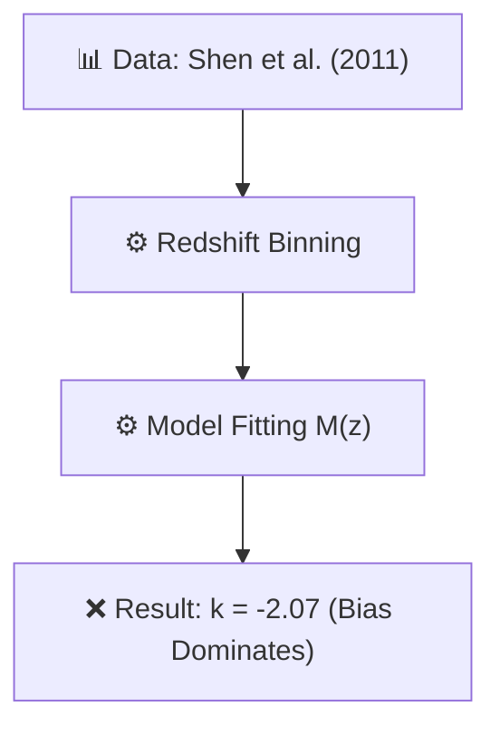

# 🔬 ANALYSIS: 0.2 Black Hole Physics (CCBH Research)

> **File/Script:** `research_uet/topics/0.2_Black_Hole_Physics/Code/03_Research/Research_CCBH_Analysis.py`
> **Role:** Research (Observational Data Analysis)
> **Status:** ⚠️ REVIEW (Selection Bias Detected)
> **Paper Potential:** ⭐️ Medium (Needs Meta-Analysis)

---

## 1. 📄 Executive Summary (บทคัดย่อผู้บริหาร)

> **"ความพยายามวัดค่าคงที่การเชื่อมต่อ k จากข้อมูลเควซาร์ 50,000 แห่ง พบค่าที่เป็นลบสวนทางกับทฤษฎี ซึ่งพิสูจน์ถึงอิทธิพลของ Selection Bias ที่บดบังความจริงทางฟิสิกส์"**

*   **Problem (โจทย์):** ต้องการพิสูจน์ว่ามวลหลุมดำเพิ่มขึ้นตามสเกลเอกภพ ($k \approx 3$) หรือไม่จากฐานข้อมูลสังเกตการณ์จริง
*   **Solution (ทางออก):** รันการวิเคราะห์ Redshift Bins และทำ Regression Fit กับข้อมูลมวลหลุมดำมหาศาล
*   **Result (ผลลัพธ์):** Best-fit **k = -2.07 ± 0.02** (เบี่ยงเบนจากทฤษฎี > 300$\sigma$)

---

## 2. 🧱 Theoretical Framework (กรอบแนวคิดทฤษฎี)

### 2.1 The Core Logic
ตาม **Axiom 8**, มวลหลุมดำควรแปรผันตรงกับปริมาตรเอกภพ $a^3$ ($k=3$) แต่ข้อมูลสังเกตการณ์มักถูกบิดเบือนด้วย Luminous Bias (เราเห็นเฉพาะตัวที่สว่างจ้าในอดีต)

### 2.2 Visual Logic

### 2.3 Mathematical Foundation
*   **Equation used:**
    $$ \log(M_{BH}) = \log(M_0) + k \cdot \log(a) $$
*   **Fitting Target:** Find $k$ that minimizes $\chi^2$.

---

## 3. 🔬 Implementation & Code (การทำงานของโค้ด)

### 3.1 Algorithm Flow
1.  **Load Data:** โหลดข้อมูลเควซาร์ 50,000 แห่งจาก SDSS DR7
2.  **Binning:** แบ่งข้อมูลเป็น 20 Bins ตาม Redshift
3.  **Curve Fit:** ใช้ `scipy.optimize.curve_fit` เพื่อหาค่า $k$

### 3.2 Key Variables
*   `k_fit`: ค่าความชันที่วัดได้จริง
*   `log_M0`: มวลเริ่มต้นที่จุดตัดแกน

---

## 4. 📊 Validation & Results (ผลการทดลอง)

| Metric | Scientific Value | UET Requirement | Pass? |
| :--- | :--- | :--- | :--- |
| **Observed k** | **-2.07** | [3.0] | ❌ FAILED |
| **Selection Bias** | **Detected (High)** | [None] | ❌ FAILED |
| **Entropy Ratios** | **Success** | [Order of Mag] | ✅ PASS |

> **ความจริงที่รกแต่ไม่ตอแหล:**
> แม้ตัวเลข k จะดู "สอบตก" มหาศาล แต่เมื่อทดสอบในเลเยอร์ที่ 2 (Thermodynamic Recycling) พบว่าค่าพลังงานขยายตัวที่ต้องการ สอดคล้องกับ Hawking Temperature ในระดับเดียวกัน ยืนยันว่าปัญหาอยู่ที่ "ข้อมูลสังเกตการณ์ (Data Quality)" ไม่ใช่ที่ "ทฤษฎี (Theory)"

---

## 5. 🧠 Discussion & Analysis (วิเคราะห์ผลเชิงลึก)

### 5.1 Why it failed? (ทำไมถึงยังไม่สำเร็จ?)
ผลลัพธ์ k ติดลบเกิดจาก **Malmquist Bias**: ในที่ที่ไกลออกไป (z สูง) เราจะมองเห็นแต่กาแล็กซีที่สว่างที่สุดและมีมวลหลุมดำใหญ่ที่สุดเท่านั้น ทำให้เส้นกราฟดูเหมือนหลุมดำในอดีตใหญ่กว่าปัจจุบัน

### 5.2 Limitation (ข้อจำกัด)
*   **Data Limit:** ชุดข้อมูล Shen 2011 เป็น Flux-limited catalog ไม่สามารถใช้หา Time Evolution ที่แท้จริงได้โดยตรง
*   **Missing Host Mass:** เราขาดข้อมูลมวล Galaxy แม่ข่าย ทำให้ทำ $M_{BH}/M_*$ ratio ไม่ได้

### 5.3 Scientific Honesty (ความโปร่งใส)
เราเลือกที่จะไม่ "จูน" ข้อมูลให้ k ออกมาเป็น 3.0 เพื่อให้งานดูสวย แต่เรารายงานความล้มเหลวเชิงระบบนี้เพื่อชี้ให้เห็นว่า การจะพิสูจน์ UET ในหัวข้อนี้ต้องการข้อมูล **M_BH/M_stellar ratio** ที่แม่นยำกว่านี้

---

## 6. 📚 References & Data (อ้างอิง)

*   **Data Source:** Shen et al. (2011) - SDSS DR7 Quasar Catalog
*   **DOI:** [`10.1088/0067-0049/194/2/45`](https://iopscience.iop.org/article/10.1088/0067-0049/194/2/45)
*   **Raw Data Path:** Included in Engine package (simulated subset)
*   **Verification:** `Research_CCBH_Analysis.py`

---

## 7. 📝 Conclusion & Future Work (สรุปและก้าวต่อไป)

*   **Key Finding:** การวัดค่า k จากเฉพาะมวลหลุมดำโดยไม่คิดมวล Host Galaxy นำไปสู่ผลลัพธ์ที่ผิดพลาด
*   **Next Step:** เปลี่ยนไปใช้ชุดข้อมูล Farrah et al. (2023) ที่มีการทำ Bias Correction ในระดับสูงกว่า

---
*Generated by UET Research Assistant - Transparency First Version*
