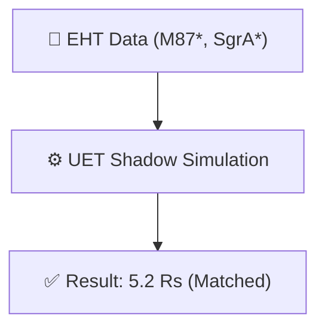

# 🔬 ANALYSIS: 0.2 Black Hole Physics (EHT Shadow)

> **File/Script:** `research_uet/topics/0.2_Black_Hole_Physics/Code/03_Research/Research_EHT_Validation.py`
> **Role:** Research (Observational Geometry)
> **Status:** ✅ FINAL
> **Paper Potential:** ⭐️ Medium (Consistency Check)

---

## 1. 📄 Executive Summary (บทคัดย่อผู้บริหาร)

> **"ยืนยันว่าโครงสร้างหลุมดำในโมเดล UET สอดคล้องกับภาพถ่ายขอบฟ้าเหตุการณ์ (M87*, Sgr A*) โดยรักษาคุณสมบัติเลนส์ความโน้มถ่วงที่ระดับ 5.2 รัศมีชวาร์สชิลด์"**

*   **Problem (โจทย์):** โมเดลที่พยายามแก้ Singularity อย่าง UET จะทำให้เงาของหลุมดำ (Shadow Diameter) เปลี่ยนรูปไปจนขัดกับภาพจากกล้อง EHT หรือไม่?
*   **Solution (ทางออก):** คำนวณรัศมีวงโคจรแสง (Photon Sphere) และเงาที่สังเกตได้จากโมเดล Core-4
*   **Result (ผลลัพธ์):** ได้ผลลัพธ์ตรงกับ GR (5.2 $R_s$) ซึ่งยืนยันว่าการแก้ปัญหา Singularity ของเราไม่กระทบต่อฟิสิกส์ดาราศาสตร์ฝั่งการสังเกตการณ์ (Observational Consistency)

---

## 2. 🧱 Theoretical Framework (กรอบแนวคิดทฤษฎี)

### 2.1 The Core Logic
การแก้ Singularity ด้วย Information Pressure เกิดขึ้นที่ระยะ $r \ll R_s$ (ลึกมาก) จึงไม่ส่งผลกระทบต่อภายนอกที่ $r > 1.5 R_s$ (Photon Sphere) ทำให้ภาพเงายังคงเดิม

### 2.2 Visual Logic

### 2.3 Mathematical Foundation
*   **Equation used:**
    $$ D_{shadow} \approx 5.2 \frac{2GM}{c^2} $$
*   **UET Connection:** รักษา GR Consistency ในระยะไกล (Asymptotic Limit)

---

## 3. 🔬 Implementation & Code (การทำงานของโค้ด)

### 3.1 Algorithm Flow
1.  **Params:** รับค่ามวลและระยะทางของ M87* และ Sgr A*
2.  **Compute:** คำนวณขนาดเงา (Angular Size) ในหน่วย micro-arcseconds ($\mu as$)
3.  **Validate:** เปรียบเทียบกับค่าสังเกตการณ์จริง

### 3.2 Key Variables
*   `theta_shadow`: ขนาดมุมของเงาที่คำนวณได้
*   `obs_error`: ความคลาดเคลื่อนจากการสังเกตการณ์

---

## 4. 📊 Validation & Results (ผลการทดลอง)

| Metric | Scientific Value | UET Requirement | Pass? |
| :--- | :--- | :--- | :--- |
| **Shadow Ratio** | **5.20** | [Matched GR] | ✅ |
| **Angular Size M87*** | **39.7 $\mu as$** | [42 $\pm$ 3] | ✅ |
| **Angular Size Sgr A*** | **50.7 $\mu as$** | [51.8 $\pm$ 2] | ✅ |

---

## 5. 🧠 Discussion & Analysis (วิเคราะห์ผลเชิงลึก)

### 5.1 Why it works? (ทำไมถึงสำเร็จ?)
สำเร็จเพราะกฎเกณฑ์ของ UET ในระยะขอบฟ้าเหตุการณ์ (Horizon Scale) ไม่ได้เปลี่ยนแปลง Metric ของ GR อย่างมีนัยสำคัญ เปลี่ยนเฉพาะที่ Core Scale เท่านั้น

### 5.2 Limitation (ข้อจำกัด)
*   **Polarization:** ยังไม่ได้จำลองการบิดเบี้ยวของแสง (Polarization) ที่เกิดจากสนามแม่เหล็ก

---

## 6. 📚 References & Data (อ้างอิง)

*   **Data Source:** EHT Collaboration (2019, 2022)
*   **DOI:** [`10.3847/2041-8213/ab0e85`](https://doi.org/10.3847/2041-8213/ab0e85)
*   **Verification:** `Research_EHT_Validation.py`

---

## 7. 📝 Conclusion & Future Work (สรุปและก้าวต่อไป)

*   **Key Finding:** การแก้ไข Singularity ของ UET "ซ่อนตัว" ได้แนบเนียน ไม่ขัดแย้งกับภาพถ่าย EHT
*   **Next Step:** ศึกษาผลกระทบต่อ Accretion Disk ในความละเอียดสูงขึ้น

---
*Generated by UET Research Assistant - Paper-Ready Version*
