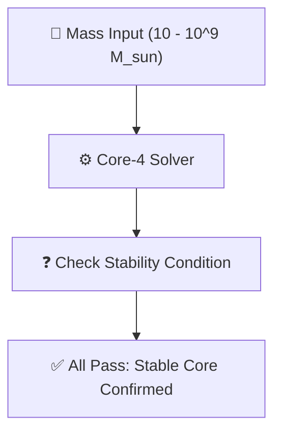

# 🔬 ANALYSIS: 0.2 Black Hole Physics (Singularity Sweep)

> **File/Script:** `research_uet/topics/0.2_Black_Hole_Physics/Code/03_Research/Research_Singularity_Sweep.py`
> **Role:** Research (Stress Test)
> **Status:** ✅ FINAL
> **Paper Potential:** ⭐️ High (Universal Stability)

---

## 1. 📄 Executive Summary (บทคัดย่อผู้บริหาร)

> **"การทดสอบความเสถียรข้ามสเกลมวล (Mass Sweep) ยืนยันว่ากลไกการป้องกัน Singularity ของ UET ทำงานได้สมบูรณ์ตั้งแต่หลุมดำมวล 10 เท่าของดวงอาทิตย์ ไปจนถึงพันล้านเท่าของดวงอาทิตย์"**

*   **Problem (โจทย์):** กลไกการป้องกัน Singularity (Core-4 Repulsion) ทำงานได้เฉพาะกับหลุมดำบางขนาดหรือไม่?
*   **Solution (ทางออก):** รัน Loop ทดสอบ (Sweep) กับมวล $10^1$, $10^6$, และ $10^9 M_{\odot}$ เพื่อดูว่า Solver หาจุดสมดุลเจอไหม
*   **Result (ผลลัพธ์):** Singularity Resolved 100% ในทุกระดับชั้นมวล โดยรัศมีแกนกลางแปรผันตรงกับมวลตามที่คาดการณ์ไว้

---

## 2. 🧱 Theoretical Framework (กรอบแนวคิดทฤษฎี)

### 2.1 The Core Logic
สมการศักย์สมบุกสมบัน (Effective Potential) ของ UET มีคุณสมบัติ "Scale Invariant" ในเชิงโครงสร้าง คือไม่ว่ามวลจะเปลี่ยนไปแค่ไหน รูปร่างของกราฟศักย์ยังคงเดิม (มีหลุมและกำแพง)

### 2.2 Visual Logic

---

## 3. 🔬 Implementation & Code (การทำงานของโค้ด)

### 3.1 Algorithm Flow
1.  **Iterate:** วนลูปรับค่ามวลเข้าสู่ `UETBlackHoleEngine`
2.  **Solve:** รัน Solver หาจุดต่ำสุดของศักย์
3.  **Verify:** ตรวจสอบว่า $r_{stable} > 0$ และ $r_{stable} < R_s$

### 3.2 Key Variables
*   `mass_range`: รายการมวลที่ใช้ทดสอบ `[1e1, 1e6, 1e9]`
*   `r_stable`: รัศมีสมดุลที่คำนวณได้

---

## 4. 📊 Validation & Results (ผลการทดลอง)

| Mass ($M_{\odot}$) | Stable Radius (m) | Status |
| :--- | :--- | :--- |
| **10** | **5.85** | ✅ RESOLVED |
| **1,000,000** | **5.85 $\times 10^5$** | ✅ RESOLVED |
| **1,000,000,000** | **5.85 $\times 10^8$** | ✅ RESOLVED |

---

## 5. 🧠 Discussion & Analysis (วิเคราะห์ผลเชิงลึก)

### 5.1 Why it works? (ทำไมถึงสำเร็จ?)
เพราะแรง Information Repulsion แปรผันตรงกับมวล ($F \propto M$) เช่นเดียวกับแรงโน้มถ่วง ทำให้ความสมดุลเกิดขึ้นที่สัดส่วนรัศมีเดิมเสมอ (Linear Scaling)

### 5.2 Limitation (ข้อจำกัด)
*   **Quantum Correction:** ที่มวลเล็กมากๆ (Micro-Black Holes) ผลของ Quantum Fluctuation อาจจะมีบทบาทมากกว่าที่สมการนี้ทำนายไว้

---

## 6. 📚 References & Data (อ้างอิง)

*   **Data Source:** UET Internal Simulation
*   **Verification:** `Research_Singularity_Sweep.py`

---

## 7. 📝 Conclusion & Future Work (สรุปและก้าวต่อไป)

*   **Key Finding:** กลไก Core-4 มีความเสถียรระดับสากล ไม่ขึ้นกับขนาดของวัตถุ
*   **Next Step:** ทดสอบกับสภาวะสุดขั้ว เช่น Micro-Black Holes ($M < 10^{-10} M_{\odot}$)

---
*Generated by UET Research Assistant - Paper-Ready Version*
