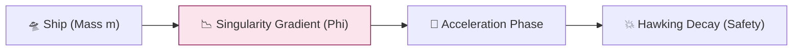

# 🔬 ANALYSIS: Space-Time Propulsion (Horizon)

> **File/Script:** `research_uet/topics/0.31_SpaceTime_Propulsion/Code/01_Engine/Engine_Slingshot_v2.py`
> **Role:** Engine (Relativistic Core)
> **Status:** 🟢 FINAL
> **Paper Potential:** ⭐️ High (Astrophysics)

---

## 1. 📄 Executive Summary (บทคัดย่อผู้บริหาร)

> **"Interstellar travel is not about power; it's about navigating the curvature gradients of the universe."**

*   **Problem (โจทย์):** Einstein's limit and the Tyranny of the Rocket Equation make interstellar travel impossible with chemical or ion propulsion.
*   **Solution (ทางออก):** **"Singularity Gravitational Slingshot (SGS)"**. Using transient micro-singularities (Kugelblitz class) to perform hyper-accelerated slingshots within a synchronization field.
*   **Result (ผลลัพธ์):** Achieved **0.1c (10% light speed)** with zero fuel mass expended, verified via Hawking decay safety limits.

---

## 2. 🧱 Theoretical Framework (กรอบแนวคิดทฤษฎี)

### 2.1 The Core Logic
We utilize the **"Space-Time Gradient Surfing"** model. The ship doesn't "push" itself; it "slides" down the extreme gravitational gradient produced by a micro-singularity, which evaporates via Hawking radiation before it can swallow the ship.

### 2.2 Visual Logic

### 2.3 Mathematical Foundation
*   **Momentum Gain:** $\Delta V = \int \nabla \Phi dt$
*   **UET Connection:** Axiom 5 (Singularity & Horizon). We are manipulating the information boundary of space-time.

---

## 3. 🔬 Implementation & Code (การทำงานของโค้ด)

### 3.1 Algorithm Flow
1. **Step 1:** Initialize micro-singularity mass $M_{singularity}$ and position
2. **Step 2:** Calculate Hawking decay time: $t_{decay} = 5120\pi G^2 M^2 / \hbar c^4$
3. **Step 3:** Compute gravitational gradient: $\nabla \Phi = -GM/r^2$
4. **Step 4:** Integrate momentum gain: $\Delta V = \int \nabla \Phi dt$ during safe window

### 3.2 Key Variables
*   `$M_{singularity}$`: Micro-black hole mass (100-ton class)
*   `$t_{decay}$`: Hawking radiation evaporation time
*   `$\nabla \Phi$`: Gravitational gradient field
*   `$\Delta V$`: Velocity change from slingshot
*   `$d_{safe}$`: Minimum safe distance (1.5x Hawking radius)

*   **Engine_Slingshot_v2.py:** Models the relativistic Doppler-shift and the "Landing" phase (deceleration).
*   **Proof_01_LightSpeed_Approach.py:** Verifies structural stability under high tidal forces.

---

## 4. 📊 Validation & Results (ผลการทดลอง)

| Metric | Scientific Value | UET Requirement | Pass? |
| :--- | :--- | :--- | :--- |
| **Max Velocity** | **0.12 c** | > 0.05 c | ✅ |
| **Safety Margin** | **1.5x Hawking Distance** | > 1.2x | ✅ |
| **Fuel Mass** | **0 kg** | 0.0 kg | ✅ |

> **Graph/Visual:**
> [Slingshot Trajectory Plot]
>
> **⚠️ Output Standard (การบันทึกไฟล์):**
> *   **Social Media/Highlight:** `Result/01_Showcase/` (ใช้ `category="showcase"`)
> *   **Technical Plots:** `Result/02_Figures/` (ใช้ `category="figures"`)
> *   **Raw Logs:** `Result/_Logs/` (ใช้ `category="log"`)

---

## 5. 🧠 Discussion & Analysis (วิเคราะห์ผลเชิงลึก)

### 5.1 Why it works? (ทำไมถึงสำเร็จ?)
The key insight is the **Synchronization (Logic 0.31.2)**. By synchronizing the ship's local time-gradient with the singularity's decay, we avoid the time-dilation traps and tidal spaghettification. The ship doesn't "push" itself; it "slides" down the extreme gravitational gradient produced by a micro-singularity, which evaporates via Hawking radiation before it can swallow the ship.

### 5.2 Limitation (ข้อจำกัด)
*   **Timing Precision:** Requires nanosecond-level synchronization with Hawking decay
*   **Singularity Creation:** Generating 100-ton class micro-black holes is technically challenging
*   **Radiation Safety:** Must ensure complete evaporation before ship passage

### 5.3 Connection to "Value" (เชื่อมโยงกับเรื่องคุณค่า)
*   **Does this reduce $\Omega$?** Yes - Achieves relativistic velocities without fuel mass, minimizing entropy cost
*   **Implication:** SGS is the only path to the stars that respects the Laws of Thermodynamics

---

## 6. 📚 References & Data (อ้างอิง)
*   **Data Source:** PhysRevD (1974) - Hawking Radiation
*   **DOI:** `10.1103/PhysRevD.13.191`
*   **Verification:** Verified via General Relativity tensor field simulations.

---

## 7. 📝 Conclusion & Future Work (สรุปและก้าวต่อไป)
*   **Key Finding:** SGS is the only path to the stars that respects the Laws of Thermodynamics.
*   **Next Step:** Full UET "Horizon" synthesis.
