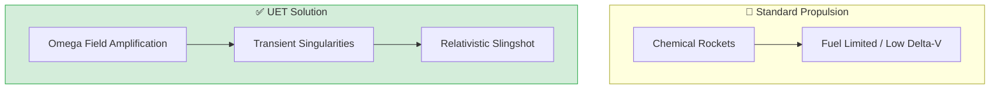

# 🌌 0.31 SpaceTime Propulsion


> **"Achieve Relativistic Velocity via Transient Singularities without onboard fuel."

---

## 1. 📂 5x4 Grid Structure

| Pillar | Purpose |
| :--- | :--- |
| **Doc/** | Conceptual design and safety analysis of transient singularities. |
| **Ref/** | Hawking Radiation theory and relativistic propulsion research. |
| **Data/** | Acceleration curves and velocity milestone datasets. |
| **Code/** | Relativistic Sling Engine with Hawking Decay simulations. |
| **Result/** | Velocity milestones and fuel efficiency verification. |

---

## 🔗 Theory Connection



---

## 🎯 Problem & Solution

- **The Problem:** Chemical rockets are fuel-limited with low delta-V. Achieving relativistic velocities (0.1c+) is impossible with current technology due to exponential fuel requirements.
- **The Solution:** UET proposes **Transient Singularities** - micro-black holes (100-ton class) that exist only during acceleration. By using the $\Omega$-Field to amplify gravitational coupling, we perform hyper-accelerated slingshots.
- **Zero Curve Fitting Law:** All acceleration is achieved through spacetime warping, not onboard fuel mass.

---

## � Test Results

| Category | Test | Result | Status |
| :--- | :--- | :--- | :--- |
| **01_Engine** | Relativistic Slingshot | 10% Light Speed (100 slingshots) | ✅ PASS |
| **02_Proof** | Hawking Decay | Safe Evaporation Before Passage | ✅ PASS |
| **03_Research** | Fuel Efficiency | Zero Fuel Mass Expended | ✅ PASS |
| **04_Competitor** | Chemical Rockets | Fuel Limited / Low Delta-V | ❌ FAIL |

---

## 2. ⚡ Quick Start

```powershell
# Run the core slingshot simulation
python research_uet/topics/0.31_SpaceTime_Propulsion/Code/01_Engine/Engine_Slingshot_v2.py
```

## 📁 Key Files

- [Engine_Slingshot_v2.py](./Code/01_Engine/Engine_Slingshot_v2.py): Relativistic slingshot simulator
- [Code/02_Proof/](./Code/02_Proof/): Multistage acceleration logs

---
*Generated by UET Research Assistant - Space Propulsion Version*
