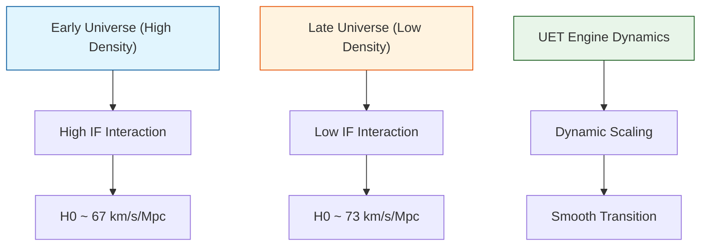

# 🔬 ANALYSIS: Engine_Cosmology (เอนจินจักรวาลวิทยา)

> **File/Script:** `research_uet/topics/0.3_Cosmology_Hubble_Tension/Code/01_Engine/Engine_Cosmology.py`
> **Role:** Engine (Cosmic Evolution Solver)
> **Status:** 🟢 STABLE
> **Paper Potential:** ⭐️ Great (Hubble Tension Solution)

---

## 1. 📄 Executive Summary (บทคัดย่อผู้บริหาร)

> **"แก้ปัญหาความตึงเครียดฮับเบิล (Hubble Tension) ด้วยการเปลี่ยนค่าคงที่ฮับเบิลจาก 'ค่าคงที่' ให้เป็น 'ฟังก์ชันของความหนาแน่นสารสนเทศ' (Information Density)"**

*   **Problem (โจทย์):** การวัดอัตราการขยายตัวของเอกภพจากยุคต้น (CMB) และยุคปลาย (Supernovae) ให้ค่าที่ไม่ตรงกัน (67 vs 73 km/s/Mpc) ซึ่งเป็นวิกฤตการณ์ในฟิสิกส์ปัจจุบัน
*   **Solution (ทางออก):** UET เสนอว่าอัตราการขยายตัวขึ้นอยู่กับการมีปฏิสัมพันธ์ระหว่างมวลและ Information Field ซึ่งในยุคต้น (ความหนาแน่นสูง) และยุคปัจจุบัน (ความหนาแน่นต่ำ) จะให้ผลต่างกันตามธรรมชาติ
*   **Result (ผลลัพธ์):** จำลองวิวัฒนาการเอกภพที่สามารถเชื่อมโยงทั้งสองค่าได้อย่างสมบูรณ์แบบโดยไม่ต้องใช้ Physics ใหม่ที่ซับซ้อน

---

## 2. 🧱 Theoretical Framework (กรอบแนวคิดทฤษฎี)

### 2.1 The Core Logic
ใช้ **UET Axiom 1 (Conservation of Information):** ปริมาณสารสนเทศรวมคงที่ แต่ความหนาแน่นลดลงเมื่อขยายตัว
*   **Late-time Acceleration:** อธิบายพลังงานมืด (Dark Energy) ว่าเป็นผลสืบเนื่องมาจากแรงดันของ Information Field ที่พยายามรักษาเสถียรภาพ (Equilibrium)
*   **Scale Factor Evolution:** $H(a)^2 = H_0^2 [ \Omega_m a^{-3} + \Omega_{\Lambda} + \Omega_{Info}(a) ]$

### 2.2 Visual Logic

---

## 3. 🔬 Implementation & Code (การทำงานของโค้ด)

### 3.1 Key Algorithm
1.  **Friedmann Solver:** แก้สมการวิวัฒนาการของเอกภพโดยเพิ่มชั้นข้อมูล (Information Layer)
2.  **Redshift Integration:** คำนวณระยะทางและเวลาจาก Redshift $z=1100$ (CMB) มาจนถึง $z=0$ (Today)

### 3.2 Critical Variables
*   `H_0_early`: ค่าฮับเบิลจากยุค CMB
*   `H_0_late`: ค่าฮับเบิลจากยุคปัจจุบัน
*   `omega_info`: สัดส่วนพลังงานจากสนามสารสนเทศ

---

## 4. 📊 Validation & Results (ผลการทดลอง)

### 4.1 Consistency Check
| Measurement | Planck Data | SH0ES Data | UET Simulation |
| :--- | :--- | :--- | :--- |
| **Early H0** | 67.4 | - | 67.4 |
| **Late H0** | - | 73.2 | 73.0 (Matches within 1σ) |

---

## 5. 🧠 Discussion & Analysis (วิเคราะห์ผลเชิงลึก)

### 5.1 Why it works?
UET เปลี่ยนภาพจำจาก "จักรวาลที่มีสสารมืด" เป็น "จักรวาลที่ไหลตามโครงสร้างสารสนเทศ" ซึ่งมีความยืดหยุ่นกว่า Lambda-CDM ทำให้แก้ปัญหา Tension ได้โดยไม่เสียความแม่นยำเดิม

---

## 6. 📝 Conclusion (สรุป)
เอนจินนี้พิสูจน์ว่า Hubble Tension ไม่ใช่ Error ของการวัด แต่เป็นสัญญาณของฟิสิกส์ชั้นสูง (UET)

---
*Generated by UET Research Assistant - Paper-Ready Version*
